# Programación IV — Back End · Propuesta de Arquitectura

> **UTN FRC** — Tecnicatura Universitaria en Programación, modalidad virtual
> 2º Año · 4º Cuatrimestre

**Origen:** transcripción a Markdown de `TUP_PIV_BE_PROPUESTA_ARQ.pdf` (16 páginas), documento de la cátedra.
**Fidelidad:** el texto es transcripción literal. Las siete láminas de la §4 se conservan como imagen (`img/lamina-*.jpeg`, extraídas sin recompresión del PDF) y además se transcriben a Mermaid y a listas. Los diagramas Mermaid son **reinterpretación**, no original: ante cualquier duda vale la imagen.
**Documento derivado:** ver [`../arquitectura/01-panorama-microservicios-backend.md`](../arquitectura/01-panorama-microservicios-backend.md).

> [!IMPORTANT]
> La cátedra declara este documento como **propuesta inicial**, no como especificación cerrada, y aclara que fue elaborado con asistencia de IA, por lo que puede contener imprecisiones. Ver [Aclaración final](#aclaración-final).

---

## Índice

1. [Arquitectura de referencia](#1-arquitectura-de-referencia)
   - [1.1 Reglas no negociables](#11-reglas-no-negociables)
   - [1.2 El recorrido de una solicitud](#12-el-recorrido-de-una-solicitud)
   - [1.3 Sincrónico o evento](#13-sincrónico-o-evento)
   - [1.4 El curso-cohorte como contexto](#14-el-curso-cohorte-como-contexto)
2. [Asignación por tema](#2-asignación-por-tema)
3. [Decisiones abiertas](#3-decisiones-abiertas)
4. [Procesos en detalle](#4-procesos-en-detalle)
   - [4.1 Arquitectura front end / back end](#41-arquitectura-front-end--back-end)
   - [4.2 Institución, curso template y curso-cohorte](#42-institución-curso-template-y-curso-cohorte)
   - [4.3 Núcleo de desafíos](#43-núcleo-de-desafíos)
   - [4.4 Bus de eventos](#44-bus-de-eventos)
   - [4.5 Economía y progreso](#45-economía-y-progreso)
   - [4.6 Backoffice y parámetros compartidos](#46-backoffice-y-parámetros-compartidos)
   - [4.7 Identidad, pertenencia y autorización](#47-identidad-pertenencia-y-autorización)
- [Aclaración final](#aclaración-final)

---

## 1. Arquitectura de referencia

Este documento reúne tres cosas: las decisiones de arquitectura que valen para toda la plataforma, el reparto de trabajo por tema, y los procesos que cruzan a varios equipos a la vez. Está pensado para leerse antes de escribir código.

Lo que se define acá es de plataforma y no se renegocia equipo por equipo. Dentro de esos límites, cada equipo decide el diseño interno de su servicio.

### 1.1 Reglas no negociables

- El **API Gateway es la única puerta de entrada**. Ningún cliente accede a un microservicio por otro camino.
- Los servicios se **registran dinámicamente**. No hay direcciones fijas escritas en configuración.
- **No hay comunicación directa entre microservicios.** Toda llamada sincrónica vuelve a pasar por el gateway.
- **Cada servicio es dueño exclusivo de su base.** Nadie lee la tabla del vecino ni comparte esquema.
- Lo **asincrónico viaja por el bus de eventos**, no por el gateway.
- **Cada entidad tiene un dueño único.** Si dos equipos creen ser dueños del mismo dato, se resuelve en la sesión de integración.

### 1.2 El recorrido de una solicitud

**Alta dinámica.** Cuando un microservicio levanta, lo primero que hace es registrarse: informa su nombre lógico, su ubicación y su estado de salud. Si mañana levantan tres instancias del mismo servicio, las tres se dan de alta solas; si una se cae, el registro la da de baja.

**Entrada única.** El cliente conoce una sola dirección: la del gateway. Esto no es una preferencia de estilo: es lo que permite resolver autenticación, límites de uso y trazabilidad en un solo lugar en vez de replicarlos doce veces.

**Resolución.** El gateway no sabe de antemano dónde vive nadie. Ante cada solicitud consulta el registro y obtiene una instancia viva. Ahí es donde entra el balanceo entre instancias.

**Ruteo.** Recién entonces el gateway reenvía la solicitud al microservicio resuelto, con el token ya validado y el contexto de usuario propagado.

**Procesamiento.** El microservicio ejecuta su lógica contra su propia base. No consulta datos ajenos por acceso directo.

**Respuesta.** El resultado vuelve al cliente por el mismo camino.

**Comunicación entre servicios.** Si un servicio necesita a otro, sale y vuelve a entrar por el gateway. Desde el punto de vista del servicio llamado, el otro microservicio es un consumidor externo más.

Una llamada directa entre microservicios rompe todo lo anterior: pierde el balanceo, se acopla a un despliegue puntual, se saltea la validación centralizada y desaparece de la traza. El acoplamiento por base de datos es la misma falta, solo que más difícil de detectar.

### 1.3 Sincrónico o evento

La regla cabe en una línea: **si necesito la respuesta para continuar, es sincrónico por el gateway; si solo estoy avisando que algo pasó, es un evento.**

Dos casos del mismo servicio ilustran la diferencia. El Tema 02 le pregunta al Tema 07 si la calibración del curso está aprobada, y necesita ese sí para poder activar: es sincrónico. El mismo Tema 02 publica que archivó un curso, sin esperar nada de nadie: es un evento, y quien esté suscrito reacciona.

### 1.4 El curso-cohorte como contexto

Casi ninguna entidad de la plataforma existe fuera de un curso-cohorte. Las recompensas se usan únicamente en el curso donde se obtuvieron; la calibración es por curso y condiciona su activación; el ranking es dentro de la cohorte; las mecánicas de enganche se desactivan por curso.

Eso convierte al curso-cohorte en el concepto compartido más importante del sistema: es la clave que viaja en cada operación y contra la que se acota cada consulta. Si un equipo modela sus entidades sin esa clave, después no hay forma de acotarlas sin migrar datos.

Ahora bien, el curso-cohorte es el **contexto** de la conversación, **no el conducto**. El Tema 02 es dueño de su identidad y de su ciclo de vida, no del contenido que vive adentro, y no media las operaciones del dictado.

---

## 2. Asignación por tema

Cada tema se presenta en tres columnas. No son etapas rígidas de un cronograma: son un criterio de prioridad.

- **Pedido para empezar:** el núcleo del dominio más todo aquello que otros equipos necesitan para no quedar bloqueados. Si algo aparece en un contrato que otro equipo consume, va en esta columna aunque sea lo menos vistoso del tema.
- **Para más adelante:** lo que puede diferirse sin frenar a nadie, pero que debe quedar previsto en el modelo y en el contrato. "Más adelante" no significa "no lo pienso": significa que se diseña ahora y se implementa después.
- **Podría ser:** lo que suma si el núcleo está entregado y funcionando. Un extra a medias vale menos que un núcleo terminado.

### Tema 01 — Identidad y Usuarios

| Pedido para empezar | Para más adelante | Podría ser |
|---|---|---|
| • Registro y autenticación • Roles: ADMIN, responsable, profesor, alumno • Perfil de usuario • Contrato del token: claims y vigencia • Validación de padrón en el onboarding • Borrado lógico en el modelo • Emisión de eventos de auditoría | • Persistencia y consulta de auditoría • Retención: 5 años configurable, sin purga automática, decisión de ADMIN • Revocación de sesión • Recuperación de contraseña y verificación por correo | • Personalización avanzada de perfil • Identidad institucional • Doble factor • API Gateway (extra asignado) |

> La purga y anonimización de PII (RSK-11) está diferida por decisión del product owner: queda declarada como fuera de alcance.

### Tema 02 — Cursos y Matrícula

| Pedido para empezar | Para más adelante | Podría ser |
|---|---|---|
| • Alta de curso • Comisiones • Inscripción de alumnos • Código de invitación de un solo uso • Ciclo de vida y archivado • Gatillo de purga del chat al archivar • Bloqueo de activación sin calibración aprobada | • Clonado con linaje • Fechas relativas al clonar • Calibración que se copia pero se reaprueba • Bloqueo de cierre con notas diferidas pendientes | • Servicio de presencialidad • Plantillas de curso reutilizables • Importación masiva de alumnos |

> El linaje de curso es prerrequisito del control de originalidad contra ediciones anteriores: sin linaje, el Tema 05 no puede cumplir su alcance.

### Tema 03 — Motor de Desafíos

| Pedido para empezar | Para más adelante | Podría ser |
|---|---|---|
| • Ciclo de vida del desafío • Publicación y asignación • Entregas y estados • Versionado • Fechas de apertura y cierre • Cierre evaluado al momento del envío | • Entrega tardía con penalidad del 30 % en ventana de 48 h • Prórroga individual auditada • Vencimiento sin entrega que no descuenta vida • Desafíos personalizados por LLM, sin XP ni monedas • Límite semanal de generación | • Colaboración en equipo sobre una misma entrega • Agenda del alumno • Plantillas de desafío |

> Las vidas quedan asignadas al Tema 10. El Tema 03 emite el hecho; el Tema 10 decide su efecto sobre vidas y XP.

### Tema 04 — Teóricos y Encuestas

| Pedido para empezar | Para más adelante | Podría ser |
|---|---|---|
| • Ítems teóricos • Corrección • Encuesta obligatoria con abstención explícita • Marcador de cumplimiento desacoplado de la respuesta • Contrato con 03 y 05: se dispara antes de revelar resultados | • Exposición de resultados al profesor con umbral de 5 respuestas • Tipos de ítem adicionales • Agregados por cohorte | • Banco de ítems con etiquetado por tema • Analítica de dificultad por ítem • Generación asistida de ítems |

> El gatillo de la encuesta implica que 03 y 05 no muestran nota hasta que el 04 confirme. Es la dependencia menos visible del reparto.

### Tema 05 — Desafíos Prácticos

| Pedido para empezar | Para más adelante | Podría ser |
|---|---|---|
| • Consignas de código • Casos de prueba • Formato de entrega • Feedback al alumno • Comunicación con el sandbox | • Control de originalidad entre entregas, umbral del 70 % • Comparación contra ediciones anteriores • Caso de originalidad con resolución humana obligatoria • Sin atribución automática de autoría | • Múltiples lenguajes • Feedback enriquecido con trazas de ejecución • Pistas progresivas |

> El control de originalidad es alcance cerrado del PRD, no una mejora opcional.

### Tema 06 — Sandbox / Runtime

| Pedido para empezar | Para más adelante | Podría ser |
|---|---|---|
| • Ejecución aislada • Límites de CPU, memoria y tiempo • Captura de salida • Contrato de invocación con el Tema 05 | • Cola de ejecuciones y comportamiento en pico de cierre • Política ante caída del sandbox • Análisis estático de código • Almacenamiento de artefactos de ejecución | • Más lenguajes • Ejecución con dependencias externas |

> Con fechas de cierre definidas, las entregas se concentran: el comportamiento bajo carga deja de ser hipotético.

### Tema 07 — Evaluación LLM

| Pedido para empezar | Para más adelante | Podría ser |
|---|---|---|
| • Rúbricas con pesos fijos 30/25/20/15/10 • Invocación del modelo • Golden set base • Calibración por curso • Bloqueo de activación sin override • Salvaguarda anti-fuga | • Detección de deriva previa a activar un modelo • Caída del LLM: nota neutra o cálculo diferido • Rúbrica portable entre modelos • Bloqueo de cierre con diferidas pendientes | • Tablero de deriva del evaluador • Configuración centralizada • Caché de evaluaciones • Control de costo por curso |

> El golden set depende de producción de contenido docente, no de desarrollo: es una dependencia externa al equipo.

### Tema 08 — Banco

| Pedido para empezar | Para más adelante | Podría ser |
|---|---|---|
| • Ledger de movimientos • Transacciones • Saldos con alcance por curso • Reglas de acreditación • Reservas | • Reversión de movimientos, necesaria por el XP reducible • Acreditación de rachas y misiones • Multiplicador de eventos con techo de 3x • Conciliación | • Historial exportable • Límites por período • Tablero de circulante por curso |

> No existe saldo global: las recompensas se usan únicamente en el curso donde se obtuvieron.

### Tema 09 — Mercado

| Pedido para empezar | Para más adelante | Podría ser |
|---|---|---|
| • Catálogo • Compra contra reserva del banco • Inventario del alumno con alcance por curso • Consumo de ítems | • Subastas con ventana temporal • Acceso móvil a subastas • Vencimiento de ítems | • Intercambio entre alumnos • Ítems por temporada • Catálogo configurable por curso |

> Es el tema más liviano del reparto: los extras son el mecanismo previsto para equilibrarlo.

### Tema 10 — Roadmap y Progreso

| Pedido para empezar | Para más adelante | Podría ser |
|---|---|---|
| • Grafo de contenidos • Prerequisitos y desbloqueo • XP y niveles • Logros e insignias • Vidas | • Ranking con zonas P90/P10 • XP retroactivamente reducible • Rachas y misiones que pagan solo en monedas e insignias • Temporadas como ventana de ranking, sin reinicio de XP • Bloque desactivable por curso | • Visualización del recorrido • Comparativas de cohorte • Recomendación del siguiente contenido |

> El XP reducible impide modelar el progreso como contador incremental: se necesita historial.

### Tema 11 — Social y Notificaciones

| Pedido para empezar | Para más adelante | Podría ser |
|---|---|---|
| • Contrato de eventos del bus • Notificaciones que comunican hechos, no reenganche • Chat sin retención • Purga al archivar, con excepción por reporte | • Equipos • Reportes de contenido y moderación • Eventos nuevos: vencimientos, casos de originalidad, hitos de racha • Preferencias de notificación | • Mensajería asíncrona como servicio de plataforma • Chat en móvil • Menciones y adjuntos |

> Define el contrato de eventos para toda la plataforma: su decisión condiciona a cinco equipos.

### Tema 12 — Backoffice

| Pedido para empezar | Para más adelante | Podría ser |
|---|---|---|
| • Administración de plataforma • Registro de parámetros PAR-01 a PAR-24 • Gestión del proveedor LLM, exclusiva de ADMIN • Contratos de lectura con los seis temas que le proveen datos | • Panel del profesor con indicador de alumno en riesgo • Frescura máxima de 15 minutos en los datos • Sin comparación entre docentes | • Reportes docentes • Exportación de datos • KPIs con CSAT de 5 estrellas • Alertas configurables |

> Es consumidor puro: sin contratos de lectura acordados en el sprint 1 no tiene nada demostrable.

---

## 3. Decisiones abiertas

Los puntos que siguen no están cerrados en el PRD y afectan a más de un equipo. Conviene resolverlos antes de que cada equipo adopte su propia interpretación.

**Caída del sandbox.** El PRD define qué ocurre si el evaluador LLM no responde, pero no la regla equivalente para el sandbox. Hoy nadie sabe qué pasa con una entrega en ese caso.

**Transversales sin dueño.** Arquitectura multi-idioma, alcance de la versión móvil y marco de indicadores no están asignados a ningún tema.

**Desmatriculación a mitad de cuatrimestre.** Las monedas, el inventario y el progreso de un alumno quedan acotados a un curso al que ya no pertenece. Afecta a los temas 02, 08, 09 y 10 a la vez.

---

## 4. Procesos en detalle

Las siete láminas que siguen desarrollan los procesos que cruzan a varios equipos. Cada una es autónoma: puede imprimirse y discutirse por separado.

> [!NOTE]
> Cada lámina se presenta en tres partes: la **imagen original**, un **diagrama Mermaid** que la reinterpreta, y la transcripción de los paneles al pie (*reglas clave*, *lectura rápida*, *leyenda*). Ante discrepancia, la imagen manda.

### 4.1 Arquitectura front end / back end

Muestra el recorrido completo de una solicitud, el registro dinámico de servicios y el motivo por el que la comunicación directa entre microservicios está prohibida. El recuadro del punto 7 es la pieza clave: cuando un servicio necesita a otro, el camino vuelve a pasar por el gateway.

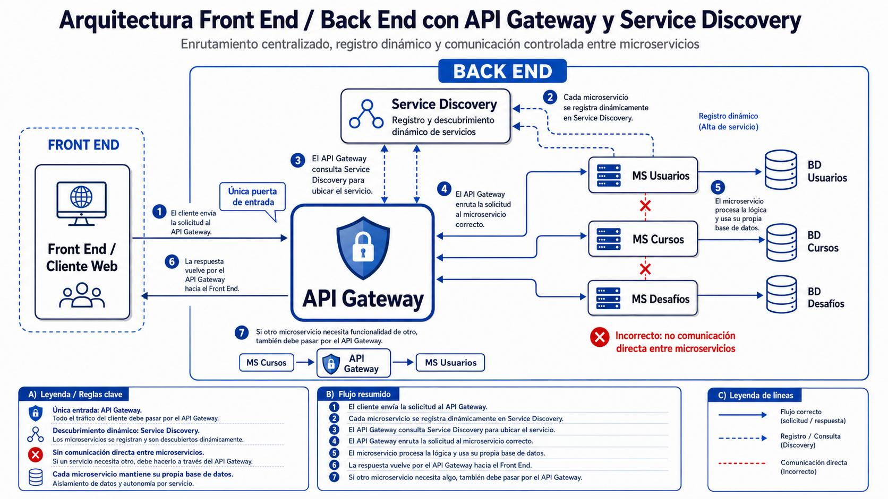

*Lámina 1 — Enrutamiento centralizado, registro dinámico y comunicación controlada*

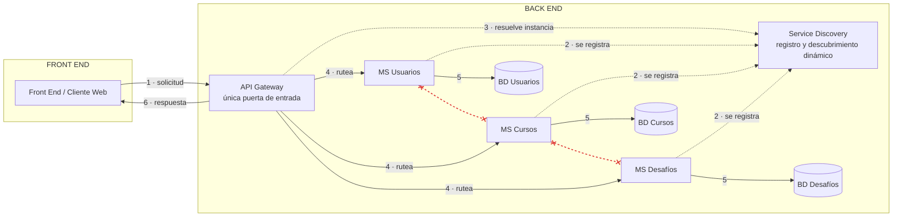

**Paso 7 — comunicación entre servicios, única forma válida:**

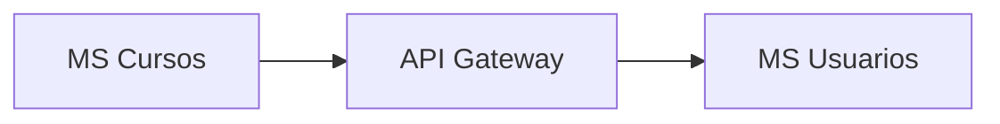

**A) Reglas clave**

| Regla | Detalle |
|---|---|
| Única entrada: API Gateway | Todo el tráfico del cliente debe pasar por el API Gateway. |
| Descubrimiento dinámico: Service Discovery | Los microservicios se registran y son descubiertos dinámicamente. |
| Sin comunicación directa entre microservicios | Si un servicio necesita otro, debe hacerlo a través del API Gateway. |
| Cada microservicio mantiene su propia base de datos | Aislamiento de datos y autonomía por servicio. |

**B) Flujo resumido**

1. El cliente envía la solicitud al API Gateway.
2. Cada microservicio se registra dinámicamente en Service Discovery.
3. El API Gateway consulta Service Discovery para ubicar el servicio.
4. El API Gateway enruta la solicitud al microservicio correcto.
5. El microservicio procesa la lógica y usa su propia base de datos.
6. La respuesta vuelve por el API Gateway hacia el Front End.
7. Si otro microservicio necesita algo, también debe pasar por el API Gateway.

**C) Leyenda de líneas**

| Trazo | Significado |
|---|---|
| Azul sólido → | Flujo correcto (solicitud / respuesta) |
| Azul punteado ⇢ | Registro / consulta (Discovery) |
| **Rojo punteado ✗** | **Comunicación directa (incorrecto)** |

---

### 4.2 Institución, curso template y curso-cohorte

El template define y se reutiliza; la cohorte ocurre. Los dos estados en ámbar no son etapas más difíciles: son estados que no se alcanzan hasta que otro servicio da el visto bueno. La regla de modelado al pie es el chequeo más rápido sobre el diseño propio: si una entidad no puede ubicarse dentro de la caja de la cohorte, probablemente esté mal modelada.

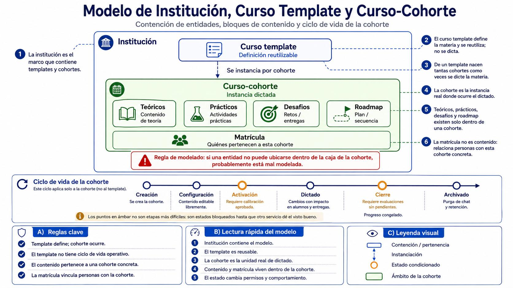

*Lámina 2 — Contención de entidades y ciclo de vida de la cohorte*

**Contención de entidades:**

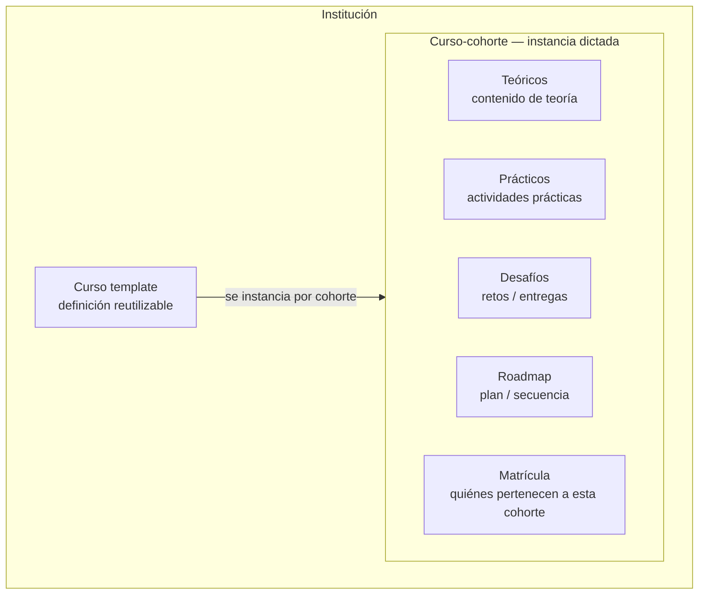

> [!WARNING]
> **Regla de modelado:** si una entidad no puede ubicarse dentro de la caja de la cohorte, probablemente está mal modelada.

**Ciclo de vida de la cohorte** — aplica solo a la cohorte, no al template:

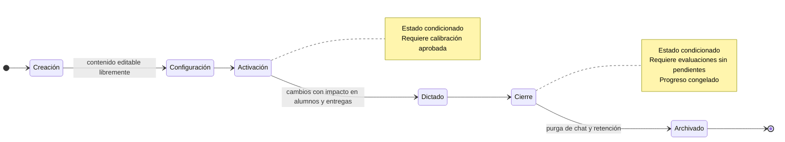

> Los puntos en ámbar no son etapas más difíciles: son **estados bloqueados** hasta que otro servicio dé el visto bueno.

**A) Reglas clave**

- Template define; cohorte ocurre.
- El template no tiene ciclo de vida operativo.
- El contenido pertenece a una cohorte concreta.
- La matrícula vincula personas con la cohorte.

**B) Lectura rápida del modelo**

1. Institución contiene el modelo.
2. El template es reusable.
3. La cohorte es la unidad real de dictado.
4. Contenido y matrícula viven dentro de la cohorte.
5. El estado cambia permisos y comportamiento.

**C) Leyenda visual**

| Elemento | Significado |
|---|---|
| Caja azul | Contención / pertenencia |
| Flecha punteada azul | Instanciación |
| Círculo ámbar | Estado condicionado |
| Caja verde | Ámbito de la cohorte |

**Notas al margen de la lámina**

1. La institución es el marco que contiene templates y cohortes.
2. El curso template define la materia y se reutiliza; no se dicta.
3. De un template nacen tantas cohortes como veces se dicte la materia.
4. La cohorte es la instancia real donde ocurre el dictado.
5. Teóricos, prácticos, desafíos y roadmap existen solo dentro de una cohorte.
6. La matrícula no es contenido: relaciona personas con esta cohorte concreta.

---

### 4.3 Núcleo de desafíos

Teórico y práctico no son dos cosas distintas: son dos tipos de desafío. Comparten ciclo de vida, estados, fechas, entrega y resultado, y todo eso vive una sola vez en el Tema 03. Si el 04 o el 05 pudieran otorgar XP por su cuenta, las reglas de la economía quedarían escritas en tres lugares. El evaluador y el sandbox, en cambio, no conocen desafíos, cursos ni alumnos.

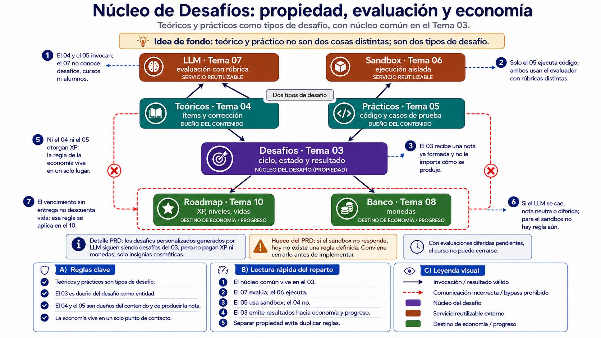

*Lámina 3 — Propiedad, evaluación y economía del desafío*

> **Idea de fondo:** teórico y práctico no son dos cosas distintas; son dos tipos de desafío.

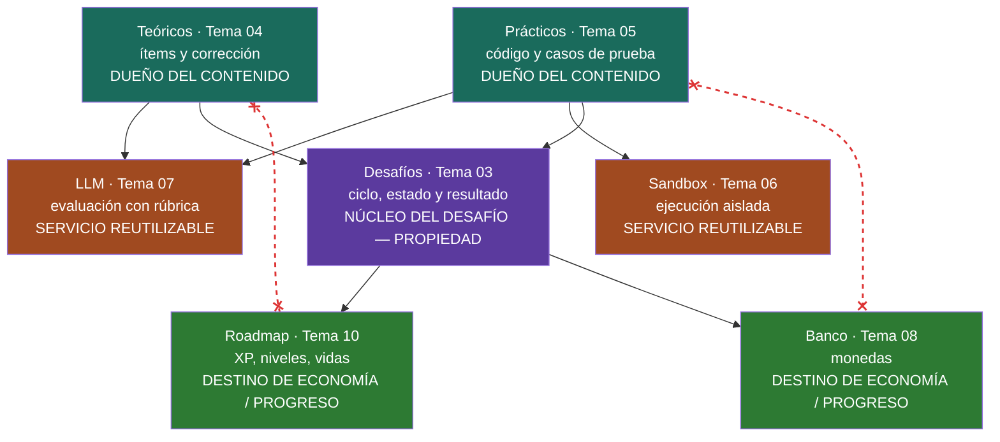

**Notas al margen de la lámina**

1. El 04 y el 05 invocan; el 07 no conoce desafíos, cursos ni alumnos.
2. Solo el 05 ejecuta código; ambos usan el evaluador con rúbricas distintas.
3. El 03 recibe una nota ya formada y no le importa cómo se produjo.
4. El 03 emite resultados hacia economía y progreso.
5. Ni el 04 ni el 05 otorgan XP: la regla de la economía vive en un solo lugar.
6. Si el LLM se cae, nota neutra o diferida; **para el sandbox no hay regla aún**.
7. El vencimiento sin entrega no descuenta vida: esa regla se aplica en el 10.

**Cajas de detalle**

- **Detalle PRD:** los desafíos personalizados generados por LLM siguen siendo desafíos del 03, pero no pagan XP ni monedas; solo insignias cosméticas.
- **Hueco del PRD:** si el sandbox no responde, hoy no existe una regla definida. Conviene cerrarlo antes de implementar.
- Con evaluaciones diferidas pendientes, el curso no puede cerrarse.

**A) Reglas clave**

- Teóricos y prácticos son tipos de desafío.
- El 03 es dueño del desafío como entidad.
- El 04 y el 05 son dueños del contenido y de producir la nota.
- La economía vive en un solo punto de contacto.

**B) Lectura rápida del reparto**

1. El núcleo común vive en el 03.
2. El 07 evalúa; el 06 ejecuta.
3. El 05 usa sandbox; el 04 no.
4. El 03 emite resultados hacia economía y progreso.
5. Separar propiedad evita duplicar reglas.

**C) Leyenda visual**

| Elemento | Significado |
|---|---|
| Flecha negra → | Invocación / resultado válido |
| **Flecha roja punteada ✗** | **Comunicación incorrecta / bypass prohibido** |
| Caja morada | Núcleo del desafío |
| Caja marrón | Servicio reutilizable externo |
| Caja verde | Destino de economía / progreso |

---

### 4.4 Bus de eventos

Un evento es un hecho consumado. Quien lo publica no sabe quién escucha, no espera respuesta y no necesita conocer a sus consumidores: si aparece un consumidor nuevo, se suscribe y nadie toca el emisor. El Tema 11 tiene un rol incómodo: define el contrato de eventos para toda la plataforma y a la vez es uno de los consumidores. Su contrato condiciona a cinco equipos.

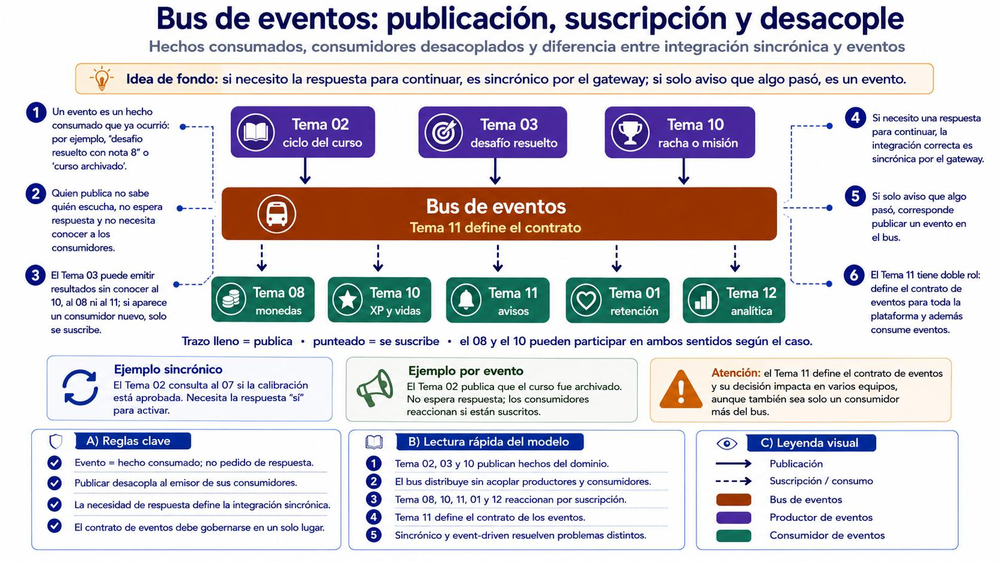

*Lámina 4 — Publicación, suscripción y desacople*

> **Idea de fondo:** si necesito la respuesta para continuar, es sincrónico por el gateway; si solo aviso que algo pasó, es un evento.

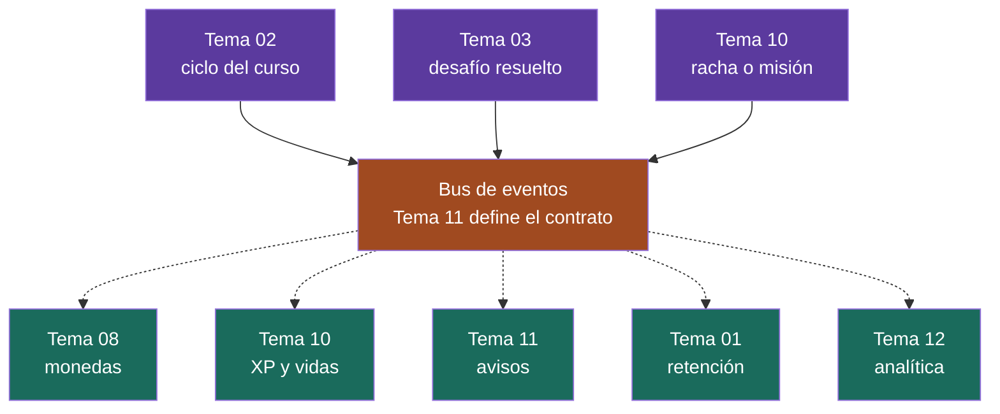

> Trazo lleno = publica · punteado = se suscribe · **el 08 y el 10 pueden participar en ambos sentidos** según el caso.

**Los dos modos, con el mismo servicio**

| | Ejemplo sincrónico | Ejemplo por evento |
|---|---|---|
| **Caso** | El Tema 02 consulta al 07 si la calibración está aprobada. | El Tema 02 publica que el curso fue archivado. |
| **Por qué** | Necesita la respuesta "sí" para activar. | No espera respuesta; los consumidores reaccionan si están suscritos. |

> [!WARNING]
> **Atención:** el Tema 11 define el contrato de eventos y su decisión impacta en varios equipos, aunque también sea solo un consumidor más del bus.

**Notas al margen de la lámina**

1. Un evento es un hecho consumado que ya ocurrió: por ejemplo, "desafío resuelto con nota 8" o "curso archivado".
2. Quien publica no sabe quién escucha, no espera respuesta y no necesita conocer a los consumidores.
3. El Tema 03 puede emitir resultados sin conocer al 10, al 08 ni al 11; si aparece un consumidor nuevo, solo se suscribe.
4. Si necesito una respuesta para continuar, la integración correcta es sincrónica por el gateway.
5. Si solo aviso que algo pasó, corresponde publicar un evento en el bus.
6. El Tema 11 tiene doble rol: define el contrato de eventos para toda la plataforma y además consume eventos.

**A) Reglas clave**

- Evento = hecho consumado; no pedido de respuesta.
- Publicar desacopla al emisor de sus consumidores.
- La necesidad de respuesta define la integración sincrónica.
- El contrato de eventos debe gobernarse en un solo lugar.

**B) Lectura rápida del modelo**

1. Tema 02, 03 y 10 publican hechos del dominio.
2. El bus distribuye sin acoplar productores y consumidores.
3. Tema 08, 10, 11, 01 y 12 reaccionan por suscripción.
4. Tema 11 define el contrato de los eventos.
5. Sincrónico y *event-driven* resuelven problemas distintos.

**C) Leyenda visual**

| Elemento | Significado |
|---|---|
| Flecha sólida → | Publicación |
| Flecha punteada ⇢ | Suscripción / consumo |
| Caja marrón | Bus de eventos |
| Caja morada | Productor de eventos |
| Caja verde | Consumidor de eventos |

---
### 4.5 Economía y progreso

Hay dos monedas conceptuales y no son intercambiables: el XP mide progreso académico y no se gasta; las monedas son poder de compra. Las rachas pagan en monedas, nunca en XP, porque si no el ranking mediría constancia en vez de aprendizaje. La compra no puede ser "descuento y después entrego": se reserva, se confirma y si algo falla se libera. Y como el XP puede bajar retroactivamente, ni el progreso ni el saldo son contadores que solo suben.

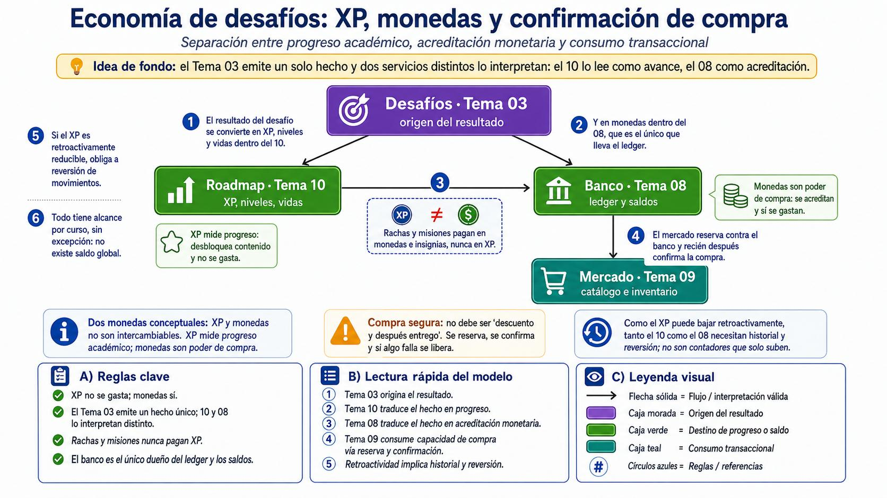

*Lámina 5 — XP, monedas y confirmación de compra*

> **Idea de fondo:** el Tema 03 emite un solo hecho y dos servicios distintos lo interpretan: el 10 lo lee como avance, el 08 como acreditación.

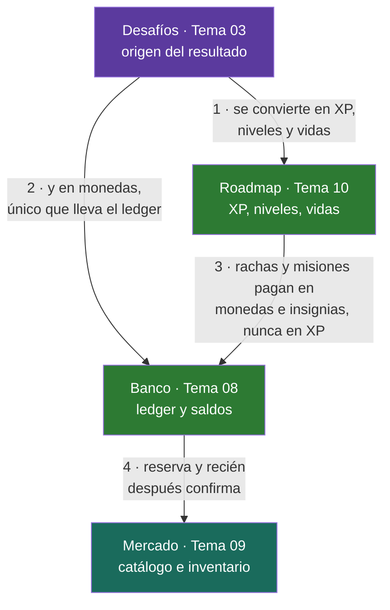

**Las dos monedas conceptuales — no son intercambiables**

| | XP | Monedas |
|---|---|---|
| **Mide** | Progreso académico | Poder de compra |
| **Se gasta** | **No** | **Sí** |
| **Efecto** | Desbloquea contenido | Se acreditan y se gastan en el Mercado |
| **Dueño** | Tema 10 | Tema 08, único dueño del ledger |
| **Rachas y misiones** | Nunca pagan en XP | Pagan en monedas e insignias |

**Compra segura** — no debe ser "descuento y después entrego":

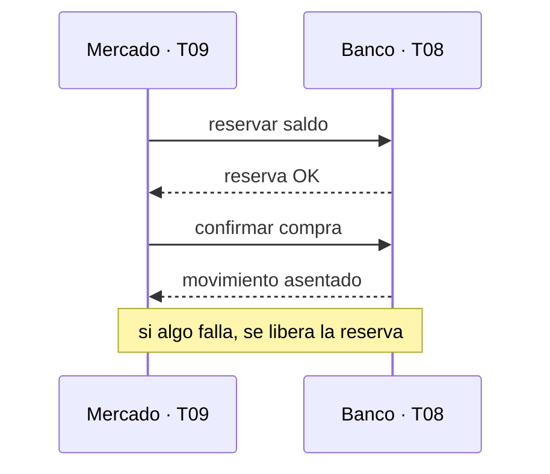

**Notas al margen de la lámina**

1. El resultado del desafío se convierte en XP, niveles y vidas dentro del 10.
2. Y en monedas dentro del 08, que es el único que lleva el ledger.
3. Rachas y misiones pagan en monedas e insignias, nunca en XP.
4. El mercado reserva contra el banco y recién después confirma la compra.
5. Si el XP es retroactivamente reducible, obliga a reversión de movimientos.
6. Todo tiene alcance por curso, sin excepción: **no existe saldo global**.

> [!IMPORTANT]
> Como el XP puede bajar retroactivamente, tanto el 10 como el 08 necesitan **historial y reversión**; no son contadores que solo suben.

**A) Reglas clave**

- XP no se gasta; monedas sí.
- El Tema 03 emite un hecho único; 10 y 08 lo interpretan distinto.
- Rachas y misiones nunca pagan XP.
- El banco es el único dueño del ledger y los saldos.

**B) Lectura rápida del modelo**

1. Tema 03 origina el resultado.
2. Tema 10 traduce el hecho en progreso.
3. Tema 08 traduce el hecho en acreditación monetaria.
4. Tema 09 consume capacidad de compra vía reserva y confirmación.
5. Retroactividad implica historial y reversión.

**C) Leyenda visual**

| Elemento | Significado |
|---|---|
| Flecha sólida → | Flujo / interpretación válida |
| Caja morada | Origen del resultado |
| Caja verde | Destino de progreso o saldo |
| Caja teal | Consumo transaccional |
| Círculos azules | Reglas / referencias |

---

### 4.6 Backoffice y parámetros compartidos

Es el único tema sin dominio propio: todo lo que muestra pertenece a otro. Eso le crea un problema de secuencia que nadie más tiene, porque no puede mostrar nada hasta que seis equipos expongan sus lecturas. Los parámetros de la economía los administra en exclusiva, pero los aplican el 03, el 05, el 08 y el 10: esos cuatro tienen que leer su configuración de algún lado en vez de tenerla fija en el código.

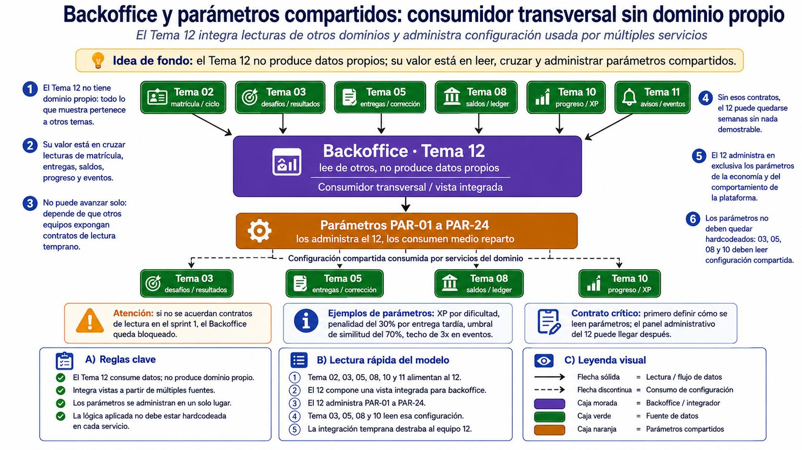

*Lámina 6 — Consumidor transversal sin dominio propio*

> **Idea de fondo:** el Tema 12 no produce datos propios; su valor está en leer, cruzar y administrar parámetros compartidos.

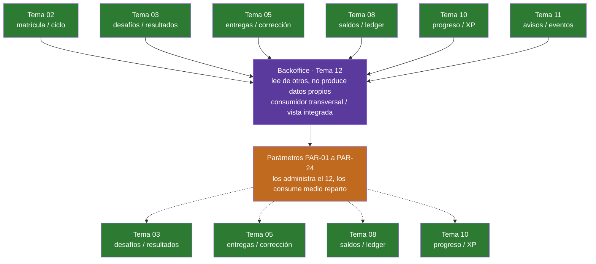

> El 12 **converge** seis fuentes hacia una vista integrada, y luego **diverge** la configuración compartida hacia los cuatro servicios que la aplican.

**Notas al margen de la lámina**

1. El Tema 12 no tiene dominio propio: todo lo que muestra pertenece a otros temas.
2. Su valor está en cruzar lecturas de matrícula, entregas, saldos, progreso y eventos.
3. No puede avanzar solo: depende de que otros equipos expongan contratos de lectura temprano.
4. Sin esos contratos, el 12 puede quedarse semanas sin nada demostrable.
5. El 12 administra en exclusiva los parámetros de la economía y del comportamiento de la plataforma.
6. Los parámetros no deben quedar hardcodeados: 03, 05, 08 y 10 deben leer configuración compartida.

**Cajas de detalle**

- **Atención:** si no se acuerdan contratos de lectura en el sprint 1, el Backoffice queda bloqueado.
- **Ejemplos de parámetros:** XP por dificultad, penalidad del 30 % por entrega tardía, umbral de similitud del 70 %, techo de 3x en eventos.
- **Contrato crítico:** primero definir cómo se leen parámetros; el panel administrativo del 12 puede llegar después.

**A) Reglas clave**

- El Tema 12 consume datos; no produce dominio propio.
- Integra vistas a partir de múltiples fuentes.
- Los parámetros se administran en un solo lugar.
- La lógica aplicada no debe estar hardcodeada en cada servicio.

**B) Lectura rápida del modelo**

1. Tema 02, 03, 05, 08, 10 y 11 alimentan al 12.
2. El 12 compone una vista integrada para *backoffice*.
3. El 12 administra PAR-01 a PAR-24.
4. Tema 03, 05, 08 y 10 leen esa configuración.
5. La integración temprana destraba al equipo 12.

**C) Leyenda visual**

| Elemento | Significado |
|---|---|
| Flecha sólida → | Lectura / flujo de datos |
| Flecha discontinua ⇢ | Consumo de configuración |
| Caja morada | Backoffice / integrador |
| Caja verde | Fuente de datos |
| Caja naranja | Parámetros compartidos |

---

### 4.7 Identidad, pertenencia y autorización

Son dos preguntas distintas con dueños distintos: quién sos y qué rol tenés lo responde el Tema 01; a qué cohorte pertenecés lo responde el Tema 02. Un profesor lo es en la plataforma, pero solo es profesor de esta cohorte si la matrícula lo dice.

Validar no es autorizar. El gateway comprueba que el token sea auténtico y esté vigente; decidir si esta persona puede hacer esta acción es otra cosa, y suele pertenecer al servicio dueño de la regla. Dónde se resuelve la autorización es una decisión de diseño que cada equipo debe justificar.

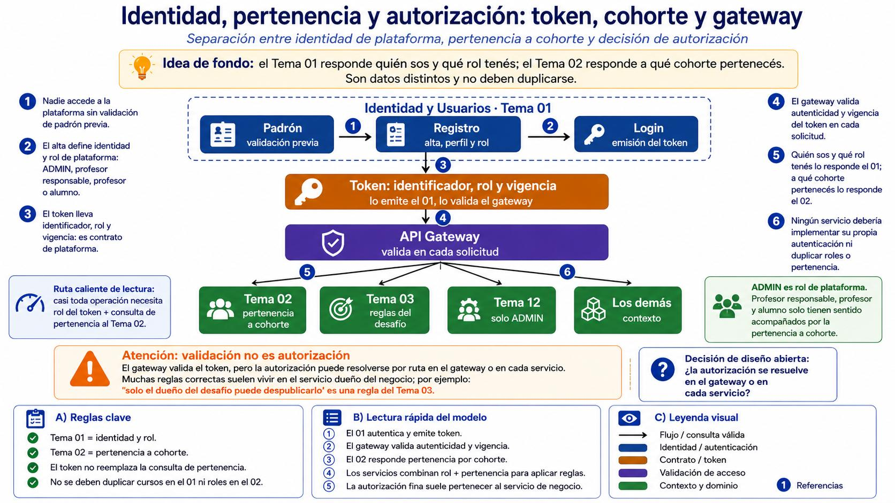

*Lámina 7 — Token, cohorte y decisión de autorización*

> **Idea de fondo:** el Tema 01 responde quién sos y qué rol tenés; el Tema 02 responde a qué cohorte pertenecés. Son datos distintos y no deben duplicarse.

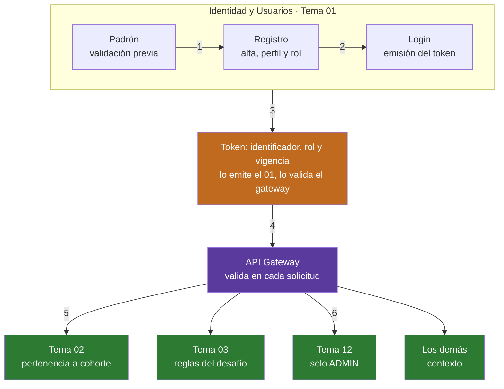

**Dos preguntas, dos dueños**

| Pregunta | Dueño | Dato |
|---|---|---|
| ¿Quién sos y qué rol tenés? | **Tema 01** | Identidad de plataforma: ADMIN, responsable, profesor, alumno |
| ¿A qué cohorte pertenecés? | **Tema 02** | Matrícula |

> **ADMIN es rol de plataforma.** Profesor responsable, profesor y alumno solo tienen sentido acompañados por la pertenencia a cohorte. Un profesor lo es en la plataforma, pero solo es profesor *de esta cohorte* si la matrícula lo dice.

> **Ruta caliente de lectura:** casi toda operación necesita rol del token + consulta de pertenencia al Tema 02.

> [!WARNING]
> **Validación no es autorización.** El gateway valida el token, pero la autorización puede resolverse por ruta en el gateway o en cada servicio. Muchas reglas correctas suelen vivir en el servicio dueño del negocio; por ejemplo: *"solo el dueño del desafío puede despublicarlo"* es una regla del Tema 03.

> [!NOTE]
> **Decisión de diseño abierta:** ¿la autorización se resuelve en el gateway o en cada servicio? Cada equipo debe justificarlo.

**Notas al margen de la lámina**

1. Nadie accede a la plataforma sin validación de padrón previa.
2. El alta define identidad y rol de plataforma: ADMIN, profesor responsable, profesor o alumno.
3. El token lleva identificador, rol y vigencia: es contrato de plataforma.
4. El gateway valida autenticidad y vigencia del token en cada solicitud.
5. Quién sos y qué rol tenés lo responde el 01; a qué cohorte pertenecés lo responde el 02.
6. Ningún servicio debería implementar su propia autenticación ni duplicar roles o pertenencia.

**A) Reglas clave**

- Tema 01 = identidad y rol.
- Tema 02 = pertenencia a cohorte.
- El token no reemplaza la consulta de pertenencia.
- No se deben duplicar cursos en el 01 ni roles en el 02.

**B) Lectura rápida del modelo**

1. El 01 autentica y emite token.
2. El gateway valida autenticidad y vigencia.
3. El 02 responde pertenencia por cohorte.
4. Los servicios combinan rol + pertenencia para aplicar reglas.
5. La autorización fina suele pertenecer al servicio de negocio.

**C) Leyenda visual**

| Elemento | Significado |
|---|---|
| Flecha → | Flujo / consulta válida |
| Caja azul | Identidad / autenticación |
| Caja naranja | Contrato / token |
| Caja morada | Validación de acceso |
| Caja verde | Contexto y dominio |

---

## Aclaración final

El presente documento constituye una **propuesta inicial de trabajo** y no necesariamente representa la solución definitiva del TPI. Su objetivo es brindar un punto de partida común, estableciendo lineamientos, criterios y posibles caminos de análisis para que cada equipo pueda comenzar a desarrollar su propuesta.

A partir de esta base, cada equipo deberá relevar, analizar y validar la información necesaria, evaluar las alternativas planteadas y determinar si corresponde mantener esta propuesta, ajustarla o desarrollar una solución superadora que responda de mejor manera a las necesidades del proyecto.

Asimismo, se deja constancia de que este documento fue elaborado **con asistencia de herramientas de Inteligencia Artificial (IA)**. Por este motivo, algunos procesos, definiciones o propuestas pueden contener imprecisiones, estar incompletos o requerir una mayor profundización.

En consecuencia, el contenido presentado **no debe interpretarse como una especificación cerrada**, sino como material de referencia que deberá ser revisado, cuestionado, validado y enriquecido por los equipos durante el desarrollo del TPI.

---

### Licencia

**Atribución-No Comercial-Sin Derivadas.** Se permite descargar esta obra y compartirla, siempre y cuando no sea modificado y/o alterado su contenido, ni se comercialice. Referenciarlo de la siguiente manera:

> Universidad Tecnológica Nacional Facultad Regional Córdoba (S/D). Material para la Tecnicatura Universitaria en Programación, modalidad virtual, Córdoba, Argentina.
