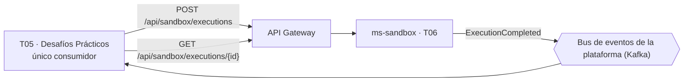
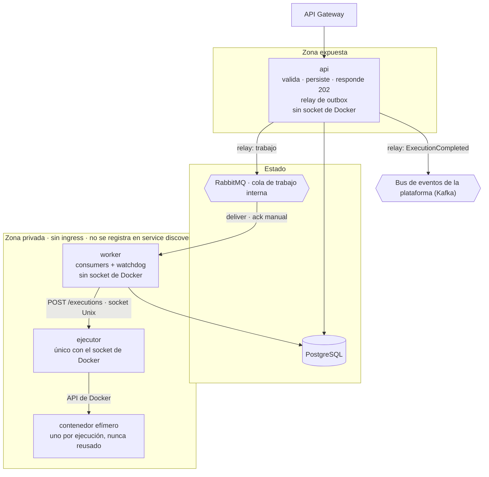
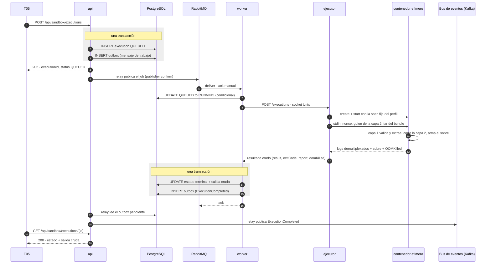
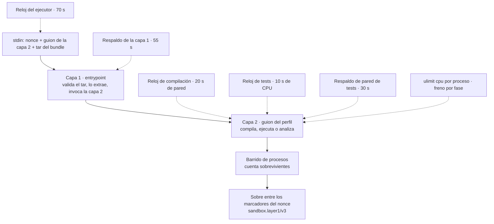
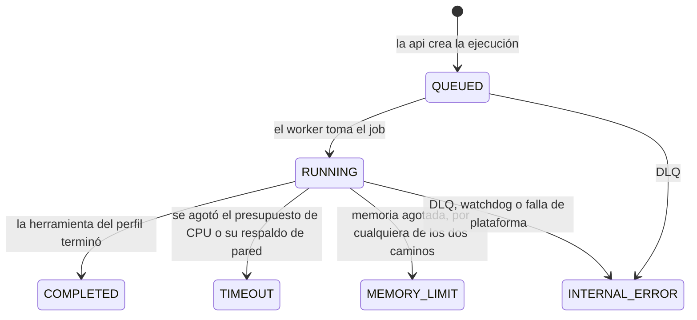

# Arquitectura de `ms-sandbox`

> Vista general con diagramas: contexto con T05, contenedores y zonas de red, secuencia de una
> ejecución, el interior del contenedor efímero y la máquina de estados.

## 1. Contexto

Toda llamada sincrónica de T05 pasa por el Gateway, incluida la de consulta de estado. El aviso de
finalización viaja por el bus de eventos de la plataforma, no por el Gateway: es el camino de lo
asincrónico (`01-contexto.md` §2). No hay ningún otro consumidor del sandbox ni ningún flujo de
veredicto hacia otro servicio: el sandbox no sabe si una entrega aprobó, y por lo tanto no hay
ninguna rama de este diagrama hacia T03 o T10. Detalle del contrato HTTP en `06-api.md` §2 y en
`06-api.openapi.yaml`.

Dos consultas conviven en este contexto y conviene no confundirlas: el `GET` es polling activo —T05
pregunta cuando le conviene—, mientras que `ExecutionCompleted` es el aviso que evita que T05 tenga
que preguntar en bucle. Las dos son necesarias porque el evento solo lleva `executionId` y `status`
(D20): para obtener la salida completa, T05 siempre termina haciendo el `GET`.

## 2. Contenedores y zonas

`api`, `worker` y `ejecutor` son tres módulos separados, cada uno con su propia imagen y su propio
ciclo de vida — no un único artefacto con perfiles conmutables (`05-worker.md` §9). La `api` es lo
único expuesto al Gateway; el worker y el ejecutor viven en una zona privada, sin ingress y sin
registrarse en el descubrimiento de servicios: nadie los llama por nombre. Los contenedores
efímeros de ejecución quedan, además, fuera de cualquier registro — es un punto de seguridad, no
un descuido (`07-patrones.md` §Service Discovery).

**La escalera de privilegios**, la tabla que resume por qué ningún componente acumula las dos
propiedades peligrosas a la vez:

| Componente | ¿Expuesto al Gateway? | ¿Tiene el socket de Docker? |
|---|---|---|
| `api` | Sí | No |
| `worker` | No — consume de la cola de trabajo | No |
| `ejecutor` | No — solo por el socket Unix compartido con el `worker` | Sí, y es el único |

La parte expuesta no tiene poder sobre Docker; la parte con poder sobre Docker no está expuesta.
Es la mitigación central del sidecar (D1, `07-patrones.md` §Sidecar). El estado vive en PostgreSQL
(base propia de `ms-sandbox`) y en RabbitMQ, que acá cumple el rol de cola de trabajo interna —
distinto del bus de eventos de la plataforma, que es Kafka (`01-contexto.md` §4). Detalle del
protocolo worker–ejecutor en `04-ejecutor.md` §2 y §3; detalle de la spec del contenedor efímero en
`03-aislamiento.md` §2.

**Por qué tres módulos y no uno con perfiles conmutables.** La consecuencia de separar `api`,
`worker` y `ejecutor` en tres imágenes independientes es de seguridad, no solo de despliegue:
cuanto más lejos del componente expuesto al Gateway está el privilegio —el socket de Docker—,
menos vías de acceso quedan para llegar a él. Un artefacto único con banderas de perfil comparte el
mismo binario entre la parte expuesta y la privilegiada, y cualquier defecto que permita ejecutar
código arbitrario en la `api` heredaría, en ese diseño, el camino más corto hacia Docker. Con tres
módulos separados, ese defecto en la `api` todavía tiene que atravesar la cola de trabajo y el
socket Unix del ejecutor antes de acercarse al socket de Docker.

El contenedor efímero no es un cuarto módulo del servicio: es el artefacto que el ejecutor crea y
destruye por cada ejecución, con la spec fija de `03-aislamiento.md` §2. No tiene ciclo de vida
propio más allá de una ejecución, y por eso no se dibuja en la misma categoría que `api`, `worker`
y `ejecutor` en el diagrama de arriba.

## 3. Secuencia de una ejecución

Cuatro puntos de este diagrama sostienen las garantías del servicio:

- **La creación de la ejecución y el mensaje de outbox nacen en la misma transacción** (pasos 2–3):
  sin eso, un `POST` que se acepta pero no se encola es un estado alcanzable. Detalle del patrón en
  `06-api.md` §6.
- **El `ack` del worker va después de escribir el resultado** (pasos 12–15): si el worker muere
  antes, el mensaje nunca se confirmó y vuelve solo a la cola. Detalle en `05-worker.md` §6.
- **El worker llega al ejecutor por un socket Unix, nunca por TCP** (paso 7): el cierre abortivo
  del canal por TCP puede truncar `stdin` (D4). Detalle en `04-ejecutor.md` §2.
- **El evento lo publica el relay de la `api`**, no el worker (paso 18): el worker solo inserta la
  fila de outbox; publicar es responsabilidad exclusiva de quien es dueña del esquema (D2).

El diagrama muestra el camino feliz, con `COMPLETED` como resultado del contenedor efímero. Los
demás estados terminales (`TIMEOUT`, `MEMORY_LIMIT`, `INTERNAL_ERROR`) entran por el mismo camino
hasta el paso 11: la diferencia está en qué mapea el worker a partir del resultado crudo que
devuelve el ejecutor, según la tabla de `05-worker.md` §5. Dos publicaciones distintas comparten el
mismo mecanismo de outbox y relay: la del mensaje de trabajo (pasos 3 y 6) y la de
`ExecutionCompleted` (pasos 16 y 18), cada una en la transacción de quien la origina — la `api` y el
worker, respectivamente — y las dos esperando confirmación del broker (*publisher confirm*) antes
de marcarse como publicadas.

## 4. Adentro del contenedor

Los seis relojes, de adentro hacia afuera, cada uno mayor que el que envuelve: el respaldo de
pared de la capa 1 (55 s) supera la suma de compilación y respaldo de tests (20 + 30 s), y el
reloj del ejecutor (70 s) supera al respaldo de la capa 1. El presupuesto real del alumno es solo
el reloj de CPU de los tests; todos los demás son costo de plataforma. El detalle de por qué hacen
falta dos naturalezas de reloj (CPU y pared), la relación entre el `ulimit cpu` por proceso y el
techo agregado, y el esquema completo del sobre `sandbox.layer1/v3` están en `03-aislamiento.md`
§5 y §6.

**La capa 1 es idéntica para los tres perfiles; la capa 2 no.** El diagrama de arriba dibuja una
sola capa 2 porque el protocolo con el que se comunica con la capa 1 —variables de entorno,
directorios del contrato, código de salida— es el mismo sea cual sea el perfil elegido. Lo que
cambia entre `java21-junit`, `java21-pmd` y `java21-checkstyle` es el contenido de ese guion: uno
compila y corre tests, los otros dos corren una herramienta de análisis estático sin ejecutar
código del alumno. Los tres corren bajo el mismo aislamiento porque los tres reciben, de una forma
u otra, un archivo que no escribió el sandbox — código en un caso, reglas de configuración en los
otros dos. El detalle de los tres perfiles y sus roles de bundle está en `03-aislamiento.md` §4.

## 5. Máquina de estados

Los seis estados son técnicos, no de negocio: `COMPLETED` significa que la herramienta del perfil
terminó, cualquiera sea su resultado, no que la entrega aprobó (D23). Cada transición a un estado
terminal —`COMPLETED`, `TIMEOUT`, `MEMORY_LIMIT` o `INTERNAL_ERROR`— emite el evento
`ExecutionCompleted`, incluidas las que no pasan por el camino feliz: el `INTERNAL_ERROR` que marca
el envío a la DLQ y el que marca el watchdog también publican su evento (`05-worker.md` §7). Las
transiciones son condicionales sobre el estado actual de la fila, de forma que una reentrega del
mensaje de trabajo nunca retrocede el estado ni pisa uno terminal (`05-worker.md` §6). El mapeo
completo de cada situación posible al estado que le corresponde está en `05-worker.md` §5.

Quién ejecuta cada transición:

| Transición | Quién la ejecuta |
|---|---|
| `[*] → QUEUED` | La `api`, en la misma transacción en la que inserta el mensaje de trabajo en el outbox |
| `QUEUED → RUNNING` | El worker, con una actualización condicional al tomar el job |
| `QUEUED → INTERNAL_ERROR` | El worker, cuando el mensaje termina en la DLQ sin haber llegado a ejecutarse |
| `RUNNING → COMPLETED / TIMEOUT / MEMORY_LIMIT` | El worker, mapeando el resultado crudo del ejecutor |
| `RUNNING → INTERNAL_ERROR` | El worker, por una falla de plataforma (daemon caído, sobre ilegible), por envío a la DLQ, o por el watchdog ante una ejecución estancada |

No existe una transición que la `api` ejecute después de `QUEUED`: a partir de ahí, toda escritura
de estado es del worker, directamente en la base, sin un canal de resultados de vuelta hacia la
`api` (D24, `05-worker.md` §6).

Estas cinco vistas son complementarias, no alternativas: el contexto (§1) ubica al sandbox en la
plataforma, la topología (§2) muestra la escalera de privilegios, la secuencia (§3) muestra el
orden temporal de las escrituras que sostienen las garantías de entrega, el interior del contenedor
(§4) muestra dónde vive cada reloj, y la máquina de estados (§5) resume a qué estado técnico llega
cada ejecución. Ninguna reemplaza el detalle normativo de `03-aislamiento.md`, `04-ejecutor.md`,
`05-worker.md` y `06-api.md`: esta vista general solo ordena las piezas y apunta a dónde profundizar
cada una.

## Abierto

| # | Pregunta | Quién la cierra |
|---|---|---|
| **A9** | Nombre del topic de `ExecutionCompleted`, formato del sobre, autenticación, particiones y retención del bus | Grupo de notificaciones |
| **A11** | Nombres físicos de la cola de trabajo, el exchange, la routing key y la DLQ | Nosotros |
