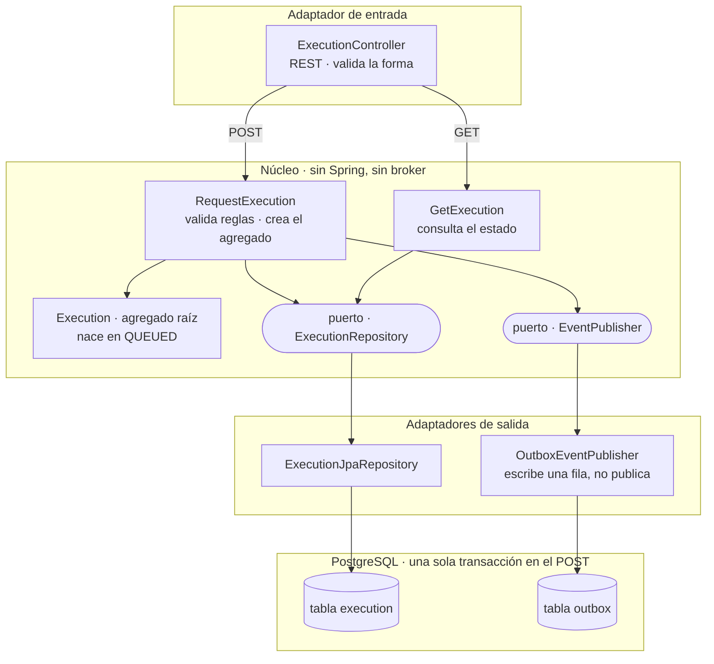
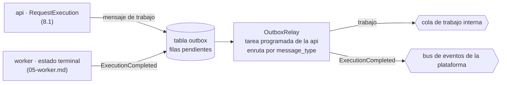

# API de `ms-sandbox`

> Cubre los endpoints, el bundle de entrada, las validaciones y errores, la idempotencia, el
> outbox y su relay, el modelo de datos, las capas internas y la salud del componente `api`. El
> contrato HTTP normativo es [`06-api.openapi.yaml`](./06-api.openapi.yaml); este documento lo
> explica y argumenta las decisiones detrás de cada parte. La `api` se construye desde cero para
> el MVP.

---

## Decisiones

| # | Decisión | Por qué | Descartado |
|---|---|---|---|
| **D2** | El relay del outbox corre solo en la `api` y enruta por tipo de mensaje: el trabajo va a la cola interna y `ExecutionCompleted` al bus de eventos de la plataforma | La `api` es dueña del esquema; el worker inserta filas en el outbox pero no publica | Que el relay corra también en el worker |
| **D14** | Un único documento para la API | Las dos versiones anteriores contaban lo mismo en dos registros distintos y quedaban desalineadas entre sí | Mantener un documento separado para la vista general y otro para el detalle |
| **D20** | El resultado se consulta por polling y se avisa con `ExecutionCompleted`, que lleva solo `executionId` y `status` por el bus de eventos de la plataforma (Kafka) | La salida puede pesar hasta 8 MiB; el aviso tiene que ser chico. El bus lo mantiene el grupo de notificaciones | Que el evento lleve la salida completa |
| **D22** | El sandbox devuelve salida cruda y no emite un resultado de negocio | Ejecutar es dominio del sandbox; interpretar si una entrega es correcta es dominio de T05 | Que la API parsee el reporte y decida si la entrega es correcta |
| **D23** | Seis estados técnicos: `QUEUED`, `RUNNING`, `COMPLETED`, `TIMEOUT`, `MEMORY_LIMIT` e `INTERNAL_ERROR` | Sin estados de negocio: `COMPLETED` significa que la herramienta terminó, no que la entrega es correcta | Estados de negocio (aprobado, desaprobado) calculados por el sandbox |
| **D24** | El worker escribe `RUNNING` y el estado terminal directamente en la base, antes de confirmar el mensaje | Evita un canal de resultados de vuelta hacia la `api`; a cambio, el esquema y sus migraciones son propiedad exclusiva de la `api` | Un endpoint interno de la `api` para que el worker reporte resultados |
| **D25** | Errores en `application/problem+json` (RFC 9457) con la extensión `code` | Ni la cátedra ni T05 fijaron un formato común de error; se adopta el estándar | Un formato de error propio del sandbox |
| **D26** | `429` por cola llena (`QUEUE_FULL`, con `Retry-After`) y por tope de ejecuciones simultáneas del alumno (`STUDENT_LIMIT_EXCEEDED`) | Saturado no es roto: la API rechaza trabajo sin declararse caída | Aceptar entregas sin límite y dejar que el worker se sature |

Estas ocho decisiones son las que le corresponden a la `api` dentro de la tabla única del
[`README.md`](./README.md); D24 se incluye porque, aunque la ejecuta el worker, fija el límite de
lo que el worker puede tocar del esquema que la `api` posee (§7).

---

## 1. Qué hace la API

La `api` es el único componente del sandbox expuesto al Gateway, y por eso es también el único
que no puede tener el socket de Docker: si lo tuviera, cualquier defecto en un endpoint público
sería un camino directo a privilegios sobre el host. Esa restricción no es un detalle de
despliegue, es la razón por la que la `api` tiene exactamente cinco responsabilidades y ninguna
más.

| # | Responsabilidad | Por qué no la puede cumplir otro componente |
|---|---|---|
| 1 | **Ser la puerta** | T05 no conoce al worker ni al ejecutor; lo único del sandbox que ve es esta API, siempre a través del Gateway |
| 2 | **Validar antes de gastar un contenedor** | Es el único punto donde rechazar cuesta microsegundos; una vez que el worker toma el job, ya hay recursos comprometidos |
| 3 | **Aceptar sin ejecutar** | Persistir la ejecución y responder de inmediato es lo que convierte un pico de entregas en espera y no en caída del servicio |
| 4 | **Responder el estado** | El worker no atiende consultas: escribe en la base y sigue. Alguien tiene que leer esa tabla para T05 |
| 5 | **No tener el socket de Docker** | Es una responsabilidad real aunque se cumpla no haciendo nada: es la mitad de la escalera de seguridad del sandbox |

La escalera de seguridad completa se resume en una línea: **la `api` es la parte expuesta pero
sin poder sobre Docker; el ejecutor tiene el poder pero no está expuesto al Gateway.** Ninguno de
los dos componentes tiene las dos cosas a la vez, y esa separación es la mitigación, no un
resultado accidental del despliegue (ver [`04-ejecutor.md`](./04-ejecutor.md) §1).

### Lo que la API deliberadamente no hace

| No hace | Por qué |
|---|---|
| **Ejecutar código** | Un request que ocupa un hilo varios segundos agotaría los hilos disponibles con pocas entregas simultáneas, y el servicio parecería caído estando sano |
| **Tocar el socket de Docker** | Es privilegio sobre el host, y la `api` es lo único expuesto al Gateway (§1 de arriba) |
| **Llamar al worker** | No se conocen entre sí: el worker no se registra en el descubrimiento de servicios. La única vía es la cola de trabajo |
| **Publicar al broker durante el request** | Publicar de forma sincrónica reintroduce el problema de la doble escritura (§6); la `api` escribe en el outbox y se olvida |
| **Interpretar `courseId`** | Viaja y se indexa como correlación, pero el sandbox no tiene dominio de negocio: no sabe qué es un curso |
| **Interpretar la salida cruda** | El sandbox ejecuta; decidir si una entrega es correcta es dominio de T05 (D22) |

---

## 2. Endpoints

| Método | Ruta | Para qué |
|---|---|---|
| `POST` | `/api/sandbox/executions` | Solicita una ejecución. Responde `202` con `executionId`, `status: QUEUED` y `queuePosition` |
| `GET` | `/api/sandbox/executions/{id}` | Consulta estado y salida cruda. `result` solo aparece en estados terminales, con `stdout`, `stderr`, `reports` y `exitCode` — crudos, sin interpretación de negocio |
| `GET` | `/languages` | Devuelve los tres perfiles del catálogo, con los roles de archivo que cada uno exige, si ejecuta código del alumno y sus límites |
| `GET` | `/actuator/health` | `liveness` y `readiness` separados (§9) |

Toda llamada llega siempre a través del API Gateway; no hay comunicación directa entre
microservicios. El detalle normativo de cada endpoint —esquemas de request y response, campos
obligatorios, `x-tbd` pendientes— está en
[`06-api.openapi.yaml`](./06-api.openapi.yaml); esta sección solo resume qué hace cada uno y por
qué.

`GET /languages` existe para que T05 no tenga que codificar de forma fija los perfiles ni sus
límites: el catálogo completo, con sus roles exigidos y sus recursos, se consulta en tiempo de
uso. `GET /actuator/health` no es un endpoint de negocio, pero está expuesto por el mismo motivo
que los demás: separar `liveness` de `readiness` (§9) es lo que le permite al orquestador de
contenedores distinguir un componente saturado de uno realmente caído.

---

## 3. El bundle

El request se basta a sí mismo (HU-01): trae todos los archivos que el perfil elegido necesita, y
la `api` nunca vuelve a preguntarle nada a T05 mientras la ejecución está en curso. Es una función
pura desde el punto de vista de la entrada: mismo bundle, mismo resultado.

Cada archivo del bundle declara un rol explícito —nunca se infiere del nombre—, y el contenido
mínimo exigido depende del perfil:

| `profileId` | Roles exigidos | Contenido mínimo |
|---|---|---|
| `java21-junit` | `solution` (`.java`), `test` (`.java`) | Al menos un archivo `solution` y uno `test` |
| `java21-pmd` | `solution` (`.java`), `config` (`.xml`) | Al menos un archivo `solution` y uno `config` |
| `java21-checkstyle` | `solution` (`.java`), `config` (`.xml`) | Al menos un archivo `solution` y uno `config` |

El request no propone límites de recursos: CPU, memoria y timeouts viven en el perfil elegido, no
en el bundle (D18, [`03-aislamiento.md`](./03-aislamiento.md) §4). Pedir un perfil es elegir de un
catálogo cerrado, no llenar un formulario de recursos.

`studentId` y `courseId` viajan como correlación opaca: la `api` los persiste y los indexa, pero
no valida su dominio contra ningún otro servicio. `studentId` cumple además un segundo rol: es la
clave con la que se cuenta el tope de ejecuciones simultáneas del alumno (§4).

El header `Idempotency-Key` es obligatorio en todo `POST` (§5). El bundle viaja completo en el
request; el sandbox nunca lo obtiene por otra vía. Los tests y las reglas de análisis estático los
provee T05 en cada entrega — el sandbox no los precarga ni los cachea.

---

## 4. Validaciones y errores

La `api` valida en un orden fijo, antes de escribir en la base y antes de crear ningún contenedor. Cada
paso previene un costo concreto y corta el request tan pronto como algo falla:

| Orden | Validación | Qué previene | Código |
|---|---|---|---|
| 0 | Viene el header `Idempotency-Key` | Aceptar una entrega que después no se puede reintentar de forma segura | `422 MISSING_IDEMPOTENCY_KEY` |
| 1 | El `profileId` pertenece al catálogo | Arrancar la validación de un bundle contra un perfil que no existe | `422 UNSUPPORTED_LANGUAGE` |
| 2 | El bundle trae el contenido mínimo del perfil (§3) | Encolar una entrega que nunca va a poder ejecutarse | `400 INCOMPLETE_BUNDLE` |
| 3 | Cada ruta es relativa, sin `..`, sin barra inicial, con la extensión permitida para su rol | Escritura fuera del árbol del bundle al desempaquetar el tar dentro del contenedor | `400 INVALID_PATH` |
| 4 | (solo `java21-junit`) Ningún archivo `solution` declara el paquete reservado de los tests | Que el alumno sombree una clase de soporte del profesor y apruebe sin resolver el ejercicio | `400 RESERVED_PACKAGE` |
| 4b | Si la clave ya existe: mismo contenido devuelve la ejecución original, contenido distinto es conflicto (§5). En los dos casos el request termina acá, sin aplicar los topes de los pasos 5 y 6 | Que el reintento de una entrega ya aceptada reciba `429` por un pico que no es suyo | `202` original o `409 IDEMPOTENCY_CONFLICT` |
| 5 | El alumno no supera su tope de ejecuciones en `QUEUED` o `RUNNING` | Que un solo alumno consuma todos los slots del pool | `429 STUDENT_LIMIT_EXCEEDED` |
| 6 | La cantidad de ejecuciones en `QUEUED` no alcanzó la profundidad máxima de cola | Aceptar trabajo que el pool no va a poder procesar en un tiempo razonable | `429 QUEUE_FULL` + `Retry-After` |

La validación de rutas (paso 3) es explícita en la `api` y nunca se delega al comportamiento del
extractor de tar que corre dentro del contenedor: confiar en que otra herramienta rechace lo que
la `api` dejó pasar es tener la validación en el lugar equivocado, además de dejar la defensa del
lado equivocado del perímetro (fuera del contenedor aislado en vez de en la puerta de entrada).

Los nueve códigos de error estables del contrato:

| Código | Status | Cuándo |
|---|---|---|
| `UNSUPPORTED_LANGUAGE` | `422` | El perfil no pertenece al catálogo |
| `INCOMPLETE_BUNDLE` | `400` | Falta el contenido mínimo del perfil |
| `INVALID_PATH` | `400` | Ruta absoluta, con `..`, o extensión no permitida para su rol |
| `RESERVED_PACKAGE` | `400` | Un archivo `solution` declara el paquete reservado de los tests |
| `MISSING_IDEMPOTENCY_KEY` | `422` | Falta el header `Idempotency-Key` |
| `IDEMPOTENCY_CONFLICT` | `409` | Misma clave, contenido de bundle distinto |
| `QUEUE_FULL` | `429` | Profundidad máxima de cola alcanzada; header `Retry-After` en segundos |
| `STUDENT_LIMIT_EXCEEDED` | `429` | Tope de ejecuciones simultáneas del alumno alcanzado |
| `EXECUTION_NOT_FOUND` | `404` | El `executionId` consultado no existe |

Todos los errores usan `application/problem+json` conforme a RFC 9457, con los campos estándar
(`type`, `title`, `status`, `detail`, `instance`) más la extensión `code` (D25), que es el campo
que T05 usa para decidir qué mostrarle al alumno. Los mensajes de error no exponen detalle interno
de la implementación que pueda usarse para evadir una validación.

---

## 5. Idempotencia

La `Idempotency-Key` es obligatoria en todo `POST /api/sandbox/executions`, con la forma natural
`submissionId:attemptNumber`. Su comportamiento:

| Situación | Respuesta |
|---|---|
| Header ausente | `422 MISSING_IDEMPOTENCY_KEY` |
| Clave repetida, mismo contenido de bundle | `202` con el `executionId` de la ejecución original — reintentar es seguro |
| Clave repetida, contenido de bundle distinto | `409 IDEMPOTENCY_CONFLICT` |

La distinción entre "mismo contenido" y "contenido distinto" se resuelve comparando una huella
(*fingerprint*) del bundle contra la que se persistió con la clave original; el algoritmo concreto
de esa huella queda abierto (§Abierto).

La restricción de unicidad sobre la clave de idempotencia en la base de datos es la última
defensa ante dos requests concurrentes con la misma clave: aunque la validación de aplicación
llegue tarde por una carrera, la base rechaza el segundo `INSERT` y la `api` responde en
consecuencia sin dejar dos filas.

La idempotencia en la entrada es la contraparte obligatoria del outbox transaccional (§6): el
outbox garantiza entrega *at-least-once*, no *exactly-once*, así que sin una clave de idempotencia
en la entrada un reintento de red de T05 dispararía una segunda ejecución y le consumiría un
intento al alumno por un problema de transporte, no de su entrega.

---

## 6. Outbox y relay

### El problema

Aceptar una entrega implica dos escrituras en dos sistemas distintos: anotar la ejecución en
Postgres y avisarle al worker por la cola de trabajo interna. No existe una transacción común
entre ambos sistemas, y cualquier orden que se elija deja una ventana en la que el proceso puede
morir entre una escritura y la otra: si se anota primero, una fila queda `QUEUED` sin que nadie la
tome nunca; si se avisa primero, el worker puede recibir un job cuya fila no llegó a existir. Ese
hueco es una propiedad del problema —la doble escritura, *dual write*— y no un descuido de
implementación: tampoco lo cierra reintentar el aviso, porque el reintento muere con el mismo
proceso que se murió.

### La solución: outbox transaccional

La `api` convierte las dos escrituras en dos lugares en dos escrituras en el mismo lugar: en la
misma transacción de Postgres en la que persiste la ejecución en `QUEUED`, inserta una fila más en
una tabla `outbox`, que es literalmente una bandeja de salida de mensajes pendientes de publicar.
Postgres garantiza que las dos filas se escriben juntas o ninguna se escribe, así que el problema
de la doble escritura desaparece dentro de la base — se traslada a una publicación posterior, que
sí puede fallar y reintentarse sin perder nada, porque la fila sigue ahí.

Un `OutboxPublisher` que en la práctica **no publica**, solo escribe una fila, es lo que mantiene
al caso de uso de negocio ignorante de que existe un broker: pedirle al outbox "publicá el mensaje
de trabajo" termina en un `INSERT`, y que otro proceso lo levante después es un detalle de
infraestructura. Esta escritura tiene que correr en la misma transacción que la del repositorio de
ejecuciones — una anotación de propagación puesta sin pensar en cualquiera de los dos rompe el
patrón entero sin que ningún test que no simule una caída lo detecte.

### El relay

El **relay** es el proceso que lee la tabla `outbox` y publica lo pendiente. Corre solo en la `api`
(D2): la `api` es dueña del esquema, y el worker inserta filas de outbox pero nunca publica nada
por su cuenta (ver [`05-worker.md`](./05-worker.md) §2).

El relay lee con `FOR UPDATE SKIP LOCKED`, ordena por el identificador de la fila (que por eso
tiene que asignarse en orden de inserción) y marca `published_at` solo después de la confirmación
del publicador (*publisher confirm*), nunca al simple retorno de la llamada de envío: un envío
puede volver sin garantizar que el broker realmente lo recibió, y marcar como publicado algo que
el broker pudo haber descartado rompería la garantía.

El relay enruta por tipo de mensaje (`message_type`, ver §7): el mensaje de trabajo va a la cola
interna, y `ExecutionCompleted` —insertado por el worker en la misma transacción del estado
terminal, ver [`05-worker.md`](./05-worker.md) §7— va al bus de eventos de la plataforma.

### Por qué no se pierde nada

El relay puede morir en cualquier punto de su ciclo (leer, publicar, recibir confirmación, marcar
publicado), y en ningún caso se pierde un mensaje: si murió antes de marcar `published_at`, el
próximo ciclo lo vuelve a publicar. La consecuencia es que un mensaje puede publicarse **más de
una vez** — el outbox garantiza entrega *at-least-once*, no *exactly-once* — y ese es exactamente
el motivo por el que la idempotencia en la entrada (§5) y las transiciones condicionales del
worker (`05-worker.md` §6) no son opcionales: son la contraparte obligatoria de esta garantía.

Con el broker caído, la `api` sigue aceptando entregas con `202` y el outbox retiene lo pendiente;
cuando el broker vuelve, el relay publica todo lo acumulado. Ninguna entrega se pierde por una
caída del broker.

### Profundidad de cola y purga

`QUEUE_FULL` se calcula contando las ejecuciones en estado `QUEUED`, **antes** de crear la
ejecución o la fila de outbox — si el tope ya se alcanzó, el `POST` responde `429` sin persistir
nada. La purga de filas de outbox ya publicadas por antigüedad es responsabilidad de la `api`,
porque es quien opera el relay; el valor de retención queda abierto (§Abierto).

---

## 7. Modelo de datos

La `api` es dueña del esquema completo, incluidas sus migraciones. El worker solo puede actualizar
columnas puntuales de la tabla `execution` e insertar filas en `outbox`; no crea migraciones ni
modifica el esquema.

### Flujo transaccional

1. La `api` valida el request sin crear contenedores (§4).
2. En una única transacción, inserta la ejecución en `QUEUED` y su mensaje de outbox.
3. El relay publica el mensaje de trabajo y registra la publicación.
4. El worker cambia `QUEUED` a `RUNNING` mediante una actualización condicional.
5. El worker persiste el estado terminal y la salida cruda en una única actualización condicional,
   e inserta en la misma transacción la fila de outbox del evento `ExecutionCompleted`, antes de
   confirmar el mensaje de trabajo.

### Tabla lógica `execution`

| Campo lógico | Regla |
|---|---|
| `execution_id` | Identificador único devuelto a T05 y usado para correlación interna. Tipo físico: pendiente. |
| `idempotency_key` | Obligatorio y único; representa `submissionId:attemptNumber`. |
| `request_fingerprint` | Huella del contenido usada para distinguir un reintento seguro de `IDEMPOTENCY_CONFLICT`. Algoritmo pendiente. |
| `profile_id` | Uno de `java21-junit`, `java21-pmd` o `java21-checkstyle`. |
| `student_id` | Correlación opaca y clave para contar ejecuciones simultáneas en `QUEUED` o `RUNNING`. |
| `course_id` | Correlación opaca; el sandbox no valida su dominio. |
| `status` | Uno de los seis estados técnicos. |
| `stdout` | Salida estándar cruda, con tope de 65.536 bytes. Representación física pendiente. |
| `stderr` | Salida de error cruda, con tope de 65.536 bytes. Representación física pendiente. |
| `reports` | Reportes crudos de la herramienta; paquete total con tope de 8 MiB. Representación física pendiente. |
| `exit_code` | Código de salida crudo de la herramienta del perfil; nulo cuando la herramienta no llegó a correr. |
| marcas temporales | Deben permitir detectar ejecuciones estancadas y operar el watchdog del worker. Nombres y tipos pendientes. |

Restricciones e índices obligatorios:

- Unicidad de `idempotency_key`, como defensa final ante solicitudes concurrentes (§5).
- Consulta eficiente por `execution_id`, para el polling de `GET /api/sandbox/executions/{id}`.
- Conteo eficiente por `student_id` filtrando `QUEUED` y `RUNNING`, para `STUDENT_LIMIT_EXCEEDED`.
- Conteo eficiente de `QUEUED`, para aplicar `QUEUE_FULL` antes de persistir.
- Las transiciones del worker son condicionales: una reentrega del mensaje de trabajo nunca
  retrocede el estado ni pisa uno terminal.

### Tabla lógica `outbox`

| Campo lógico | Regla |
|---|---|
| `outbox_id` | Orden estable para tomar publicaciones pendientes. Tipo físico pendiente. |
| `execution_id` | Correlación con la ejecución creada en la misma transacción. |
| `message_type` | Distingue el mensaje de trabajo del evento `ExecutionCompleted`; nombres definitivos pendientes. |
| `payload` | Sobre serializado según el contrato de mensajería. |
| `created_at` | Momento de creación. |
| `published_at` | Nulo hasta que el broker confirma la publicación. |

La retención, la purga, la estrategia de bloqueo del relay y la cantidad de reintentos de
publicación no están definidas por las historias de usuario: quedan pendientes (§Abierto).

### Transiciones

```text
QUEUED -> RUNNING -> COMPLETED
                  -> TIMEOUT
                  -> MEMORY_LIMIT
                  -> INTERNAL_ERROR

QUEUED -> INTERNAL_ERROR
```

No existen estados de negocio. En particular, el contenido del reporte no cambia `COMPLETED` a un
estado de éxito o fallo de la entrega: esa interpretación es de T05.

### Permisos del worker

El usuario de base de datos del worker solo puede actualizar las columnas de estado, resultado y
las marcas temporales estrictamente necesarias para esas transiciones, e insertar filas en la
tabla `outbox`. No puede modificar la clave de idempotencia, las correlaciones ni el perfil: esas
columnas son propiedad exclusiva de la `api`.

---

## 8. Capas internas

La `api` se organiza en capas hexagonales, con el núcleo de negocio libre de dependencias de
Spring y sin ninguna noción de que existe un broker.

**Los dos diagramas de esta sección son partes del mismo módulo `api` y del mismo proceso.** Se
dibujan separados porque corren en momentos distintos:

- **8.1, el request:** corre en el hilo HTTP de cada `POST` o `GET` y termina al responder.
- **8.2, el relay:** es una tarea programada del mismo proceso, que corre cada pocos segundos, fuera
  de cualquier request.

Los une la **tabla `outbox`**: el request escribe filas ahí (8.1) y el relay las lee y las publica
(8.2). Ninguno llama al otro. Esa separación es la que permite responder `202` aunque el broker
esté caído.

### 8.1 El request, por capas



En el `POST`, el caso de uso guarda la ejecución y pide "publicar" el mensaje de trabajo. Las dos
escrituras caen en la **misma transacción**: o quedan las dos filas, o ninguna. El `GET` sólo lee la
tabla `execution`.

### 8.2 El relay, fuera del request



Al outbox escriben dos actores: la `api` inserta el mensaje de trabajo (8.1) y el worker inserta
`ExecutionCompleted` en la misma transacción del estado terminal (`05-worker.md`, persistencia del
resultado). El relay es uno solo y vive en la `api` (D2). Toma las filas pendientes, las publica
según su tipo y las marca como publicadas recién con la confirmación del broker (§6).

Dos puntos sostienen que el patrón funcione en la implementación, y los dos son fáciles de romper
sin darse cuenta:

- **El `EventPublisher` no publica.** Es un adaptador que escribe una fila en `outbox`, y ese es
  el detalle que mantiene al caso de uso ignorante de que existe un broker: si el caso de uso
  supiera que hay un relay, el outbox estaría mal implementado.
- **El `OutboxEventPublisher` tiene que correr en la misma transacción que el repositorio.** Es
  una condición de corrección, no de estilo: una anotación que abra una segunda transacción en
  cualquiera de los dos adaptadores rompe el patrón entero, y ningún test que no simule una caída
  lo detecta (§6).

---

## 9. Salud

La distinción entre `liveness` y `readiness` es la que sostiene la diferencia entre "saturado" y
"roto": un servicio saturado que se reporta como caído provoca que el orquestador lo reinicie o lo
desregistre, y la carga se corre a los demás componentes, que se saturan a su vez — cae en cascada
todo el servicio por estar funcionando a pleno.

| Situación | `liveness` | `readiness` | Respuesta al cliente |
|---|---|---|---|
| Proceso vivo, todo bien | `UP` | `UP` | `202` |
| Cola llena | `UP` | `UP` | `429 QUEUE_FULL` + `Retry-After` |
| Base de datos caída | `UP` | `DOWN` | `503` |
| Broker caído | `UP` | `UP` | `202` — el outbox retiene |

La cola llena no es una enfermedad: se responde con `429`, que es información para el cliente, no
con `readiness: DOWN`, que es información para el orquestador. El broker caído tampoco compromete
la disponibilidad: mientras la base de datos responda, la `api` sigue aceptando entregas y
escribiéndolas en el outbox, y el relay las publica todas cuando el broker vuelve.

El chequeo básico verifica que el catálogo de perfiles no esté vacío y que la conectividad con el
motor de contenedores responda; el catálogo vacío o la falta de conectividad con Docker son las
dos condiciones concretas que hacen bajar `readiness` más allá de la base de datos. El ejecutor
tiene su propio `/health`, independiente del de la `api` (ver [`04-ejecutor.md`](./04-ejecutor.md)
§3.4).

Dos métricas vigilan el mismo silencio — una entrega aceptada que nunca se va a ejecutar —:

| Métrica | Qué significa si crece |
|---|---|
| Filas de outbox pendientes | Se están aceptando entregas que no se están publicando: el broker rechaza, o el relay dejó de correr |
| Profundidad de la cola de mensajes fallidos | Hay mensajes que ningún worker pudo procesar |

La ejecución canaria periódica (crear, correr y borrar un job trivial conocido de punta a punta
para alimentar el chequeo de salud) es una mejora identificada, no obligatoria para el alcance
mínimo de esta historia (T-09-08).

---

## Abierto

| # | Pregunta | Quién la cierra |
|---|---|---|
| **A6** | Autenticación servicio a servicio entre T05 y el sandbox a través del Gateway, y autorización de quién puede consultar el estado de una ejecución | T05 y la plataforma |
| **A7** | Formato final del bundle en el request y codificación de los archivos y de los reportes | T05 |
| **A8** | Estabilidad de la clave `Idempotency-Key` entre reintentos de T05 | T05 |
| **A9** | Nombre del topic de `ExecutionCompleted`, formato del sobre, autenticación, particiones y retención del bus de eventos de la plataforma | Grupo de notificaciones |
| **A11** | Nombres físicos de la cola de trabajo, el exchange, la routing key y la cola de mensajes fallidos | Nosotros |
| **D12** | Paquete reservado de los tests del profesor, necesario para `RESERVED_PACKAGE` | T05 |
| — | Cómo se calcula `queuePosition` | Nosotros |
| — | Valor del tope de ejecuciones simultáneas por alumno | Nosotros |
| — | Profundidad máxima de la cola de trabajo | Nosotros |
| — | Algoritmo de la huella (*fingerprint*) de idempotencia | Nosotros |
| — | Nombres JSON definitivos de los límites que expone `GET /languages` | Nosotros |
| — | Política de retención y purga de filas de outbox, y detalle final de la estrategia de bloqueo del relay | Nosotros |

---

## En una frase

La `api` acepta, valida, anota y se olvida: no ejecuta código, no tiene el socket de Docker, y
responde en el orden de milisegundos algo que puede tardar segundos en resolverse. El outbox es lo
que hace que "se olvida" no signifique "lo perdió", y la idempotencia en la entrada es lo que hace
que "se manda al menos una vez" no signifique "se ejecuta más de una vez".

---

**Ver también**
- [`06-api.openapi.yaml`](./06-api.openapi.yaml) — contrato HTTP normativo.
- [`05-worker.md`](./05-worker.md) — la cola de trabajo, la persistencia del resultado y la
  emisión de `ExecutionCompleted` del lado del worker.
- [`03-aislamiento.md`](./03-aislamiento.md) — catálogo de perfiles y sus límites.
- [`04-ejecutor.md`](./04-ejecutor.md) — el sidecar privilegiado, fuera del alcance de este
  documento.
- [`README.md`](./README.md) — tabla única de decisiones y estado de lo abierto.
