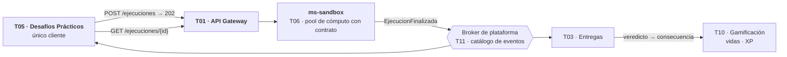
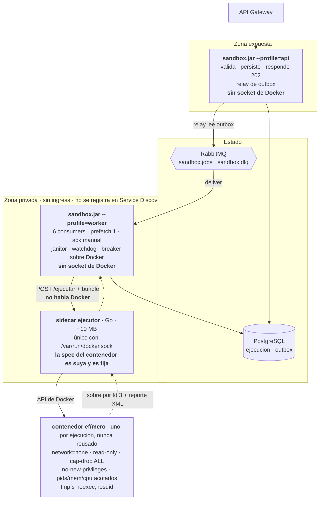
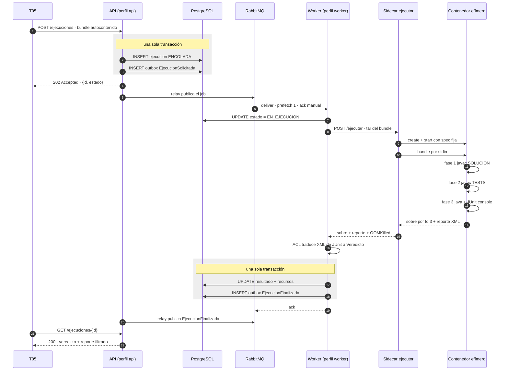
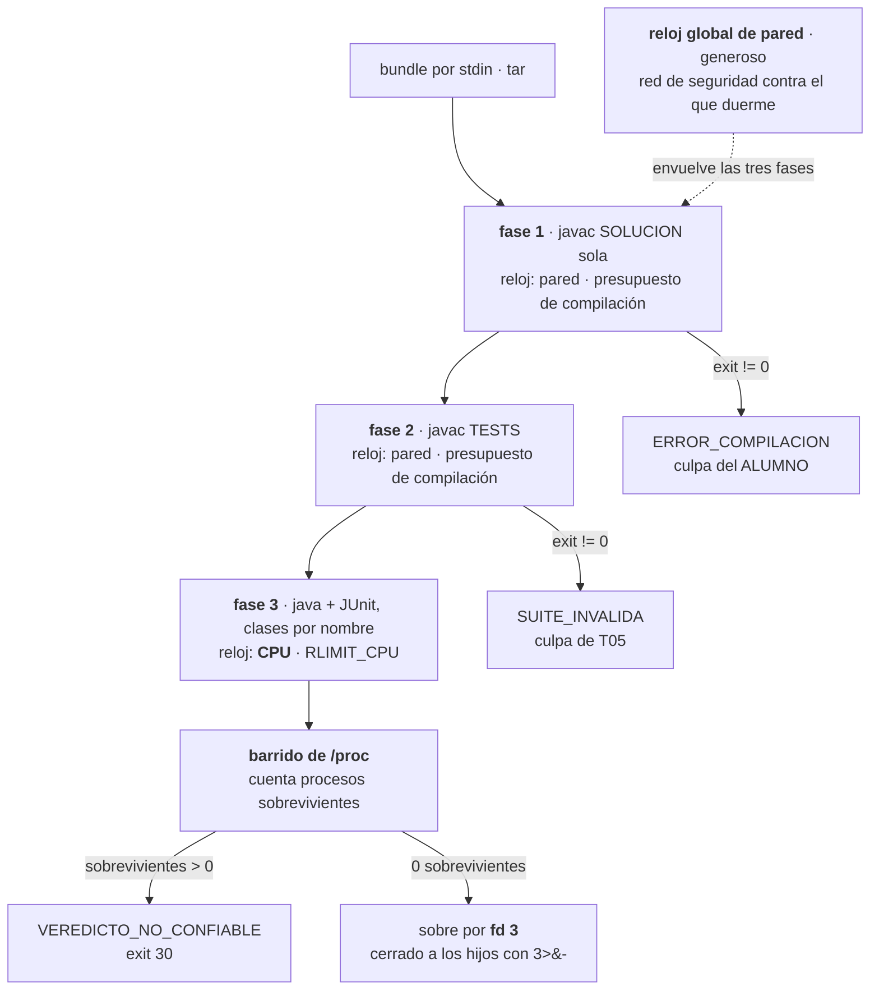
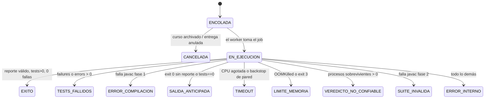
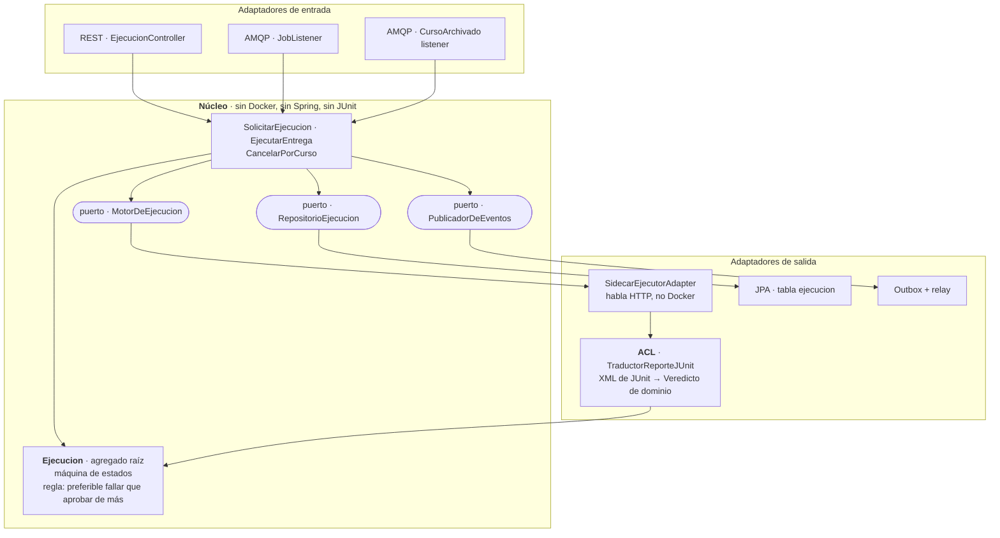

# `ms-sandbox` — La arquitectura en diagramas

> **Tema 06 — Sandbox / Runtime.** Grupo 8, 11 integrantes.
> UTN FRC · Programación 4 + Metodología de Sistemas 2 · TPI 2026.
>
> **Qué es este documento.** Las seis vistas de la arquitectura, dibujadas, más las cuatro
> decisiones que todavía están abiertas. No reemplaza a [`00-propuesta-ms-sandbox.md`](./00-propuesta-ms-sandbox.md)
> —que es el punto de entrada narrativo— sino que le pone las imágenes y separa lo decidido
> de lo que falta acordar.
>
> Dos de las cuatro decisiones abiertas salieron de la **suite de entregas hostiles**
> (`sandbox/runner/suite-hostil.sh`), que se corrió después de escribir los otros documentos.

---

## Índice

1. [Contexto — quién nos habla y a quién le hablamos](#1-contexto)
2. [Contenedores — la topología](#2-contenedores)
3. [Secuencia de una ejecución](#3-secuencia-de-una-ejecución)
4. [Adentro del contenedor efímero](#4-adentro-del-contenedor-efímero)
5. [Máquina de estados](#5-máquina-de-estados)
6. [Capas internas](#6-capas-internas)
7. [Las cuatro decisiones abiertas](#7-las-cuatro-decisiones-abiertas)

---

## 1. Contexto

El encuadre que sostiene todo el diseño, y que conviene decir de entrada en la defensa:

> **`ms-sandbox` no tiene dominio de negocio. Es un pool de cómputo con contrato.**

El `cursoId` viaja en el mensaje y se indexa —hace falta para cancelar en bloque cuando se
archiva un curso— pero **no se interpreta**. No sabemos qué es un curso.

📄 *Detalle: [`00`](./00-propuesta-ms-sandbox.md) §1 y §2 · [`03`](./03-ms-sandbox-ejecucion.md) §2*

---

## 2. Contenedores

### Las cuatro decisiones estructurales que no se tocan

| Decisión | El problema que resuelve |
|---|---|
| **API y worker separados por una cola** | Sin cola: se agotan los threads HTTP, nada limita la concurrencia, los reintentos hacen espiral y un deploy pierde entregas. Con cola, los cuatro son uno solo ya resuelto: *backpressure*. Y es **lo que hace posible el `202`** |
| **Outbox transaccional** | *"Guardé pero no publiqué"* deja de ser un estado alcanzable. En una cascada de seis servicios, ese estado significa que media plataforma no se entera |
| **El worker no toca Docker** | El socket de Docker es la API completa del demonio y **no tiene modelo de autorización**: quien le habla puede montar `/` en un contenedor privilegiado |
| **Un contenedor por ejecución, nunca reusado** | Es lo que hace que el trabajo de un alumno no pueda contaminar el de otro |

### La quinta, que propongo cerrar: el sidecar deja de ser un proxy

[`05`](./05-ms-sandbox-patrones.md) §1 ya trae la evidencia, pero la deja planteada como
*"si igual se decide escribir uno"*. Propongo **promoverla a decisión**.

| | Proxy con lista blanca (`tecnativa`) | **Sidecar ejecutor** |
|---|---|---|
| Qué expone | La API de Docker filtrada por path y método | Un solo `POST /ejecutar` con el bundle |
| `Privileged: true`, `Binds: ["/:/host"]` | **No los filtra** — viajan en el body del `create` | **No se pueden expresar** |
| Clase de bug que hereda | Desincronización de parseo: CVE-2018-16398, CVE-2024-41110, CVE-2026-34040 | Ninguna — no tiene nada que parsear |
| Familia de races de `runc` | Abierta: en general requieren que el atacante controle la spec | **Cerrada por construcción** |
| Costo | 0 líneas propias | ~150 líneas de Go |

El patrón de las tres CVEs se enuncia en una frase:

> **Filtrar el body es un problema de parseo sobre input influido por el atacante, y las tres
> veces falló por lo mismo: el filtro y el demonio no interpretan el mismo byte stream.**
> Un sidecar que no acepta una spec de contenedor no tiene ese problema.

**El intercambio, dicho honestamente:** movemos el riesgo de *"que la lista blanca esté completa"*
a *"que 150 líneas nuestras estén bien"*. Pero esas 150 líneas **no parsean input influido por el
atacante**, y la lista blanca sí. Y encaja con el hallazgo que reordenó el diseño ([`00`](./00-propuesta-ms-sandbox.md) §5):
el riesgo real está en nuestro código de orquestación — razón de más para que ese código sea
chico y auditable de una sentada.

📄 *Detalle: [`04`](./04-ms-sandbox-worker.md) §10 (topología) y §11 (concurrencia) · [`05`](./05-ms-sandbox-patrones.md) §1 (el sidecar, con los CVEs)*

---

## 3. Secuencia de una ejecución

Dos cosas para mirar en este diagrama:

- **El `ack` va último** (paso 19), después de escribir el resultado. Si el worker muere antes,
  el mensaje nunca se confirmó y vuelve a la cola solo. Los jobs zombis no necesitan código.
- **El evento del worker lo publica el relay del perfil `api`** (paso 20). Es un efecto no
  intencionado de dónde quedó el relay — ver [decisión 4](#decisión-4--dónde-corre-el-relay-del-outbox).

📄 *Detalle: [`04`](./04-ms-sandbox-worker.md) §5–§7 · [`03`](./03-ms-sandbox-ejecucion.md) §1.3 y §1.5*

---

## 4. Adentro del contenedor efímero

### Por qué dos pasadas de `javac` y no una

Cuesta medio segundo más, y a cambio separa tres culpas distintas. **Saber de quién es la culpa
vale más que ese medio segundo.**

### Por qué tres relojes

Con un reloj único, **el camino feliz daba `TIMEOUT`**: compilar se comía el presupuesto del
alumno. Y la misma entrega variaba entre 1.8 y 5.2 segundos según qué más estuviera corriendo.
Eso produce `TIMEOUT` intermitentes sobre código correcto — el peor modo de falla posible,
porque no es reproducible y el alumno no puede distinguirlo de un bug suyo.

| Reloj | Qué mide | Para qué |
|---|---|---|
| **Del alumno** | **Tiempo de procesador** | Decide el veredicto `TIMEOUT` |
| De compilación | Tiempo de reloj | Detectar un compilador colgado — es costo de plataforma, no se le cobra al alumno |
| Global | Tiempo de reloj, generoso | Red de seguridad contra un proceso que **duerme** en vez de consumir procesador |

> **El tiempo de procesador no cuenta el tiempo en que el sistema operativo se lo dio a otro.**
> Los `TIMEOUT` intermitentes desaparecen porque **desaparece su causa**, no porque se les
> agregó margen.

### Por qué el barrido de `/proc`, y por qué es detección y no protección

Este es el resultado de la suite hostil, y contradice lo que decíamos antes:

> **El reporte no se puede proteger, solo detectar.**

La idea original —matar los procesos sobrevivientes antes de leer el reporte— **no funciona**.
Un atacante que reescribe el reporte *en bucle* gana siempre, porque matarlo después no deshace
la escritura ya hecha. Verificado con `bundles/hostil-reporte-loop`: la corrida sin defensa
devolvía un `TEST-forjado.xml` con `failures="0"` como único archivo. El alumno se escribía la nota.

Y es **estructural**, no un bug: el reporte vive en `/tmp`, `/tmp` lo escribe el alumno, y
**JUnit corre con el uid del alumno**. Un segundo tmpfs con otro uid tampoco alcanza, porque el
que tiene que escribir el reporte es JUnit, o sea el alumno. Es el mismo límite que encontramos
para Ares: **el contenedor protege el host, no el veredicto** — y el reporte-como-archivo hereda
ese límite.

La solución es invertir la pregunta: para reescribir el reporte *después* de que JUnit lo
escribió, el atacante necesita **un proceso vivo**. Se cuentan los sobrevivientes y si hay
alguno, el veredicto no es confiable y nunca puede ser éxito.

Dos bugs de implementación salieron de esa misma prueba, y los dos valen para la defensa:

- El barrido era `pkill -x java` y **el proceso del ataque es un `sh`**: no matcheaba. Ahora se
  barre por `/proc` sin filtrar por nombre.
- **El fd 3 lo heredaban los hijos del alumno**, que podían escribir un sobre falso. Se cierra
  con `3>&-` antes de lanzar la JVM.

📄 *Detalle: [`03`](./03-ms-sandbox-ejecucion.md) §1.6 (los tropiezos de Java) y §4.3 (los relojes) · `sandbox/runner/README.md`*

---

## 5. Máquina de estados

| Grupo | Estados | ¿Consume vida? |
|---|---|---|
| Aprobación | `EXITO` | No |
| **Culpa del alumno** | `TESTS_FALLIDOS` · `ERROR_COMPILACION` · `TIMEOUT` · `LIMITE_MEMORIA` · `SALIDA_ANTICIPADA` | **Sí** |
| **Evasión** | `VEREDICTO_NO_CONFIABLE` — **nuevo, ver [decisión 1](#decisión-1--veredicto_no_confiable-entra-al-contrato)** | A definir |
| **Culpa nuestra o de T05** | `ERROR_INTERNO` · `SUITE_INVALIDA` | **Nunca** |
| Administrativo | `CANCELADA` | No |

Tres de estos estados existen porque **el veredicto obvio era el equivocado**, y eso lo
descubrimos probando, no diseñando:

- `SALIDA_ANTICIPADA` existe porque `System.exit(0)` sale con código `0` y **aprobaría**.
- `SUITE_INVALIDA` existe porque un error en los tests de T05 se leería como error de
  compilación del alumno, y le consumiría una vida por algo que no escribió.
- `LIMITE_MEMORIA` ganó un segundo camino de detección porque con la JVM bien configurada
  `OOMKilled` queda en `false`: la entrega se clasificaría como falla de infraestructura y el
  alumno tendría **intentos infinitos fugando memoria**.

📄 *Detalle: [`03`](./03-ms-sandbox-ejecucion.md) §5*

---

## 6. Capas internas

> **El ACL es la mejor pieza de DDD del servicio:** impide que el formato de reporte de una
> librería se filtre a la plataforma. Si mañana cambiamos JUnit por otra cosa, cambia una clase.

Y es también donde vive la regla que atraviesa todo el diseño — **es preferible fallar que
aprobar de más** — porque es el único punto del código donde un XML se convierte en una nota.

📄 *Detalle: [`05`](./05-ms-sandbox-patrones.md) §4 (DDD y el ACL)*

---

## 7. Las cuatro decisiones abiertas

### Decisión 1 — `VEREDICTO_NO_CONFIABLE` entra al contrato

**Estado:** ya existe en el runner (exit 30). **No existe** en [`03`](./03-ms-sandbox-ejecucion.md) §5.1
ni en el contrato con T10.

La pregunta fina no es si el estado va —va— sino **si consume vida**:

| | Argumento |
|---|---|
| **A favor de que sí** | Es evasión deliberada, misma familia que `SALIDA_ANTICIPADA`. No cobrarla es invitar a intentarlo: el costo del ataque baja a cero |
| **A favor de que no** | Si un alumno honesto puede dejar un proceso vivo sin querer, le cobramos algo que no hizo — y eso rompe la regla de que el alumno nunca paga por algo que no es suyo |

> **Propuesta: consume vida**, con dos condiciones. Primero, verificar antes con un caso de
> suite honesto que use `Runtime.exec` legítimamente. Segundo, que el mensaje al alumno diga
> exactamente qué se detectó — un veredicto punitivo que no se explica es indefendible.

### Decisión 2 — `TIMEOUT` es uno hacia afuera, dos hacia adentro

El runner ya distingue `TIMEOUT_CPU` de `TIMEOUT_PARED`. El contrato tiene un solo `TIMEOUT`.

> **Propuesta: dejarlo uno solo en el contrato**, con un `subtipo` informativo en el resultado.
> La consecuencia para T10 es idéntica en los dos casos, y dos estados donde alcanza uno le
> agrega superficie al contrato sin comprar nada.

**Nota de implementación que hay que documentar igual:** el doc dice que al agotarse el reloj
de CPU el kernel manda `SIGXCPU` (exit 152). En la práctica **la JVM sale con 137** (`SIGKILL`):
`ulimit -t` deja soft y hard limit iguales, las dos señales llegan juntas y gana la segunda.
Importa porque **137 es ambiguo** — es también el OOM-kill del cgroup. La desambiguación no es
por exit code sino **por la CPU medida**: si el consumo llegó al 95% del presupuesto es
`TIMEOUT`; si no, es una muerte por señal y decide el worker con `.State.OOMKilled`.

### Decisión 3 — El sidecar: ¿proxy o ejecutor?

Es la decisión con más impacto de las cuatro y la que mejor se defiende. La tabla está en
[§2](#la-quinta-que-propongo-cerrar-el-sidecar-deja-de-ser-un-proxy).

> **Propuesta: ejecutor.** Deja de ser *"más código propio a cambio de no depender de la lista
> blanca"* y pasa a ser *"eliminamos por construcción dos clases de vulnerabilidad documentadas:
> el bypass de AuthZ por desincronización de parseo, y la configuración maliciosa de `runc`"*.

### Decisión 4 — Dónde corre el relay del outbox

Hoy el relay corre en el perfil `api` ([`04`](./04-ms-sandbox-worker.md) §10). Consecuencia no
intencionada: el `EjecucionFinalizada` que **escribe el worker** espera al poll de **otro
proceso** para publicarse. En una cascada de seis servicios, esa latencia se paga entera.

> **Propuesta: relay en los dos perfiles**, cada uno publicando lo suyo. Es el mismo mecanismo
> y la misma garantía; solo deja de haber un salto de proceso entre escribir el evento y
> publicarlo.

---

## Qué queda pendiente después de esto

De la lista de [`00`](./00-propuesta-ms-sandbox.md) §10, lo que sigue abierto:

| # | Pendiente | Estado |
|---|---|---|
| 4 | Casos hostiles a nivel **tar**: enlaces simbólicos y duros | Abierto. No se pueden expresar como bundle de directorios porque `run.sh` arma el tar — necesitan un harness que lo fabrique a mano |
| 6 | Cachear la suite de tests compilada por versión de desafío | Abierto. Bloqueado por la definición con T03: ¿una versión publicada es **inmutable**? |
| 7 | La suite hostil corriendo en **CI** | Abierto. La suite existe y pasa; falta el pipeline |
| 8 | Contrato **OpenAPI** y un stub para T05 | Abierto |

Y el pendiente 2 —validar el paquete que declara el alumno— **se resolvió de otra forma**:
`hostil-paquete` reproduce el CVE de Ares (el alumno declara `tp.Ayuda`, clase de soporte del
profesor, para que el test se compare contra su propia respuesta) y **queda contenido por el
orden del classpath**, sin validar paquetes. Validar el paquete sigue siendo deseable como
defensa en profundidad y para dar un `400` temprano, pero **ya no es lo único que separa al
veredicto de ser falso**.
