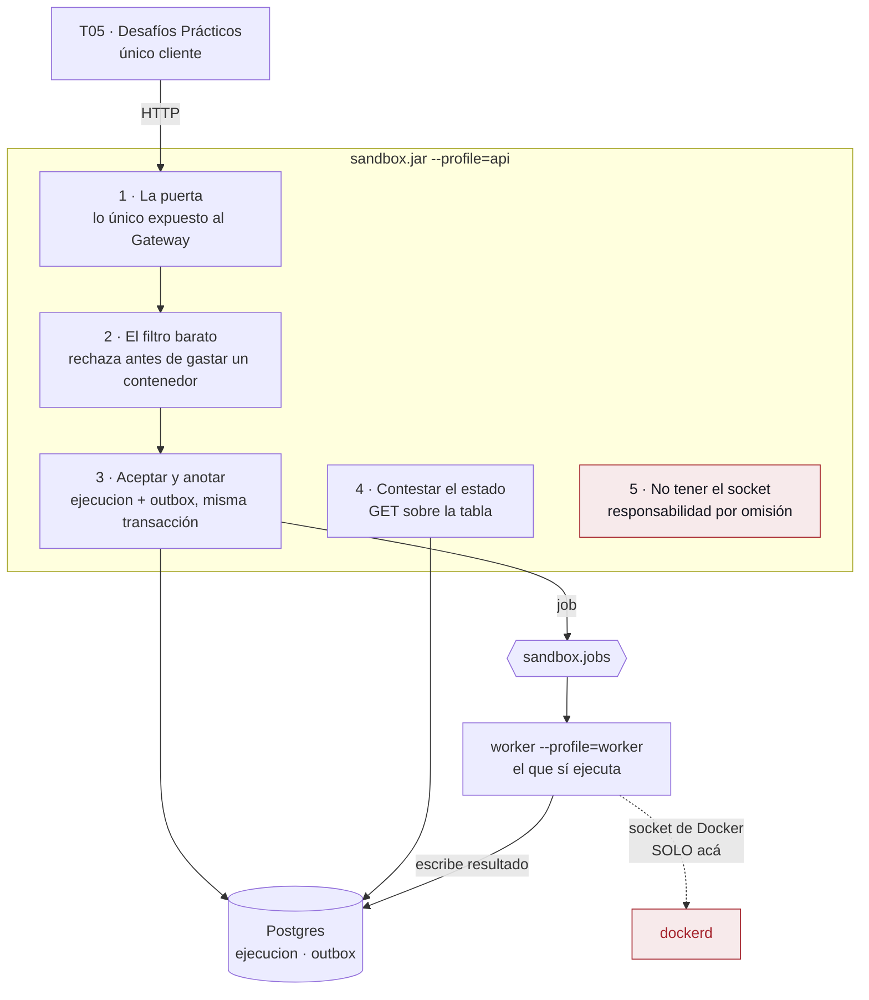
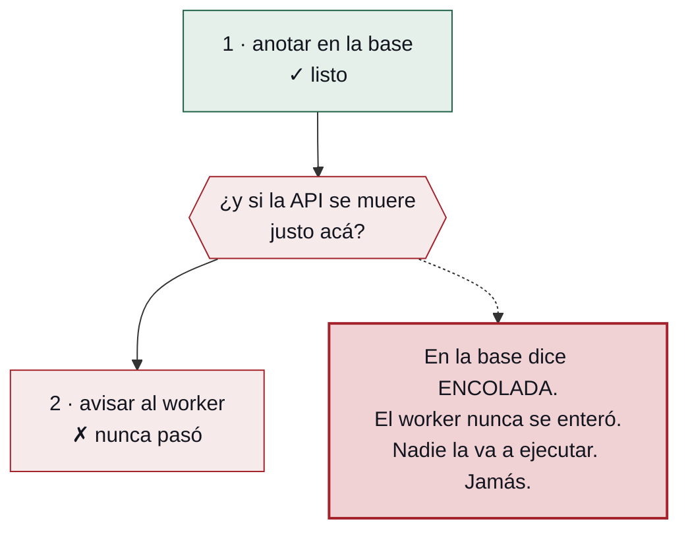
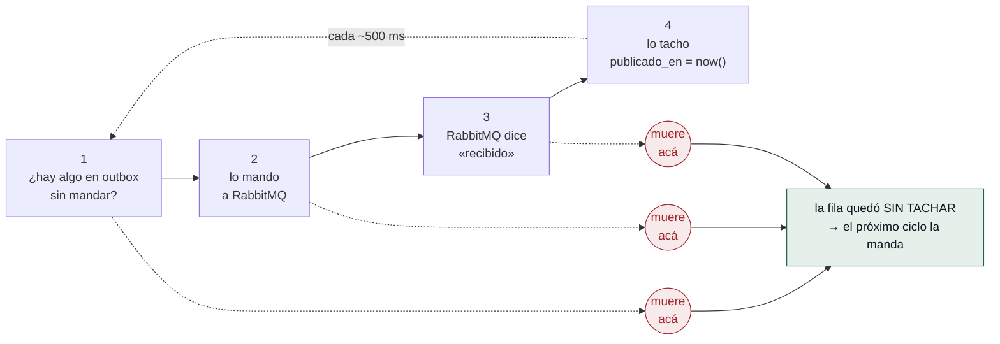
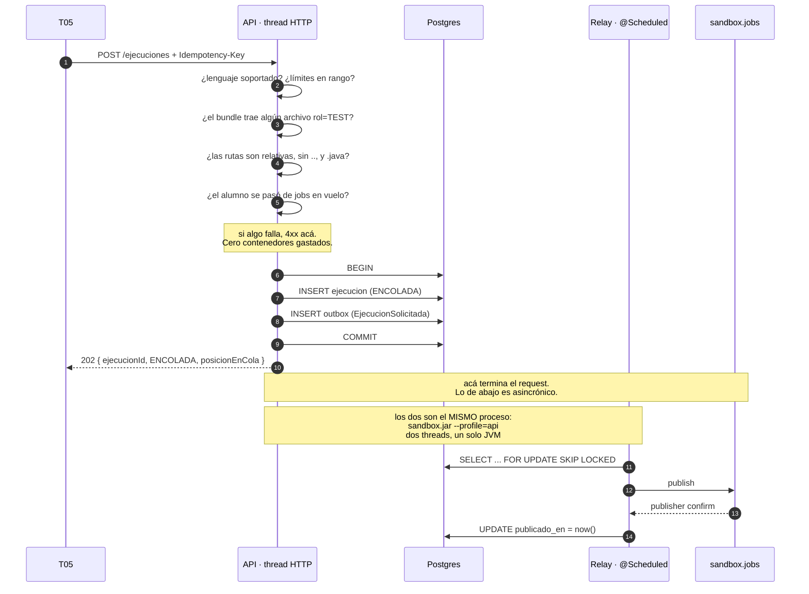
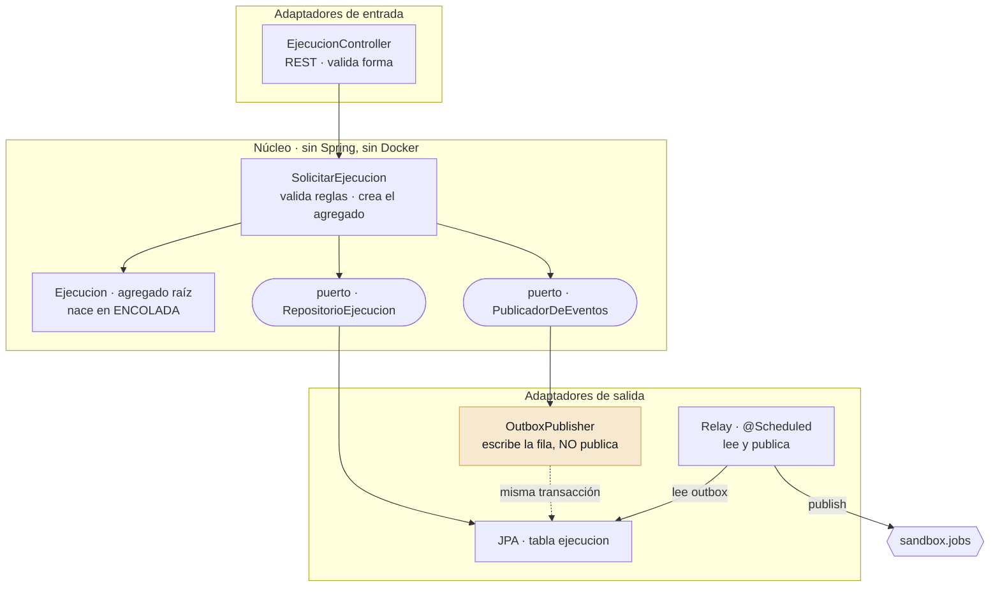

# La API de `ms-sandbox`

> ms-sandbox · T06 / Grupo 8 · 11 integrantes / UTN FRC · TPI 2026

La mitad del servicio que **no ejecuta nada**: de qué se hace cargo la API, por qué no tiene acceso al socket de Docker, y el patrón *outbox* explicado desde cero.

*Propuesta de arquitectura · para discutir*

> **⚠ Falta el catálogo de perfiles.** Esta lámina se regenera a partir de
> [`07-arquitectura-api.md`](./07-arquitectura-api.md), y el documento todavía no incorporó la
> familia de endpoints que trajo el V4 del Grupo 5. El outbox, que es el corazón de la lámina, no
> se mueve. Ver el aviso del `07`.

---

## 01 · El malentendido que hay que sacar de encima

La primera reacción de cualquiera que mira la arquitectura es la misma:

> *«¿Y la API qué hace? Si no ejecuta nada, no toca Docker, no compila, no evalúa… ¿no es un pasamanos?»*

Es una buena pregunta y la respuesta es **no**, pero hay que poder explicar por qué. La analogía que conviene tener a mano en la defensa:

> **La API es la recepción de un taller mecánico.**
>
> Te atiende, mira si el trabajo se puede hacer, te toma el pedido, te da un número y te dice cuándo volver. No arregla nada. Y —esto es lo importante— **no tiene las llaves del taller**.
>
> El worker es el mecánico: está en el fondo, tiene las herramientas, y no atiende al público.

Y la razón por la que la recepción no tiene las llaves no es organizativa. Es que **cualquiera puede entrar a la recepción**.

Esa frase es toda la arquitectura del servicio en una línea, y las cinco responsabilidades de abajo se derivan de ella.

---

## 02 · Las cinco responsabilidades

1. **Ser la puerta** — T05 no conoce al worker. No sabe que existe. Lo único que ve del sandbox es esta API.
2. **Validar y rechazar rápido** — Es el único punto donde rechazar cuesta microsegundos. Después ya hay un contenedor arrancando.
3. **Aceptar sin ejecutar** — Es lo que convierte un pico de 30 entregas en espera y no en caída.
4. **Contestar «¿cómo viene?»** — El worker no atiende a nadie: escribe en la base y sigue. Alguien tiene que leer esa tabla.
5. **No tener el socket de Docker** — Una responsabilidad real, aunque se cumpla no haciendo nada.

**Lámina 1 — Las cinco responsabilidades, y dónde termina cada una**



### La quinta merece su párrafo

Montar el socket de Docker es, en la práctica, **ser root en el host**.

Si la API lo tuviera montado, cualquier bug en cualquiera de sus endpoints —una deserialización mal hecha, un path traversal, lo que sea— sería un camino directo a root en la máquina donde corren los doce microservicios del sistema. Y la API es **lo único expuesto al Gateway**: es exactamente la superficie que un atacante puede tocar.

> **La API es la parte expuesta pero sin poder. El worker tiene el poder pero no está expuesto. Ninguno de los dos tiene las dos cosas.**
>
> Que estén separados **no es una decisión de despliegue: es la mitigación**.

---

## 03 · El outbox, desde cero

Esta sección no da nada por sabido. Es la pieza que más cuesta explicar y la que más se malinterpreta de toda la arquitectura. Primero la definición formal —la que hay que poder decir en la defensa— y después la explicación larga, que es la que se entiende.

### Outbox transaccional · *transactional outbox*

Patrón de integración que vuelve **atómicas** una escritura de negocio en la base de datos y la publicación del mensaje que la anuncia, **sin recurrir a una transacción distribuida**. El servicio inserta el mensaje como una fila más, en una tabla de la misma base y dentro de la misma transacción que la escritura de negocio. Un proceso separado —el *relay*— lee esas filas, las publica en el broker y las marca como enviadas.

| | |
|---|---|
| **Problema** | La **doble escritura** (*dual write*): dos sistemas sin transacción común, con una ventana entre ambas escrituras en la que el proceso puede morir. |
| **Garantía** | **At-least-once.** No *exactly-once*: exige idempotencia en el consumidor. |
| **Piezas** | Tabla `outbox` + *relay*. Acá el relay es un **polling publisher** (consulta periódica); la alternativa es **transaction log tailing**, leer el WAL de la base con Debezium. |
| **Contraparte** | Clave de idempotencia en el consumidor —acá `uq_ejecucion_idem`— y *publisher confirms* en el productor. |
| **Catálogo** | Chris Richardson, *microservices.io* — patrones *Transactional outbox* y *Polling publisher*. |

Todo lo que sigue es esa definición, desarmada.

### 3.1 · El problema, contado como una historia

Un alumno entrega su código. La API tiene que hacer **dos cosas**: anotar en la base que existe la ejecución `4f2a` en estado `ENCOLADA`, y avisarle al worker por RabbitMQ para que la ejecute.

El problema es que son **dos lugares distintos**: uno es Postgres, el otro es RabbitMQ. Y no hay forma de hacer las dos cosas «de una». Siempre hacés una, y después la otra.

**Lámina 2 — El hueco entre las dos escrituras — la falla que el outbox viene a cerrar**



El alumno ve *«tu entrega está en cola»*. Y espera. Y espera. Y no pasa nada.

Y nadie se entera de que algo se rompió, **porque desde afuera todo parece normal**. Esa es la peor clase de falla: silenciosa e irrecuperable.

### 3.2 · «¿Y si lo hago al revés?»

Es el primer reflejo de todos. No funciona:

| Orden | Si se muere en el medio |
|---|---|
| anotar → avisar | Fila `ENCOLADA` sin mensaje. **Nadie la ejecuta** |
| avisar → anotar | El worker recibe «ejecutá la `4f2a`» y en la base no hay ninguna `4f2a` |
| reintentar el aviso | Solo achica el hueco. Si el proceso muere, el reintento muere con él |

> **No existe un orden que funcione.** Siempre queda un huequito entre las dos cosas, y en ese huequito te podés morir. Es una propiedad del problema, no un descuido de implementación.

*Sí existe la transacción distribuida de dos fases —2PC— que sería la respuesta «de libro». No se usa: RabbitMQ no la soporta, necesita un coordinador con estado que se vuelve un punto único de falla, y bloquea recursos en un endpoint que tiene que responder en 5 ms. Y sobre todo: el problema no pide atomicidad, pide entrega garantizada. Son cosas distintas, y la segunda es mucho más barata.*

### 3.3 · La solución: dejá la carta en el buzón

La idea del outbox es medio tramposa:

> **Si no puedo hacer atómicas dos cosas en dos lugares, hago que sean dos cosas en el mismo lugar.**

La API, en vez de *anotar y avisar*, hace **las dos anotaciones en la misma base**. Con Spring Data JPA son dos `save()` bajo un mismo `@Transactional`:

```java
@Service
class SolicitarEjecucion {

    private final EjecucionRepository ejecuciones;   // JpaRepository<Ejecucion, UUID>
    private final OutboxRepository    outbox;        // JpaRepository<MensajeOutbox, Long>

    @Transactional                                    // una sola transacción para las dos escrituras
    UUID solicitar(SolicitudEjecucion cmd) {

        var ejecucion = Ejecucion.encolar(cmd);        // el agregado nace en ENCOLADA
        ejecuciones.save(ejecucion);

        outbox.save(MensajeOutbox.de(
                "EjecucionSolicitada",
                "sandbox.jobs",
                EjecucionSolicitada.desde(ejecucion)));

        return ejecucion.getId();                      // flush + COMMIT al salir del método
    }
}
```

Que el `COMMIT` ocurra al salir del método —y no en cada `save()`— es justamente lo que hace falta: hasta ese momento las dos filas son una sola unidad. Si la segunda escritura explota, la primera se va con ella.

La entidad del buzón no tiene nada de especial, y ahí está la gracia: es una tabla más:

```java
@Entity @Table(name = "outbox")
class MensajeOutbox {

    @Id @GeneratedValue(strategy = GenerationType.IDENTITY)   // BIGSERIAL
    private Long id;

    private String  tipo;          // EjecucionSolicitada | EjecucionFinalizada
    private String  routingKey;
    private UUID    correlationId;

    @JdbcTypeCode(SqlTypes.JSON)
    private String  payload;

    private Instant creadoEn;
    private Instant publicadoEn;   // null = pendiente. Es todo el estado que hay.
}
```

La tabla `outbox` es literalmente **una bandeja de salida**: la lista de «mensajes que hay que mandar y todavía no mandé». Como el buzón de tu casa — dejás la carta ahí y el cartero después la lleva.

Y esto **sí es atómico**, porque es una sola transacción. Postgres garantiza que o se escriben las dos filas o no se escribe ninguna. El problema de 3.1 desaparece. Y acá la API responde y se olvida: **nunca habla con RabbitMQ durante el request**.

#### Dos trampas de JPA que rompen el patrón sin hacer ruido

| Si escribís… | Qué pasa |
|---|---|
| `@Transactional(propagation = REQUIRES_NEW)` en cualquiera de los dos `save()` | Se abre una **segunda transacción** y vuelven a ser dos escrituras independientes: el patrón queda escrito pero no aplica. Y **no lo detecta ningún test que no simule la caída** |
| `GenerationType.SEQUENCE` con `allocationSize > 1` | Hibernate pre-asigna ids en bloques por sesión, así que **el orden del `id` deja de ser el orden de inserción** — y el relay publica `ORDER BY id`. Con `IDENTITY` el id lo asigna Postgres al insertar y el orden se sostiene |

`IDENTITY` tiene un costo conocido: obliga a Hibernate a ir a la base en cada `save()` y deshabilita el *batch insert*. Acá no importa —es una fila por entrega— y a cambio compra la garantía de orden, que sí importa.

### 3.4 · El cartero: el relay

Falta que alguien lleve la carta. Ese es el **relay**, un pedacito de código que corre en loop. Cuatro pasos, nada más:

> **El relay no es otro servicio: es un bean con `@Scheduled` adentro del mismo proceso que la API.**
>
> Un solo `java -jar sandbox.jar --profile=api` levanta las dos cosas: los threads de Tomcat que atienden requests, y un thread más que cada ~500 ms mira el buzón. **Es un thread aparte, no un proceso aparte.**
>
> En los diagramas aparece como actor propio porque es asincrónico *respecto del request* —los cuatro pasos ocurren después del `202`—, no porque sea un despliegue separado.

**Lámina 3 — El relay — y los tres puntos donde se puede morir sin perder nada**



### 3.5 · Por qué esto no pierde nada, nunca

Preguntate: **¿qué pasa si el relay se muere en el medio?**

| Se muere entre | La fila quedó | Qué pasa |
|---|---|---|
| 1 y 2 | sin tachar | El próximo ciclo la manda |
| 2 y 3 | sin tachar | El próximo ciclo la manda |
| 3 y 4 | sin tachar | El próximo ciclo la manda **otra vez** |

Miralo bien: **no hay ningún caso en que el mensaje se pierda.** El peor caso es que se mande **dos veces**. Y ese es el negocio completo del patrón:

| | Sin outbox | Con outbox |
|---|---|---|
| Lo peor que puede pasar | **El mensaje se pierde** | El mensaje se manda dos veces |
| ¿Te enterás? | No. Silencio total | No hace falta |
| ¿Se arregla? | Imposible | Sí, y es fácil |

> **Cambiaste un problema imposible de arreglar por uno fácil. Eso es todo el patrón.**

### 3.6 · El precio: duplicados

Hay que decirlo antes de que te lo digan en la defensa: **el outbox no garantiza que el mensaje llegue exactamente una vez. Garantiza que llegue al menos una vez, y traslada el problema del duplicado al que lo recibe.**

Los duplicados entran por dos puertas: el relay que republica, y el broker que re-entrega un mensaje que un worker muerto nunca confirmó. Por eso el diseño tiene dos defensas, que son la contraparte obligatoria del outbox:

```sql
CONSTRAINT uq_ejecucion_idem UNIQUE (idempotency_key)   -- entregaId:intentoNro
```

**En la entrada**, esa clave única: si llega el mismo job dos veces, el segundo choca y se descarta — Postgres hace de portero. **En la salida**, el *guard* del worker: escribe el resultado solo si la fila sigue en `EN_EJECUCION`; el que llegó tarde descarta lo suyo.

> **La cadena, para tenerla de memoria:** outbox → al menos una vez → idempotencia obligatoria en el consumidor.
>
> Si en la defensa alguien dice *«entonces puede ejecutar dos veces»*, la respuesta no es «no». Es **«sí, y por eso existe `uq_ejecucion_idem`»**.

<details>
<summary><b>La letra chica del relay — tres detalles que no están en ningún otro documento</b></summary>

#### La query lleva FOR UPDATE SKIP LOCKED

```sql
SELECT id, tipo, routing_key, payload
  FROM outbox
 WHERE publicado_en IS NULL
 ORDER BY id
 LIMIT 100
   FOR UPDATE SKIP LOCKED;
```

Y no es una precaución por si algún día hay dos relays. **Como el relay vive dentro del proceso de la API, cada réplica de la API trae el suyo**: la segunda réplica ya son dos relays leyendo la misma tabla. Sin `SKIP LOCKED` publican todo duplicado desde el primer minuto — y de forma sistemática, no como carrera ocasional.

Con `SKIP LOCKED`, el segundo saltea las filas que el primero ya bloqueó y agarra las que siguen. **Postgres hace de coordinador** — sin elección de líder, sin Zookeeper, sin nada.

En Spring Data se declara así, y el `-2` no es un número mágico cualquiera: es la constante `LockOptions.SKIP_LOCKED` de Hibernate.

```java
public interface OutboxRepository extends JpaRepository<MensajeOutbox, Long> {

    @Lock(LockModeType.PESSIMISTIC_WRITE)
    @QueryHints(@QueryHint(name = "jakarta.persistence.lock.timeout", value = "-2"))
    @Query("select m from MensajeOutbox m where m.publicadoEn is null order by m.id")
    List<MensajeOutbox> tomarPendientes(Pageable pagina);
}
```

`ORDER BY id` es la razón de que el id sea `BIGSERIAL` y no UUID: el relay publica en orden de inserción, y un UUID aleatorio no ordena nada. Y el índice es **parcial** (`WHERE publicado_en IS NULL`), así que contiene solo lo pendiente —cero o dos filas en régimen normal— aunque la tabla tenga un millón de filas históricas.

#### El paso 3 es un publisher confirm, no el retorno del send

```yaml
spring:
  rabbitmq:
    publisher-confirm-type: correlated
    publisher-returns: true
```

`convertAndSend()` retorna sin garantizar nada. Marcar `publicado_en` ahí es marcar como publicado algo que el broker puede haber tirado. El *confirm* es la única señal honesta. Y `publisher-returns` cubre el otro agujero: un mensaje con la routing key mal escrita el broker lo **acepta y lo descarta**, con confirm positivo.

#### El poll suma latencia, y se arregla con un empujón

Un `@Scheduled(fixedDelay = 500)` le agrega hasta medio segundo a cada entrega. Se corrige despertando al relay apenas commitea la transacción, con un `TransactionSynchronization.afterCommit()`.

**El empujón es una optimización, no el mecanismo.** Si se pierde, el poll periódico levanta la fila igual. La corrección sigue viviendo entera en la tabla.

</details>

### 3.7 · Una tabla, dos usos

El argumento más económico a favor del patrón, y conviene tenerlo listo porque el outbox parece infraestructura de más:

| Quién escribe | tipo | Junto con qué escritura | Para quién |
|---|---|---|---|
| **API** | `EjecucionSolicitada` | `INSERT INTO ejecucion (ENCOLADA)` | El worker |
| **Worker** | `EjecucionFinalizada` | `UPDATE ejecucion SET estado, resultado` | T05, T03, y quien se suscriba |

Es **el mismo problema en las dos puntas**: una escritura de negocio en Postgres que tiene que ir acompañada de una publicación al broker, sin transacción común. Una tabla, un mecanismo, dos usos.

---

## 04 · Anatomía de los 5 milisegundos

Todo lo que pasa entre que T05 hace el `POST` y recibe el `202`:

**Lámina 4 — El request completo, y la línea donde deja de ser sincrónico**



> **`202`, no `200`.** El código significa exactamente *«lo recibí, todavía no lo hice»*. Es la respuesta honesta, y es la única compatible con que la ejecución tarde 5 segundos.

### Las validaciones no son burocracia

Cada una evita un costo concreto:

| Validación | Qué evita | Código |
|---|---|---|
| Lenguaje / límites | Arrancar un contenedor para nada | 422 |
| Bundle sin `rol: TEST` | Ejecutar algo que no tiene contra qué compararse | 400 |
| Ruta absoluta o con `..` | **Escritura fuera del árbol del bundle** al desempaquetar el tar | 400 |
| Paquete reservado | Que el alumno sombree una clase del profesor y apruebe sin resolver nada | 400 |
| Tope de jobs por alumno | Que uno solo se coma los seis slots del pool | 429 |
| Cola llena | Aceptar trabajo que no se va a poder hacer | 429 |

> **`RUTA_INVALIDA` no existe hoy y hace falta.** Salió de correr el prototipo: la validación se estaba apoyando, sin saberlo, en que el desempaquetador de tar rechazara lo que la API dejó pasar. Depender de eso es depender de un detalle de implementación de otra herramienta.

---

## 05 · El contrato y las capas

| Método | Ruta | Para qué |
|---|---|---|
| POST | `/ejecuciones` | Encolar. Devuelve `202` |
| GET | `/ejecuciones/{id}` | Estado y resultado |
| POST | `/ejecuciones/{id}/cancelar` | Cancelar si todavía no arrancó |
| GET | `/ejecuciones/{id}/artefactos` | Artefactos guardados (*extra* del tema) |
| GET | `/lenguajes` | Lenguajes y límites — para que T05 no hardcodee nada |
| GET | `/actuator/health` | `liveness` / `readiness` separados |

Errores en `application/problem+json` (RFC 7807), con códigos estables: `LENGUAJE_NO_SOPORTADO`, `LIMITES_FUERA_DE_RANGO`, `BUNDLE_SIN_TESTS`, `RUTA_INVALIDA`, `PAQUETE_RESERVADO`, `SUITE_VERSION_DESCONOCIDA`, `IDEMPOTENCY_KEY_AUSENTE`, `IDEMPOTENCY_CONFLICTO`, `COLA_LLENA`, `TOPE_ALUMNO_EXCEDIDO`, `EJECUCION_INEXISTENTE`, `EJECUCION_NO_CANCELABLE`.

**Lámina 5 — Las capas — y el adaptador que miente sobre su nombre**



> **El PublicadorDeEventos no publica. Escribe una fila.**
>
> Es un adaptador que miente deliberadamente sobre su nombre, y esa mentira es lo que mantiene al caso de uso ignorante de que existe un broker. El caso de uso dice *«publicá `EjecucionSolicitada`»* y termina; que eso sea un `INSERT` que otro proceso levanta medio segundo después es un detalle de infraestructura. **Si el caso de uso supiera del relay, el outbox estaría mal implementado.**

Y el `OutboxPublisher` tiene que correr **en la misma transacción** que el repositorio. Es una condición de corrección, no de estilo: un `@Transactional(REQUIRES_NEW)` puesto sin pensar en cualquiera de los dos rompe el patrón entero, y no lo detecta ningún test que no simule la caída.

---

## 06 · Salud: saturado ≠ enfermo

La distinción `liveness` / `readiness`, que en un CRUD es casi decorativa, acá importa de verdad.

| Situación | liveness | readiness | Respuesta al cliente |
|---|---|---|---|
| Proceso vivo, todo bien | UP | UP | `202` |
| **Cola llena** | UP | UP | `429` + `Retry-After` |
| Postgres caído | UP | DOWN | `503` |
| **Broker caído** | UP | UP | `202` — el outbox retiene |

Las dos filas marcadas son el punto entero de la sección.

**La cola llena no es una enfermedad.** Es el error que casi todos cometen: si un servicio saturado reporta DOWN y se desregistra, la carga se corre a los demás, que se saturan, se desregistran, y **cae en cascada todo el servicio por estar funcionando a full**. Saturado se responde con `429`, que es información para el cliente; no con DOWN, que es información para el orquestador.

> **El broker caído tampoco tumba la API**, y esa es la propiedad más linda que regala el outbox: si RabbitMQ está abajo, la API sigue aceptando entregas y escribiéndolas en el buzón. Cuando el broker vuelve, el relay las publica todas. **Cero entregas perdidas con el broker caído** — es, literalmente, la prueba que justifica el patrón.

Lo que sí hay que vigilar es el buzón:

| Métrica | Qué significa si crece |
|---|---|
| `sandbox_outbox_pendientes` | Se están aceptando entregas que **no se están encolando**. El broker rechaza, o el relay murió |
| profundidad de `sandbox.dlq` | Hay mensajes que ningún worker pudo procesar |

Las dos vigilan **el mismo silencio**: una entrega aceptada que nunca se va a ejecutar. Sin ellas, ese modo de falla es invisible hasta que un alumno reclama.

---

## 07 · Lo que la API deliberadamente NO hace

Tan importante como la lista de responsabilidades, y más fácil de defender:

| No hace | Por qué |
|---|---|
| **Ejecutar código** | Un request que ocupa un thread 10 segundos: con 30 entregas simultáneas no quedan threads ni para responder `/health`. **El servicio parece caído estando perfecto** |
| **Tocar el socket de Docker** | Es root en el host, y la API es lo único expuesto |
| **Llamar al worker** | No se conocen ni por nombre. El worker no se registra en el Service Discovery. La única vía es la cola |
| **Publicar al broker durante el request** | Si lo hiciera, volvería el problema de 3.1. Escribe en el buzón y se olvida |
| **Interpretar el `cursoId`** | Viaja y se indexa —hace falta para cancelar en bloque cuando se archiva un curso— pero **no sabemos qué es un curso**. `ms-sandbox` no tiene dominio de negocio |
| **Decidir qué test es oculto** | Eso lo dice T05 en el request. La API aplica la marca, no la inventa |

---

## 08 · Lo que falta decidir

### El relay corre solo en el perfil `api`

Consecuencia no intencionada: el `EjecucionFinalizada` que escribe el **worker** espera a que lo levante el poll de **otro proceso**. Funciona —el outbox garantiza que sale igual— pero le mete un salto de proceso a la notificación de resultados, y la ata a que la API esté viva.

> **Propuesta: relay en los dos perfiles.** Con `FOR UPDATE SKIP LOCKED` los dos pueden leer la misma tabla sin pisarse, así que no cuesta nada.
>
> Y es más chico de lo que suena: **no hay nada nuevo que desplegar**. El relay es un bean del mismo jar; hoy está limitado con `@Profile("api")` y pasaría a estar activo también en `worker`. Es una anotación.

### `RUTA_INVALIDA` no está implementada

Hoy la validación de rutas no existe en la API. De ella dependen dos de los diez casos de la suite hostil. **Es lo más barato de todo lo que queda pendiente.**

### El contrato OpenAPI y el stub para T05

Sin un stub (WireMock o un perfil `fake`), T05 no puede avanzar hasta que la implementación real exista.

### `VEREDICTO_NO_CONFIABLE` no está en el contrato

El runner ya lo devuelve (exit 30); la API no lo sabe expresar. La pregunta fina no es si el estado va —va— sino **si consume vida**.

---

> La API acepta, valida, anota y se olvida. No ejecuta nada, no tiene las llaves de Docker, y responde en 5 milisegundos algo que va a tardar 5 segundos. El buzón es lo que hace que «me olvido» no signifique «lo perdí».

---

*Documento fuente: `docs/arquitectura/07-arquitectura-api.md` · Complementa: 03 contrato · 04 worker · 05 patrones · 06 diagramas*
