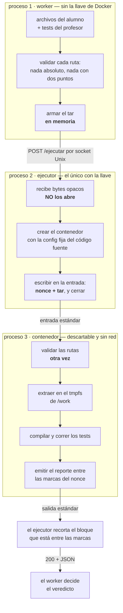

# Del worker al ejecutor, explicado

> **Tema 06 — Sandbox / Runtime.** Grupo 8, 11 integrantes.
> UTN FRC · Programación 4 + Metodología de Sistemas 2 · TPI 2026.
>
> **Para quién es este documento.** Para cualquiera del grupo, sin importar si va a tocar
> este código. No da por sabido nada: cada término técnico está definido la primera vez que
> aparece, y todos están juntos en el [glosario](#glosario) del final.
>
> **Qué explica.** Cómo se hablan las dos piezas del servicio que ejecutan una entrega, con
> foco en **el paquete de archivos que viaja entre ellas**. Lo demás —la cola, la base, la
> API— está en los otros documentos.

---

## 1. La idea en una frase

> ## ⚠ Una cosa cambió después de escribir esto (8‑sep‑2026)
>
> **Todo lo que este documento explica sigue siendo cierto**: el worker, la ventanilla, el ejecutor,
> el recorrido del tar y el glosario no los toca nada. Es el camino del paquete, y ese camino no se
> movió.
>
> Lo que cambió es **qué pasa adentro del taller**. Acá se cuenta como si el contenedor supiera
> Java: compila, corre JUnit, lee el XML. Con el modelo de dos capas que acordamos con el Grupo 5,
> el contenedor **deja de saberlo**: adentro del tar viaja además un `run.sh` escrito por ellos, y
> nuestro entrypoint sólo lo invoca y recoge lo que haya quedado en `/work/reports`.
>
> Si querés la versión larga y sin dar nada por sabido de ese cambio —es el mismo registro
> divulgativo que este documento— está en
> [`10-propuesta-g5-sandwich.md`](./10-propuesta-g5-sandwich.md).

Hay dos procesos y una ventanilla entre ellos.

> El **worker** prepara un paquete con el código del alumno y se lo pasa por una ventanilla
> al **ejecutor**, que es el único que tiene la llave del taller. El worker nunca entra al taller.

El "taller" es Docker. La llave es el **socket de Docker** *(ver [glosario](#glosario))*, y quien
la tiene puede hacer cualquier cosa en la máquina: crear contenedores con acceso total al disco,
apagar los de otros, montar el disco del host. No hay usuarios ni permisos: quien puede hablarle,
puede todo.

Por eso la llave la tiene **un solo proceso**, el más chico y el más aburrido de los dos.

---

## 2. Toda la conversación es un pedido

El worker y el ejecutor se hablan por **HTTP**, igual que un navegador con una página web. Una sola
operación, un solo pedido:

```
POST /ejecutar
Content-Type: application/octet-stream
Content-Length: 10240
X-Ejecucion-Id: 3f2b9c1a-7e44-4a91-b0d2-5c8e1f0a9b33

<10240 bytes: el paquete de archivos>
```

Y la respuesta:

```json
{
  "resultado": "COMPLETADA",
  "exitCode": 0,
  "oomKilled": false,
  "duracionMs": 5505,
  "stdout": "",
  "stderr": "",
  "reporte": "…",
  "reporteAusente": false
}
```

**Lo importante de este pedido es lo que NO tiene.** No lleva qué imagen usar, ni cuánta memoria,
ni cuántos procesadores, ni cuánto tiempo, ni si tiene red. El worker no puede pedir nada de eso
**porque no existe el campo donde pedirlo**.

Esa es la decisión central del diseño, y tiene nombre propio:

> **Invariante de spec fija.** Ningún byte de la configuración del contenedor viene de quien llama.
> Está escrita en el código fuente del ejecutor y es idéntica en todas las ejecuciones.

El costo es real y se acepta: cambiar el límite de memoria significa recompilar y volver a
desplegar el ejecutor. A cambio, **un worker comprometido no puede pedir un contenedor peligroso**:
no hay nada que filtrar, porque no hay nada que el que llama pueda expresar.

### Por dónde viaja ese HTTP

No por la red. Por un **socket Unix** *(ver [glosario](#glosario))*: un archivo especial en el disco
que dos procesos de la misma máquina usan para hablarse.

La diferencia con un puerto de red importa, y es de seguridad. Un puerto abierto en una red de Docker
es alcanzable por **cualquier contenedor de esa red**. Un socket Unix es alcanzable sólo por quien
tenga ese archivo montado — el worker y nadie más. El contenedor del alumno no lo tiene, y además
corre sin red, así que no llega ni aunque se escape del programa.

---

## 3. El paquete: el tar

Acá está el corazón de este documento.

### 3.1 Qué es un tar

Un **tar** es un formato para meter varios archivos, con sus nombres y sus carpetas, en **un solo
chorro de bytes**. Es "una caja con etiquetas adentro": guarda, para cada archivo, su ruta, su
tamaño y su contenido, uno detrás del otro.

Dos aclaraciones que evitan confusiones:

- **Un tar no comprime.** Comprimir es otra cosa (`.tar.gz` es un tar al que después se le pasó
  gzip). El nuestro va **sin comprimir**: son archivos `.java`, pesan nada, y comprimir agregaría
  un paso más que puede fallar.
- **Un tar no es un archivo en disco necesariamente.** Puede existir solamente en memoria, como una
  secuencia de bytes que se manda por un caño. Así lo usamos.

### 3.2 Por qué un tar, y no otra cosa

Esto es lo que más conviene entender, porque **el tar no se eligió: quedó como la única opción que
sobrevivió**. El problema era meter los archivos del alumno adentro de un contenedor, y había tres
caminos:

| Camino | Por qué se descartó |
|---|---|
| **Montar una carpeta del host** | Expone una ruta real de la máquina adentro del contenedor. Es exactamente lo que estamos tratando de no hacer |
| **`docker cp`** (copiar archivos a un contenedor) | Falló por dos motivos concretos, no por objeciones de diseño. Ver abajo |
| **Mandarlo por la entrada estándar** | Funciona, no toca el disco del host, y no necesita habilitar ningún endpoint peligroso de Docker |

Los dos motivos por los que `docker cp` quedó afuera valen la pena porque son medidos, no teóricos:

1. **El contenedor corre con el disco de solo lectura** *(`--read-only`, ver glosario)* y Docker
   directamente rechaza la copia: `container rootfs is marked read-only`. Y el solo-lectura no se
   negocia.
2. **Aunque lo permitiera, no funcionaría igual.** `docker cp` copia a `/work`, y el contenedor monta
   su carpeta temporal **encima** de `/work` al arrancar. El montaje tapa lo copiado: los archivos
   del alumno desaparecerían antes de que el script los mire.

Y si vas a mandar varios archivos por un caño que transporta bytes sueltos, necesitás un formato que
empaquete "varios archivos con sus nombres" en una secuencia. Eso **es** un tar.

> **Beneficio que salió gratis.** Al no usar `docker cp`, el sistema deja de necesitar el endpoint
> `PUT /containers/{id}/archive` de Docker, que es literalmente *"escribile un archivo al disco de
> este contenedor"* — el más peligroso de los que antes hacían falta.

### 3.3 Qué hay adentro

Dos carpetas y nada más:

```
src/tp/Solucion.java        ← lo que escribió el alumno
test/tp/SolucionTest.java   ← lo que escribió el profesor (llega desde T05)
```

Las rutas son **relativas**: `src/tp/Solucion.java`, nunca `/home/alumno/Solucion.java` ni
`../../etc/passwd`. Esa regla es la mitad de la seguridad de esta parte.

El bundle real de nuestras pruebas pesa **10 KB**. El tope es **2 MB**, y es holgado a propósito.

### 3.4 Cómo lo arma el worker

En memoria, sin escribir un archivo temporal en el disco del host — así, si el worker se muere a
mitad de camino, no deja basura que alguien tenga que limpiar después.

Antes de empaquetar, **valida la ruta de cada archivo**: si alguna es absoluta o contiene `..`, la
entrega se rechaza ahí mismo y nunca llega a Docker.

Después, ese tar es el cuerpo del `POST`. Dos detalles del pedido que no son capricho:

- **`Content-Length` es obligatorio.** Es la cabecera HTTP que dice cuántos bytes vienen. El ejecutor
  rechaza el pedido si falta, porque necesita saber el tamaño **antes** de aceptar un solo byte: así
  puede cortar un bundle de 500 MB sin haberlo leído.
- **`X-Ejecucion-Id` es un UUID** *(ver glosario)*, el mismo identificador que la fila en la base de
  datos. Es la única cuerda que une a los dos procesos cuando hay que reconstruir qué pasó con una
  entrega.

---

## 4. El recorrido completo del tar



Fijate en un detalle del dibujo: **el tar cruza dos fronteras de proceso y sólo se abre en la
tercera**, la más encerrada de las tres.

---

## 5. El ejecutor no abre el tar, y es a propósito

Es la parte contraintuitiva. Uno esperaría que el proceso que recibe un paquete lo revise.

> **El ejecutor no abre el tar. Ni lo valida, ni lo descomprime, ni lo mira.** Para él son bytes
> opacos que empuja hacia adentro del contenedor.

El motivo: ese tar viene, en última instancia, **de un alumno**. Es entrada hostil. Y el ejecutor es
el proceso privilegiado, el que tiene la llave. Abrir un archivo hostil adentro del proceso
privilegiado es justo el error que estamos tratando de no cometer — es la familia de bugs que
produjo los dos CVE de severidad máxima de **Judge0** *(ver glosario)*, una plataforma que hace
exactamente lo mismo que nosotros.

Así que el ejecutor hace una sola cosa con el tar: **lo empuja por la entrada estándar del
contenedor y cierra el caño**. Quien lo abre es el contenedor, que es el lugar del que ya asumimos
que no se puede escapar.

---

## 6. Por ese mismo caño va algo más: el nonce

Lo que el ejecutor escribe en la entrada del contenedor no es sólo el tar:

```
a610e9d2bb0e6e196ed1c258dcc3630a      ← una línea: el nonce
<los bytes del tar>                    ← inmediatamente después
```

El **nonce** *(ver glosario)* son 32 caracteres al azar, distintos en cada ejecución, y resuelven un
problema que no tiene que ver con la entrada sino con **la salida**.

**El problema.** El reporte de los tests vuelve por la salida estándar del contenedor. Pero esa es la
misma salida donde el código del alumno puede imprimir lo que quiera. Sin un separador que el alumno
no pueda adivinar, alcanza un `println` bien formateado para **falsificar el resultado de los tests**
— y el resultado de los tests es la nota.

Ninguna medida de aislamiento cubre esto: no es una fuga, es una falsificación por un canal legítimo.

**La solución.** El ejecutor sortea el nonce, se lo manda por el mismo caño que el tar, y el
contenedor devuelve el reporte envuelto:

```
---SANDBOX-a610e9d2bb0e6e196ed1c258dcc3630a-INICIO---
{ …el reporte… }
---SANDBOX-a610e9d2bb0e6e196ed1c258dcc3630a-FIN---
```

El alumno no puede producir esas marcas porque no conoce el número.

> **Por qué va por la entrada y no por una variable de entorno.** Porque las variables de entorno de
> un proceso **se pueden leer desde `/proc/1/environ`**, y borrarlas no ayuda: el borrado cambia la
> memoria del programa, no la copia que ya guardó el sistema operativo. Un nonce leído por el alumno
> no sirve para nada.

**Y un detalle fino que hubo que verificar.** El contenedor lee **una línea** y le deja el resto del
caño a `tar`. Eso sólo funciona si el intérprete de comandos lee de a un byte por vez, en lugar de
adelantarse y tragarse un bloque entero. Es el comportamiento esperado, pero lo probamos antes de
darlo por bueno, porque si se adelantara se comería el principio del tar.

---

## 7. La segunda validación, ya adentro

El worker validó las rutas. El contenedor **las valida de nuevo** antes de extraer nada: recorre la
lista de archivos del tar y rechaza cualquiera que sea absoluta, tenga `..`, o caiga fuera de `src/`
y `test/`.

No es desconfianza del worker. Es que ésta es la primera capa que ve **el tar real**, con los bytes
que efectivamente llegaron. Y cuando por fin extrae, le dice a `tar` que ignore los dueños y permisos
que el archivo declare: **el tar no dicta quién es dueño de nada**.

Este tipo de ataque tiene nombre — **path traversal** *(ver glosario)* — y probamos que está
contenido. Quedan dos variantes de la misma familia por probar, con enlaces simbólicos y duros; están
anotadas como pendiente.

---

## 8. La vuelta

Cuando el contenedor termina, el ejecutor devuelve la **materia prima**: cómo terminó el proceso, su
código de salida, si lo mató la memoria, la salida, y el bloque que venía entre las marcas del nonce.

> **No devuelve un veredicto.** El ejecutor no sabe si el alumno aprobó, y no tiene que saberlo: eso
> es lógica de negocio, y meterla en el proceso privilegiado es justo lo que estamos evitando.

El que decide es el worker, y para eso tiene que mirar **dos capas**:

| Capa | Quién la produce | Qué dice |
|---|---|---|
| `resultado`, `exitCode`, `oomKilled` | El **ejecutor** | Cómo terminó el contenedor *como proceso* |
| El contenido de `reporte` | La **imagen del contenedor** | Qué pasó *adentro*: la fase, los relojes, y los XML de los tests |

Y hay una trampa que apareció recién cuando corrimos todo junto de verdad:

> Una ejecución a la que se le agotó el procesador llega como **`resultado: COMPLETADA`, con reporte
> presente**. Desde los campos del ejecutor es **indistinguible de una entrega que corrió bien**. El
> que la clasifica es el contenido del reporte.

Encima de todo eso hay una regla que no se negocia: **no hay aprobado sin un reporte con más de cero
tests corridos.** Si el veredicto saliera del código de salida del programa, cualquier alumno
aprobaría escribiendo `System.exit(0)`: el proceso termina informando "todo bien", con cero tests
ejecutados. Lo probamos, y efectivamente aprobaba.

---

## Glosario

**tar** — Formato que empaqueta varios archivos, con sus rutas, en una sola secuencia de bytes. No
comprime; `.tar.gz` es un tar al que después se le aplicó compresión. Puede vivir sólo en memoria.

**socket Unix** — Archivo especial del sistema que dos procesos de la misma máquina usan para
hablarse. Se parece a una conexión de red, pero no sale a la red: sólo lo alcanza quien tenga ese
archivo. Es lo que usan el worker y el ejecutor.

**socket de Docker** — El socket Unix por el que se le dan órdenes a Docker (`/var/run/docker.sock`).
Tenerlo equivale a ser administrador de la máquina: no tiene usuarios ni permisos, quien puede
hablarle puede todo.

**entrada estándar / salida estándar** *(stdin / stdout)* — Los dos caños que todo programa tiene
abiertos por defecto: uno por donde le entran datos, otro por donde los saca. Nosotros metemos el tar
por la entrada del contenedor y sacamos el reporte por la salida.

**HTTP** — El protocolo de la web. Un pedido tiene un método (`POST`), una ruta (`/ejecutar`), unas
cabeceras y un cuerpo. Acá se usa entre dos procesos de la misma máquina, no entre navegador y
servidor.

**`Content-Length`** — Cabecera HTTP que declara cuántos bytes trae el cuerpo del pedido. La exigimos
para poder rechazar un paquete demasiado grande **antes** de leerlo.

**UUID** — Identificador único de 128 bits, del estilo `3f2b9c1a-7e44-4a91-…`. Se usa para que dos
sistemas nombren la misma cosa sin coordinarse.

**contenedor** — Un proceso aislado del resto de la máquina: tiene su propio disco, sus propios
procesos y sus propios límites. El nuestro además no tiene red y se destruye al terminar.

**imagen** — El molde del que se crean los contenedores: trae el sistema, las herramientas (acá, Java
y JUnit) y el programa de arranque. Se construye una vez y no se toca por ejecución.

**entrypoint** — El programa que corre apenas arranca el contenedor. En nuestro caso es el script que
lee el tar, compila, corre los tests y emite el reporte.

**rootfs de solo lectura** *(`--read-only`)* — El contenedor no puede escribir en su propio disco. Es
lo que impide que el código del alumno modifique las herramientas con las que se lo está evaluando.

**tmpfs** — Un directorio que vive en memoria RAM en vez de en el disco, con un tamaño máximo fijo.
Como el disco del contenedor es de solo lectura, éste es el único lugar escribible — y desaparece
cuando el contenedor muere.

**nonce** — Un número al azar que se usa una sola vez. Acá sirve para marcar el reporte de forma que
el código del alumno no pueda imitar la marca.

**código de salida** *(exit code)* — El número que un programa devuelve al terminar; 0 significa "salí
bien". **No** lo usamos para decidir si el alumno aprobó, por el motivo del `System.exit(0)`.

**path traversal** — Ataque que usa rutas como `../../etc/passwd` para escribir fuera de la carpeta
prevista. Es la familia de bugs que hay que contener al extraer un tar que viene de un desconocido.

**Judge0** — Plataforma libre que ejecuta código de usuarios, como la nuestra. Es la referencia
obligada porque tuvo dos vulnerabilidades de severidad máxima, y las dos fueron **errores de lógica
de la plataforma**, no fallas del aislamiento.

**backpressure** — Que un sistema saturado responda "esperá y reintentá" en lugar de aceptar trabajo
que no puede hacer, o de declararse roto. Es lo que hace el ejecutor cuando ya tiene demasiadas
ejecuciones en curso.

---

**Ver también**

- [`README.md`](./README.md) — índice de la documentación y estado de todas las decisiones.
- [`04-ms-sandbox-worker.md`](./04-ms-sandbox-worker.md) — el worker en detalle: la cola, el outbox,
  la frontera con el ejecutor.
- [`08-spec-ejecutor.md`](./08-spec-ejecutor.md) — el contrato exacto del ejecutor, con los valores y
  los criterios de aceptación.
- [`03-ms-sandbox-ejecucion.md`](./03-ms-sandbox-ejecucion.md) — el aislamiento y todo lo medido.
