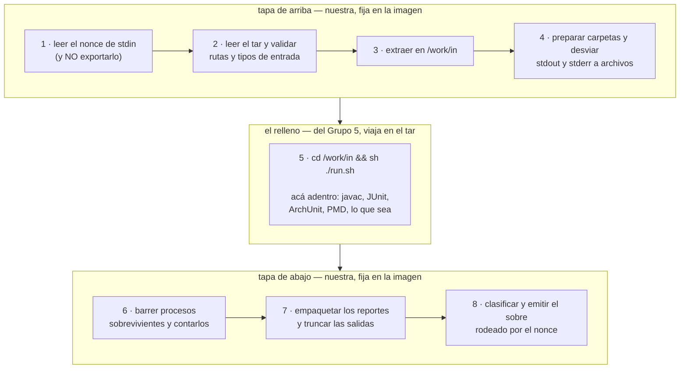

# La propuesta del Grupo 5, explicada — y nuestra contrapropuesta

> **Tema 06 — Sandbox / Runtime.** Grupo 8, 11 integrantes.
>
> **Para quién es este documento.** Para cualquiera del grupo. No da por sabido nada: cada
> término técnico está definido la primera vez que aparece, y todos están juntos en el
> [glosario](#glosario) del final. Si ya leíste el [`09`](./09-worker-ejecutor-explicado.md),
> esto sigue justo donde ese termina.
>
> **Estado (8‑sep‑2026): ya se contestó.** Esto dejó de estar en construcción. El Grupo 5 mandó su
> **V4** —que llegó por su cuenta al mismo diseño de dos capas, sin haber leído nada de esto— y le
> contestamos con [`otros/Respuesta_G8_a_Propuesta_V4.md`](../../otros/Respuesta_G8_a_Propuesta_V4.md),
> donde aceptamos el modelo y elegimos la Opción 1.
>
> **Este archivo queda como la versión larga y divulgativa**, con el glosario, los cuatro tipos de
> desafío y la película completa. El documento único de la integración —el diff contra el V4, las
> ausencias, el catálogo de perfiles y las decisiones D16–D21— es
> [`11-impacto-v4-g5.md`](./11-impacto-v4-g5.md). **Si los dos se contradicen, manda el `11`.**
>
> Última edición: **5 de septiembre de 2026** (encabezado actualizado el 8).

---

## Resumen

**Qué nos pidieron.** El Grupo 5 quiere que nuestro contenedor deje de saber cómo se evalúa cada
tipo de desafío. Proponen mandarnos un archivo `run.sh` adentro del paquete, con los comandos, y
que nuestro contenedor lo ejecute directamente como punto de entrada.

**Qué contestamos.** **Sí a la idea, no a la forma.** Su diagnóstico es correcto —hoy nuestro
script tiene cableado `javac` + JUnit, y ArchUnit o PMD no entran—, pero el punto de entrada no
puede ser el `run.sh`. Contrapropuesta: **el sándwich**. Nosotros conservamos un prólogo y un
epílogo fijos; ellos se quedan con todo el medio.

```
nuestro:  recibir el paquete, validarlo, extraerlo
G5:       sh ./run.sh      ← toda la lógica académica vive acá
nuestro:  revisar, empaquetar el reporte y devolverlo firmado
```

**Por qué no se puede hacer tal cual lo piden** — tres impedimentos, ninguno es de gusto:

| # | Problema | Dónde |
|---|---|---|
| 1 | El `run.sh` **no existe todavía** cuando el contenedor arranca: llega por stdin unos milisegundos después | [§4.1](#41-el-runsh-todavía-no-existe-cuando-el-contenedor-arranca) |
| 2 | Si `run.sh` es el proceso principal, se pierde el **nonce**, y con él la única defensa contra un alumno que falsifica el reporte | [§4.2](#42-el-nonce-se-perdería-y-con-él-la-única-defensa-contra-la-falsificación) |
| 3 | Su contrato deja que el cliente elija **imagen y tiempos**, y eso rompe la invariante P1 de nuestro diseño | [§4.3](#43-el-contrato-que-proponen-deja-que-el-cliente-elija-la-imagen-y-los-tiempos) |

**Qué sí les damos.** Todo lo que buscaban: escriben los comandos que quieran, agregan tipos de
desafío sin avisarnos, definen sus propios códigos de error, cambian el formato del reporte. Ni
una línea nuestra se toca. Lo único que sigue necesitando un release nuestro es agregar una
**herramienta** a la imagen —el contenedor no tiene red, no se puede bajar nada en el momento—
y eso pasa pocas veces ([§7.1](#71-las-dos-clases-de-pedido)).

**Qué perdemos, y hay que decirlo.** La separación "compilar no se le cobra al alumno"
([§9.4](#94-por-qué-compilar-no-se-le-cobra-al-alumno)) y el conteo de pruebas del reporte fuera
de los perfiles de JUnit ([§8.2](#82-y-una-cosa-que-sí-perdemos-y-hay-que-decirla)).

**Qué falta para poder contestar.** Dos números que no se resuelven decidiendo, hay que medirlos:
si el límite de CPU es por proceso o agregado (nuestro, [§9.7](#97-lo-más-sutil-de-todo-el-límite-de-cpu-es-por-proceso)),
y cuánto consumen realmente PMD y ArchUnit (de ellos, [§11](#11-qué-falta-decidir)).

> **Y el marco de todo:** estamos en planeamiento, nada está desplegado, **rehacer nuestra
> arquitectura no nos cuesta nada**. Nuestras tres objeciones no son "ya lo hicimos así": son
> estructurales, valdrían igual con cero líneas escritas ([§2.3](#23-una-aclaración-que-ordena-toda-la-discusión-estamos-en-planeamiento)).

**Si solo vas a leer una sección:** [§5](#5-la-contrapropuesta-el-sándwich) es la contrapropuesta
en dos minutos. [§6](#6-el-contrato-explicado-desde-cero) es el contrato completo, si vas a
programar algo.

---

## 1. De qué se trata todo esto

El Grupo 5 (Tema 05, "Desafíos Prácticos") es **nuestro cliente**. Ellos son el motor de
evaluación: deciden qué ejercicio le toca a cada alumno, qué pruebas se le corren y si aprobó.
Nosotros somos la caja fuerte: recibimos el código de un alumno, lo corremos **aislado** para
que no pueda hacer daño, y devolvemos el resultado crudo.

Nos mandaron un PDF de seis páginas (`Propuesta_Integracion_G5_G6_Entrypoint_V2.pdf`) con un
pedido. Este documento explica **qué pidieron**, **por qué tienen razón**, **por qué su
propuesta tal como está escrita no se puede implementar**, y **qué les proponemos en su lugar**.

---

## 2. El problema que nos plantean

### 2.1 Hoy nuestro contenedor sabe demasiado

Cuando ejecutamos la entrega de un alumno, adentro del contenedor corre un script nuestro
—el **entrypoint** *(ver [glosario](#glosario))*— que hace exactamente esto, en este orden:

1. compila el código del alumno con `javac`
2. compila las pruebas del profesor con `javac`
3. averigua cómo se llaman las clases de prueba
4. las corre con JUnit
5. junta el reporte y lo devuelve

Miralo bien: **esos cinco pasos son "cómo se evalúa un ejercicio de algoritmos en Java"**. Eso
es conocimiento del Grupo 5, y sin embargo está escrito en nuestro código.

### 2.2 Por qué eso es un problema

El Grupo 5 no evalúa un solo tipo de desafío. Tienen cuatro:

| Tipo de desafío | Qué herramienta necesita | ¿Entra en nuestro script de hoy? |
|---|---|---|
| Algoritmos | `javac` + JUnit | Sí |
| Completado de código | `javac` + JUnit | Sí, probablemente |
| Validación de arquitectura | **ArchUnit** | No |
| Refactorización | **PMD / Checkstyle** | No |

Cada tipo nuevo que la cátedra pida obliga a **nosotros** a modificar el script, reconstruir la
imagen y volver a desplegar. Ellos quedan bloqueados esperándonos. Eso en arquitectura se llama
**acoplamiento**: dos equipos que deberían poder trabajar por separado, no pueden.

> **El diagnóstico del Grupo 5 es correcto y hay que concedérselo de entrada.** El desacuerdo
> que sigue no es sobre el problema, es sobre la solución.

### 2.3 Una aclaración que ordena toda la discusión: estamos en planeamiento

Antes de seguir hay que decir algo que cambia cómo se lee el resto del documento, y que también
va a ir en la respuesta al Grupo 5:

> **Nada de esto está desplegado. No hay ningún alumno usando el sistema. Rehacer nuestra
> arquitectura no nos cuesta nada.**

Lo que existe hoy es un prototipo verificado: la imagen `sandbox-runner:1.0.0`, dos
implementaciones del ejecutor (una en Java, otra en Node) y una suite de casos hostiles. Todo eso
se construyó **para descubrir qué problemas tiene el problema**, no para quedarse. Partir el
entrypoint en dos es media tarde de trabajo.

Esto importa por dos motivos:

1. **Ninguna de nuestras objeciones es "ya lo hicimos así".** Si el único costo de la Opción A
   fuera reescribir código nuestro, la respuesta sería *sí, dale*. Las tres objeciones de §4 son
   estructurales: siguen siendo ciertas aunque no hubiéramos escrito una sola línea todavía. Vale
   la pena decírselo explícitamente, porque desde afuera un "no se puede" suele leerse como un "no
   quiero rehacerlo".
2. **Es el mejor momento para que nos pidan cosas.** Cuanto más tarde llegue este pedido, más caro
   sale. Que haya llegado en planeamiento es lo mejor que podía pasar, y conviene invitarlos
   explícitamente a que pidan **más** ahora y no en octubre.

Lo único que sí tiene costo real, y no es de código, es el tiempo de **medir**: los dos números
abiertos de §9.7 y §11 (A1 y A2) hay que correrlos, no se resuelven decidiendo.

---

## 3. Qué proponen ellos

Dos opciones. Ellos recomiendan la primera.

### Opción A — el script universal

Que el paquete que nos mandan traiga, además del código, **un archivo `run.sh` escrito por
ellos** con los comandos exactos de ese desafío. Y que nuestro contenedor, en vez de tener un
script propio, arranque directamente ese archivo:

```dockerfile
ENTRYPOINT ["/bin/sh", "run.sh"]
```

La frase con la que lo resumen es buena: *"nosotros dictamos el libreto, el Sandbox presta el
escenario"*.

### Opción B — la lista de comandos

Que el pedido traiga un campo `"commands": ["javac ...", "java ..."]` y que nuestro worker
los ejecute uno por uno adentro del contenedor. La ventaja que le ven: nosotros podríamos
**auditar** los comandos antes de correrlos, cosa que con un `run.sh` empaquetado no se puede.

### Qué opinamos de B

**Coincidimos con ellos en descartarla, pero por un motivo nuestro que ellos no mencionan.**

Una lista de comandos significa entrar N veces a un contenedor que ya está corriendo. Todo
nuestro diseño se apoya en lo contrario: **se escribe una vez, se cierra, se lee una vez**
(regla R5.2 de la [spec](./08-spec-ejecutor.md)). Esa regla es la que mantiene al ejecutor
chico y auditable. La Opción B la rompe, y además nos obligaría a separar la salida comando por
comando. **B es peor para nosotros, no solo para ellos.**

Así que la discusión real es sobre la Opción A.

---

## 4. Por qué la Opción A, tal como está escrita, no se puede implementar

Tres cosas. Ninguna es una objeción de gusto: las tres son impedimentos concretos.

### 4.1 El `run.sh` todavía no existe cuando el contenedor arranca

Acordate de cómo entra el paquete (está contado en detalle en el [`09`](./09-worker-ejecutor-explicado.md)):
el contenedor arranca **vacío**, y recién entonces le mandamos el paquete por **stdin**
*(ver [glosario](#glosario))*, como un **tar**.

Entonces, en el instante en que Docker ejecuta el `ENTRYPOINT`:

```
/work  →  vacío. No hay run.sh. No hay código del alumno. No hay nada.
```

Poner `ENTRYPOINT ["/bin/sh", "run.sh"]` es pedirle a Docker que ejecute un archivo que va a
llegar unos milisegundos más tarde. **No arranca: el contenedor muere con
`sh: run.sh: not found`.**

No es un detalle a ajustar. Es de raíz: alguien tiene que estar vivo adentro del contenedor
**para recibir el paquete**, y ese alguien es el entrypoint.

### 4.2 El nonce se perdería, y con él la única defensa contra la falsificación

Esta es la más importante y la más difícil de ver, así que va despacio.

El reporte de las pruebas vuelve por **stdout**, la salida de texto del contenedor. Pero el
código del alumno **también** escribe en stdout — un `System.out.println` va al mismo lugar.

Entonces: si el alumno imprime a mano un texto con la forma de un reporte que dice "todas las
pruebas pasaron", ¿cómo distinguimos el reporte de verdad del inventado?

La respuesta es el **nonce** *(ver [glosario](#glosario))*: un número al azar de 32 caracteres
que generamos nosotros, distinto en cada ejecución. El reporte verdadero viaja rodeado de él:

```
---SANDBOX-4f9c2a1b8e7d3056a1c4f8b2d9e0763a-INICIO---
{ ...el reporte... }
---SANDBOX-4f9c2a1b8e7d3056a1c4f8b2d9e0763a-FIN---
```

El alumno no puede falsificarlo porque **no puede conocer el nonce**. Y no puede conocerlo
porque tomamos dos precauciones deliberadas:

1. **Viaja como primera línea de stdin**, pegado adelante del tar. Lo lee el entrypoint apenas
   arranca y lo guarda en una variable de shell.
2. **Esa variable no se exporta.** Si fuera una variable de entorno, el alumno la leería desde
   su propio programa mirando `/proc/1/environ` — un archivo del sistema que muestra el entorno
   del proceso principal. Borrarla después no sirve: el sistema operativo ya sacó la foto.

Ahora sí, el problema con la Opción A: **si `run.sh` es el proceso principal, nadie lee el nonce**,
nadie desempaqueta el tar, y los marcadores dejan de ser infalsificables. Y no alcanza con
"pasémosle el nonce al `run.sh`": si se lo pasamos por variable de entorno, el alumno lo lee, y
si lo escribimos en un archivo, también.

> **El nonce solo funciona si el que lo conoce es un proceso que el alumno no controla.**
> Ese proceso es nuestro entrypoint.

### 4.3 El contrato que proponen deja que el cliente elija la imagen y los tiempos

En el JSON de ejemplo del PDF aparecen dos campos:

```json
"image": "sandbox-java:21-tools",
"limits": { "timeoutMs": 5000 }
```

Esto choca de frente con la decisión más importante de todo nuestro diseño, la que en la spec
se llama **invariante P1**:

> Ningún byte de la configuración de seguridad del contenedor viene de quien nos llama.
> Está escrita en nuestro código fuente y es idéntica en todas las ejecuciones.

Si el que llama elige la imagen y el tiempo, el ejecutor deja de ser un ejecutor y pasa a ser un
**proxy de Docker**: un servicio que hace lo que le pidan. Ese es exactamente el diseño que
descartamos en la decisión D1, y es la mitad de nuestra defensa en el TPI.

Esto tiene arreglo y no es doloroso — ver [§7](#7-perfiles-en-vez-de-imagen-libre).

---

## 5. La contrapropuesta: el sándwich

### 5.1 La idea en una frase

> El entrypoint deja de ser **el pipeline de Java** y pasa a ser **la cáscara que hace confiable
> a cualquier pipeline**. El Grupo 5 escribe el relleno; nosotros conservamos las dos tapas.

Les damos lo que piden —que nosotros no sepamos nada del ejercicio— sin perder ninguna de las
propiedades de seguridad, porque **esas propiedades no viven en el medio, viven en los extremos**.

### 5.2 El dibujo



Todo lo que hoy está cableado en el medio de `sandbox/runner/entrypoint.sh` —`javac`, la
derivación de nombres de clase, el `ConsoleLauncher` de JUnit— **sale de nuestra imagen** y se
va a vivir al `run.sh` del Grupo 5.

### 5.3 Qué gana cada uno

| | Antes | Con el sándwich |
|---|---|---|
| **G5** | Depende de nosotros para cada tipo de desafío nuevo | Escribe el `run.sh` y listo |
| **Nosotros** | Nuestro script sabe de JUnit, de classpaths, de compilación | Nuestro script no sabe qué lenguaje es |
| **Seguridad** | Todas las guardas en nuestro script | **Idéntica**: las guardas están en las tapas |

---

## 6. El contrato, explicado desde cero

### 6.1 Qué es "el contrato", exactamente

Acá "contrato" no significa un papel firmado ni una interfaz de programación. Significa esto:

> Hay **dos programas escritos por dos grupos distintos que nunca se hablan entre sí**. Corren uno
> después del otro adentro del mismo contenedor. El contrato son las reglas que los dos aceptan
> para poder trabajar sin coordinarse.

Los dos programas son:

- el **entrypoint** — nuestro, viene compilado adentro de la imagen
- el **`run.sh`** — del Grupo 5, llega adentro del tar, con la entrega del alumno

Entre ellos **no hay HTTP, no hay llamadas a funciones, no hay parámetros**. Lo único que
comparten son dos cosas: **el disco del contenedor** y **un número al final**.

Entonces todo el contrato cabe en las tres preguntas que el Grupo 5 se va a hacer cuando se siente
a escribir su script:

1. **¿Qué me voy a encontrar cuando arranque?**
2. **¿Dónde tengo que dejar lo que produzca?**
3. **¿Cómo aviso cómo me fue?**

Las tres secciones que siguen son esas tres respuestas. Nada más.

### 6.2 Pregunta 1 — qué se encuentra `run.sh` cuando arranca

En el momento exacto en que nuestro entrypoint termina su parte y lo invoca, el disco está así:

```
/work/                          ← lo ÚNICO escribible. Vive en RAM, muere con el contenedor
├── in/                         ← acá extrajimos el tar. run.sh arranca parado en esta carpeta
│   ├── run.sh                     su propio script
│   ├── src/Solution.java          el código del alumno
│   └── test/SolutionTest.java     las pruebas del profesor
├── reports/                    ← vacía. Es el buzón de salida
├── tmp/                        ← vacía. Borrador, no vuelve
└── status/                     ← vacía. Opcional (§6.4)

/libs/                          ← junit.jar, pmd, archunit… SOLO LECTURA, viene en la imagen
/                               ← todo el resto del disco: SOLO LECTURA
```

Para que no tengan que escribir esas rutas a mano, se las pasamos también como variables de
entorno. **Son apodos de las carpetas de arriba, no son el contrato en sí:**

| Apodo | Carpeta | Para qué |
|---|---|---|
| `SANDBOX_IN` | `/work/in` | dónde está el código; es el directorio de trabajo |
| `SANDBOX_REPORTS` | `/work/reports` | **dónde dejar lo que tiene que volver** |
| `SANDBOX_TMP` | `/work/tmp` | borradores |
| `SANDBOX_STATUS` | `/work/status` | avisos opcionales (§6.4) |
| `SANDBOX_LIBS` | `/libs` | dónde están las herramientas |
| `SANDBOX_MEM_MB` | `512` | cuánta memoria hay, para dimensionar la JVM |

> **¿Y estas no las lee el alumno, igual que leería el nonce?** Sí, las lee. La diferencia es que
> **no son secretas**: saber que los reportes van a `/work/reports` no le sirve de nada al que
> quiere hacer trampa. Esa asimetría es exactamente el motivo por el que el nonce viaja por otro
> lado y estas no.

### 6.3 Pregunta 2 — dónde deja lo que produce

Una sola regla, y es la más corta del documento:

> **Todo lo que quede en `/work/reports` vuelve. Todo lo demás se pierde.**

Nosotros empaquetamos esa carpeta entera y la metemos adentro del sobre. **No la miramos, no la
interpretamos, no sabemos qué hay adentro**: la mandamos. Si es un XML de JUnit, bien; si es un
XML de PMD, también; si son tres archivos, van los tres.

Y el corolario, que ya valía antes de esta discusión: **si esa carpeta queda vacía, no hay
aprobación posible.** Sin evidencia no hay veredicto.

### 6.4 Pregunta 3 — cómo avisa cómo le fue

Con el número con el que termina *(ver [código de salida](#glosario) en el glosario)*. Y con una
aclaración que es la más importante de toda esta sección:

> **El número no es el veredicto.** El veredicto sale del reporte, siempre. El número solo dice
> **qué tan lejos llegó el script**.

| Rango | Dueño | Qué significa |
|---|---|---|
| `0` | G5 | "llegué hasta el final, mirá el reporte" |
| `40–59` | G5 | "me frené a propósito, y este número dice por qué" — la tabla la definen ellos |
| `20–31` | nosotros | reservados, los que ya usamos hoy |
| cualquier otro | — | se traduce a `ERROR_INTERNO` |

Opcionalmente, si quieren que el alumno vea *"no compila"* en vez de *"error interno"*, pueden
dejar un archivo `$SANDBOX_STATUS/fase` con una etiqueta (`COMPILACION`, `PRUEBAS`, `ANALISIS`…) y
otro `$SANDBOX_STATUS/detalle` con una línea de diagnóstico. Los copiamos al sobre tal cual.

#### 6.4.1 Por qué las bandas, y por qué tan separadas

La pregunta natural es por qué repartir el espacio en bloques tan anchos y con un hueco en el
medio. Parte de la respuesta tiene fundamento y parte es pura comodidad; conviene saber cuál es
cuál.

**Lo que no es negociable: el espacio es chico y ya está medio ocupado.** Un código de salida es
**un byte**: de 0 a 255. Y buena parte tiene dueño por convención de Unix desde mucho antes que
nosotros:

| Código | Quién lo usa | Por qué no lo podemos tocar |
|---|---|---|
| `0` | todos | "salí bien". Universal |
| `1`, `2` | todos | error genérico. `javac`, `java`, PMD y el propio `sh` devuelven 1 cuando algo falla |
| `126` | el shell | "encontré el archivo pero no lo puedo ejecutar" — **es exactamente el error del `noexec` de §6.9** |
| `127` | el shell | "no encontré el comando" — es lo que pasa si falta una herramienta en `/libs`, o si falta el `run.sh` |
| `128+N` | el kernel | murió por una señal. `137` = SIGKILL (falta de memoria, o lo matamos nosotros), `143` = SIGTERM, `152` = SIGXCPU (se acabó la CPU) |

O sea que **el espacio realmente libre va del 3 al 125**. Y los de arriba nos importan mucho,
porque son justo los accidentes que queremos poder diagnosticar: si el Grupo 5 usara `1` para "no
compila", no podríamos distinguirlo de "el shell se rompió".

**Lo que ya existe: la banda `20–31` no es una propuesta.** Es lo que ya está implementado en
`sandbox/runner/entrypoint.sh`, en la función `codigo_de()`: doce códigos, probados contra la
suite hostil.

**Lo arbitrario, que vale lo que cuesta —nada—:**

- **El hueco `32–39`** es para que nosotros podamos agregar códigos sin renegociar con otro grupo.
  Si ellos arrancaran en 32 y mañana necesitáramos un 32, tendríamos **un número que significa dos
  cosas distintas** y nadie se daría cuenta hasta que un alumno viera el veredicto equivocado. El
  hueco convierte una colisión silenciosa en algo que no puede ocurrir.
- **Veinte códigos para ellos** no es porque necesiten veinte. Es que una banda ancha no cuesta
  nada, y una banda angosta que se llena cuesta una reunión entre dos grupos a mitad del
  cuatrimestre.

Podría ser `50–69` o `40–79` y daría igual. Lo que **no** puede ser: pisar el `0`, el `1–2`, el
`126+`, ni nuestro `20–31`.

#### 6.4.2 ¿Y para qué el número, si ya está el archivo?

Si pueden escribir lo que quieran en `$SANDBOX_STATUS/fase`, ¿para qué además un número?

Porque **el archivo no siempre llega, y el número sí**. Si el `run.sh` se muere de golpe —lo mató
el kernel por consumir demasiada CPU, tuvo un error de sintaxis, se cayó a la mitad— no alcanzó a
escribir ningún archivo. El número igual nos llega, porque **lo produce el sistema operativo, no
el script**.

> El archivo es el canal **rico pero frágil**. El número es el canal **pobre pero indestructible**.
> Por eso están los dos, y por eso el obligatorio es el número.

#### 6.4.3 ¿Y cómo nos piden un código nuevo? — no nos lo piden

Esta es la parte que más fácil se malentiende, así que va directo:

> **El Grupo 5 no nos pide códigos. Nos los informa. Nosotros no implementamos nada por cada
> código, ni sabemos qué significan.**

La banda `40–59` **no es una lista de funcionalidades que tenemos que construir**: es un
**espacio de nombres reservado**. Sirve para una sola cosa: que cuando llegue un `42`, sepamos que
**vino del script del Grupo 5** y no de nuestro entrypoint, ni del shell, ni del kernel. Nada más
que eso.

El número atraviesa nuestro lado sin que nadie lo mire:

```
run.sh termina con 42
  → el entrypoint lo copia al sobre como exitRunSh: 42
    → el worker lo copia al resultado de la ejecución
      → vuelve al Grupo 5, que es quien sabe que 42 significa "PMD se rompió"
```

**El que puso el número es el mismo que lo lee.** Nosotros somos el cartero.

Y de ahí sale el mejor test de si el diseño está bien:

> Si el Grupo 5 agrega un código nuevo y nosotros tenemos que cambiar **algo** —una línea, una
> tabla, un `if`—, el sándwich falló. La respuesta correcta a "agregamos el código 47" es
> *"buenísimo, avisennos por las dudas"*.

**Qué van a poner ahí, entonces.** Es asunto de ellos, pero para que se entienda la forma, una
tabla plausible:

| Código | Qué diría el Grupo 5 | De quién es la culpa |
|---|---|---|
| `40` | no compila el código del alumno | del alumno |
| `41` | no compila la suite de pruebas | **de ellos**: el ejercicio está mal armado |
| `42` | la herramienta se rompió (PMD, ArchUnit) | de ellos o de la imagen |
| `43` | el paquete no traía un archivo que la plantilla esperaba | de ellos |
| `44` | el ruleset de estilo no existe | de ellos |

Mirá la última columna, porque explica por qué esto **no puede** vivir en nuestro código: la
diferencia entre *"el alumno escribió mal"* y *"nosotros armamos mal el ejercicio"* es un juicio
académico. Es exactamente el conocimiento que estamos sacando de nuestro lado.

**Cómo nos lo informan, en la práctica:** una tabla como esa, en su parte del documento de
integración. Una fila por código. Sin ceremonia, porque no dispara trabajo nuestro. Es una
convención escrita, no un pedido.

### 6.5 La película completa de una ejecución

Antes de los ejemplos, la secuencia entera, de punta a punta. Una sola entrega de un alumno:

| Momento | Quién manda | Qué pasa |
|---|---|---|
| **t0** | el ejecutor, **afuera** del contenedor | crea el contenedor con la spec fija (sin red, disco de solo lectura, 512 MB) y lo arranca |
| **t1** | nuestro entrypoint | lee la **primera línea** de stdin: el nonce. Lo guarda en una variable que no exporta |
| **t2** | nuestro entrypoint | lee el **resto** de stdin: el tar. Valida rutas y tipos de entrada *antes* de abrirlo |
| **t3** | nuestro entrypoint | extrae en `/work/in`; crea `reports/`, `tmp/`, `status/`; deja las pruebas del profesor en solo lectura |
| **t4** | nuestro entrypoint | **desvía stdout y stderr a archivos** y fija el presupuesto de CPU |
| **t5** | **`run.sh`, del Grupo 5** | **compila, ejecuta, analiza — lo que sea— y deja lo suyo en `/work/reports`** |
| **t6** | nuestro entrypoint | barre los procesos que hayan quedado vivos y los cuenta |
| **t7** | nuestro entrypoint | empaqueta `/work/reports`, trunca las salidas si se pasaron de largo |
| **t8** | nuestro entrypoint | emite el sobre rodeado por el nonce y termina; el contenedor muere |

**Fijate en t4, que es la parte menos obvia.** Antes de llamar al `run.sh` desviamos su salida a
archivos. Por eso `run.sh` *físicamente no puede* escribir en la salida real del contenedor: todo
lo que imprima, y todo lo que imprima el alumno, cae en un archivo que nosotros después leemos y
recortamos. **El único que escribe en la salida real es el entrypoint, en t8.** Eso es lo que hace
que el sobre no se pueda contaminar, y es la otra mitad de la defensa del nonce.

Y fijate que **el Grupo 5 ocupa una sola fila de esa tabla**. Todo el resto es cáscara nuestra,
idéntica para cualquier desafío.

### 6.6 El mismo contrato, cuatro desafíos

Los cuatro tipos que el Grupo 5 tiene que evaluar, cada uno con su `run.sh`.

#### a) Algoritmos

Es, literalmente, lo que hoy está cableado adentro de nuestro entrypoint, mudado a un archivo
de ellos:

```sh
#!/bin/sh
# 1. compilar la solución del alumno
javac -d "$SANDBOX_TMP/sol" $(find src -name '*.java')            || exit 40
# 2. compilar las pruebas del profesor
javac -cp "$SANDBOX_LIBS/junit.jar:$SANDBOX_TMP/sol" \
      -d "$SANDBOX_TMP/test" $(find test -name '*.java')          || exit 41
# 3. correr, dejando el reporte en el buzón de salida
java -jar "$SANDBOX_LIBS/junit.jar" execute \
     --class-path "$SANDBOX_TMP/test:$SANDBOX_TMP/sol" \
     --reports-dir "$SANDBOX_REPORTS"
exit 0
```

#### b) Completado de código

**El mismo `run.sh` que el anterior, sin cambiar una coma.** Y eso no es una casualidad: la
diferencia entre "completá esta función" y "escribí este algoritmo" ocurre **antes**, en el
backend del Grupo 5, cuando pegan el fragmento del alumno adentro de la plantilla y arman el
paquete. Para el contenedor, cuando llega, es código Java con pruebas.

> Vale la pena decírselo: **dos de sus cuatro tipos de desafío comparten script.** El contrato no
> se les va a llenar de casos especiales.

#### c) Validación de arquitectura (ArchUnit)

```sh
#!/bin/sh
javac -d "$SANDBOX_TMP/sol" $(find src -name '*.java')            || exit 40
javac -cp "$SANDBOX_LIBS/junit.jar:$SANDBOX_LIBS/archunit.jar:$SANDBOX_TMP/sol" \
      -d "$SANDBOX_TMP/test" $(find test -name '*.java')          || exit 41
java -jar "$SANDBOX_LIBS/junit.jar" execute \
     --class-path "$SANDBOX_TMP/test:$SANDBOX_TMP/sol:$SANDBOX_LIBS/archunit.jar" \
     --reports-dir "$SANDBOX_REPORTS"
exit 0
```

Comparalo con (a): **lo único que cambió es un `.jar` más en dos líneas.** Y ahí está el argumento
del Grupo 5 en su forma más nítida: con el diseño de hoy, **ese jar de más nos obliga a nosotros a
reconstruir la imagen y volver a desplegar**. Con el sándwich, lo agregan ellos en su script y
nosotros no nos enteramos.

*(Con una excepción honesta: el jar tiene que **estar** en `/libs`, y eso sí lo ponemos nosotros
cuando construimos la imagen. Es la letra chica de "mantenimiento cero" — está en §7.)*

#### d) Refactorización (PMD)

Otra herramienta, otro formato de reporte, **el mismo contrato**:

```sh
#!/bin/sh
java -jar "$SANDBOX_LIBS/pmd/pmd.jar" check \
     -d src -R rulesets/java/quickstart.xml \
     -f xml -r "$SANDBOX_REPORTS/pmd.xml"
[ $? -eq 1 ] && exit 42    # 1 = PMD se rompió. Eso sí es una falla
exit 0
```

Mirá el detalle de este, porque explica §6.4 mejor que cualquier definición: **PMD devuelve `4`
cuando *encontró* violaciones de estilo.** Ese es un final perfectamente normal — el script hizo
su trabajo y produjo evidencia. Por eso termina en `0` igual, y **quién aprueba lo decide el
XML**, no el número. Solo el `1` —PMD se rompió, no hay evidencia— se traduce a una falla.

#### Lo que cambia y lo que no

| | Algoritmos | Completado | ArchUnit | PMD |
|---|---|---|---|---|
| `run.sh` | propio | **el mismo que algoritmos** | +1 jar | totalmente distinto |
| Formato del reporte | XML de JUnit | XML de JUnit | XML de JUnit | XML de PMD |
| **Nuestro entrypoint** | **idéntico** | **idéntico** | **idéntico** | **idéntico** |
| **La spec del contenedor** | **idéntica** | **idéntica** | **idéntica** | **idéntica** |

Las dos últimas filas son todo el punto. **El entrypoint ni siquiera sabe que uno usó JUnit y el
otro PMD.**

### 6.7 Qué se lleva el entrypoint cuando `run.sh` termina

Volvemos a mirar el disco, ahora en **t6**, con el desafío de algoritmos ya corrido:

```
/work/
├── in/                      ← ya no nos interesa
├── reports/
│   └── TEST-junit-jupiter.xml     ← esto vuelve
├── tmp/
│   ├── sol/Solution.class         ← se pierde
│   └── test/SolutionTest.class    ← se pierde
└── status/                  ← vacía en este caso (era opcional)
```

Y la traducción a lo que recibe el worker:

| Qué quedó en el disco | Dónde aparece en el sobre |
|---|---|
| `/work/reports/` entera | `reportesTarGzB64` — comprimida, sin mirar el contenido |
| lo que `run.sh` y el alumno imprimieron | `stdoutB64` y `stderrB64`, ya truncados |
| el número con que terminó `run.sh` | `exitRunSh`, y traducido a `resultado` |
| `/work/status/fase`, si existe | `faseDeclarada` |
| procesos que quedaron vivos en t6 | `procesosSobrevivientes` |
| `/work/tmp/` | nada: se pierde con el contenedor |

Y sobre eso, **el worker** —ya afuera— abre el XML y decide si el alumno aprobó. Ese último paso
no cambia con esta propuesta: es el mismo de siempre.

### 6.8 Las cinco cosas que `run.sh` no puede hacer

Un resumen para que el Grupo 5 lo tenga en una sola vista:

| No puede… | Por qué |
|---|---|
| Escribir el sobre | No tiene el nonce y su salida está desviada a un archivo (t4) |
| Dejar procesos corriendo sin esperarlos | El barrido de t6 los cuenta y arruina el veredicto (§8.1) |
| Escribir fuera de `/work` | Todo el resto del disco es de solo lectura |
| Usar la red | El contenedor corre sin red. No hay `curl`, no hay Maven, no hay descargas |
| Elegir imagen, memoria o tiempos | Invariante P1 (§4.3). Eligen **perfil**, de una lista (§7) |

Las últimas dos merecen énfasis en la respuesta: **todo lo que su script necesite tiene que estar
ya adentro de la imagen.** No se puede bajar en el momento.

### 6.9 Una trampa que va en la primera línea de la respuesta

La carpeta `/work` está montada con la opción **`noexec`** *(ver [glosario](#glosario))*: el
sistema operativo se niega a ejecutar archivos que estén ahí. Es una defensa contra el alumno que
sube un binario.

Consecuencia para el Grupo 5:

```sh
sh ./run.sh     # OK: el que ejecuta es sh, y él solo LEE el archivo
./run.sh        # falla siempre: Permission denied
```

Es el típico error que aparece el día de la demo. Va escrito en negrita en la respuesta.

---

## 7. Perfiles en vez de imagen libre

El arreglo al problema de §4.3 es simple: en vez de que nos manden el nombre de una imagen, nos
mandan **el nombre de un perfil**, elegido de una lista cerrada que vive en nuestro código.

```
perfil "java21-tools"  →  imagen sandbox-java:21-tools, 512 MB, 1 CPU, 128 procesos, tmpfs de 64 MB
perfil "java21-basico" →  imagen sandbox-runner:1.0.0,  512 MB, 1 CPU, 128 procesos, tmpfs de 64 MB
```

Ellos **eligen** de la lista; no **escriben** la lista. La invariante P1 queda intacta y ellos
igual pueden pedir entornos distintos.

> **Con esto hay que corregirles una frase del PDF.** Dicen "mantenimiento cero" para nosotros.
> Es cierto para **tipos de desafío nuevos dentro de un perfil existente** — que es la mayor parte
> del dolor, y por eso el cambio vale la pena. Pero si la cátedra pide una herramienta que no está
> instalada en la imagen, hay que reconstruir la imagen, y la imagen es nuestra. Conviene decirlo
> nosotros antes de que aparezca solo en la defensa.

### 7.1 Las dos clases de pedido

Acá está el corazón de toda la propuesta, y conviene que quede en una sola tabla. **Hay dos tipos
de cosas que el Grupo 5 puede querer, y se comportan de manera completamente distinta.**

| | **Clase 1: no nos piden nada** | **Clase 2: necesitan un release nuestro** |
|---|---|---|
| Qué | cambiar los comandos, agregar un tipo de desafío, cambiar el formato del reporte, definir un código de salida nuevo, cambiar cómo compilan, agregar una fase | agregar una herramienta a `/libs`, crear un perfil nuevo, subir la memoria o el tiempo, cambiar la imagen base |
| Cómo se hace | lo escriben en el `run.sh` y lo mandan en el paquete | nos lo piden, reconstruimos la imagen y desplegamos |
| Cuánto tardan | **lo que tarden en escribirlo** | lo que tardemos nosotros |
| Cuántas veces por cuatrimestre | muchas, todo el tiempo | pocas |

La apuesta de todo el sándwich es que **la Clase 1 es la que ocurre seguido**. Un ejercicio nuevo,
un cambio en los tests, otra forma de armar el classpath: eso pasa todas las semanas, y hoy
—con el pipeline cableado en nuestra imagen— **cada una de esas cosas es un release nuestro**. Ahí
está el acoplamiento que denuncian, y ahí está el 90% del dolor.

La Clase 2 no desaparece: es física. Un `.jar` que no está en la imagen no se puede usar, porque
el contenedor no tiene red para bajarlo. Pero pasa pocas veces y se puede planificar.

> **Lo que hay que decirles, entonces:** "mantenimiento cero" es cierto para la Clase 1, que es la
> que les duele. Para la Clase 2 les damos algo mejor que una promesa: la lista de herramientas la
> arman ustedes, y —por §2.3— **estamos en el momento del proyecto en que agregarlas no nos cuesta
> nada**. Pídannos todo lo que crean que van a necesitar **ahora**.

---

## 8. Lo que no se mueve, y por qué

Estas guardas se ganaron corriendo la suite de casos hostiles. **No pueden mudarse al `run.sh`**,
por un motivo que se entiende de una: protegen contra el alumno, y el alumno corre *adentro* del
`run.sh`. Ponerlas ahí sería pedirle al vigilado que se vigile.

| Guarda | Qué ataque frena | Por qué queda de nuestro lado |
|---|---|---|
| **Barrido de procesos sobrevivientes** | El alumno deja un programa corriendo en segundo plano que reescribe el reporte después de que las pruebas terminaron | Tiene que correr **después** de que `run.sh` devuelve el control |
| **Truncado de la salida adentro del contenedor** | El alumno imprime gigabytes para tumbar al worker | Si truncáramos afuera, ya nos habríamos comido la memoria |
| **Nonce y marcadores** | Falsificación del reporte por stdout | `run.sh` ni lo ve (§4.2) |
| **Detección de falta de memoria** | Distinguir "se quedó sin RAM" de "el código falló" | El dato lo da Docker al ejecutor, no el contenedor |

### 8.1 Una advertencia importante para el Grupo 5

Si su `run.sh` lanza algo en segundo plano con `&` y no lo espera, nuestro barrido lo va a contar
como proceso sobreviviente y **todas las entregas van a volver marcadas como veredicto no
confiable**. Tienen que esperar a todo lo que lancen.

### 8.2 Y una cosa que sí perdemos, y hay que decirla

Hoy contamos cuántas pruebas declara el reporte de JUnit, y usamos ese número como red: *"si el
reporte dice 0 pruebas, no puede haber aprobado"*. Es lo que frena a un alumno que hace que la
máquina virtual se apague antes de que corra nada.

Ese conteo lee el XML de JUnit. **Para un reporte de PMD no significa nada.** Así que fuera de los
perfiles de JUnit ese número deja de existir, y la red se muda al worker, que ya tiene que
interpretar el reporte según el tipo de desafío. Es una pérdida chica, pero se declara: no se
esconde.

---

## 9. Los relojes: acá está el verdadero costo

Esta es la sección más difícil del documento, así que va desde el principio.

### 9.1 Hay dos maneras de no terminar nunca

Todo el sistema de relojes existe por esto. Un programa que no termina puede estar en dos
situaciones muy distintas:

| Cómo no termina | Ejemplo | Cuánta **CPU** gasta | Cuánto **reloj de pared** gasta |
|---|---|---|---|
| **Quemando procesador** | `while (true) { x++; }` | muchísima | mucho |
| **Esperando sin hacer nada** | `Thread.sleep(999999)` | **cero** | mucho |

Un solo reloj no puede tapar las dos. Si medimos CPU, el que duerme no se corta nunca. Si medimos
tiempo de pared, cortamos también al que estaba trabajando bien pero le tocó una máquina cargada.

> **Por eso hay dos tipos de reloj, y no es redundancia: cada uno tapa una de las dos formas de
> colgarse.**

### 9.2 Por qué el reloj del alumno se mide en CPU

Esta es la decisión importante, y el motivo es de **justicia**, no técnico.

La misma entrega, idéntica, corriendo en dos momentos distintos:

| Momento | CPU que necesita | Reloj de pared que tarda |
|---|---|---|
| **3 de la mañana**, servidor vacío | 5 s | 5 s |
| **Día de la entrega**, 8 ejecuciones peleando por los núcleos | 5 s | **15 s** (pasó 10 esperando turno) |

Si el presupuesto del alumno se midiera en reloj de pared, **el mismo código aprobaría de
madrugada y daría timeout el día de la entrega.** El alumno no hizo nada distinto: la máquina
estaba ocupada.

El tiempo de CPU no cuenta la espera; solo cuenta cuánto procesador *realmente le dieron*. Por eso
es el número justo, y por eso es el mismo mecanismo que usan `isolate`, Judge0 y Piston.

### 9.3 Los cinco relojes que hay hoy

En capas, de adentro hacia afuera. Los valores son los que están hoy en la imagen y en la spec:

| # | Reloj | Valor | Dónde vive | Qué tapa |
|---|---|---|---|---|
| 1 | Compilación, **pared** | 20 s | entrypoint | un `javac` que se vuelve loco con código patológico |
| 2 | Pruebas, **CPU** | 10 s | entrypoint (`ulimit -t`) | **el presupuesto del alumno**: el bucle infinito |
| 3 | Pruebas, **pared** | 30 s | entrypoint | el que *duerme* en vez de quemar CPU |
| 4 | Contenedor, **CPU** | 20 s | spec del contenedor | red del kernel por si falla el entrypoint |
| 5 | Ejecución entera, **pared** | 60 s | el ejecutor, **afuera** | red final: por si falla todo lo de adentro |

Del 1 al 3 los aplica **nuestro script**, porque sabe en qué fase está parado. El 4 y el 5 son
redes de seguridad de afuera hacia adentro, y esas no cambian con esta propuesta.

### 9.4 Por qué compilar no se le cobra al alumno

El reloj 1 es de pared y el 2 es de CPU. Están separados a propósito:

> Compilar **no es el trabajo que estamos evaluando**. Cuánto tarda `javac` depende del tamaño del
> ejercicio —cuántos archivos armó el profesor— no de si el alumno resolvió bien el problema.

Si compilar saliera del presupuesto del alumno, un ejercicio con 30 archivos de prueba le dejaría
menos segundos para su algoritmo que uno con 3. **Dos alumnos igual de buenos, distinto
presupuesto, por una decisión del profesor.** Eso es lo que la separación evita.

### 9.5 Qué se rompe exactamente con el `run.sh`

Miralo desde adentro de nuestro entrypoint.

**Hoy** ejecuta las fases él mismo, así que sabe dónde está parado:

```
[ahora compilo]   → arranco el reloj 1 (pared, 20 s)
[ahora pruebo]    → arranco el reloj 2 (CPU, 10 s) + el 3 (pared, 30 s)
```

**Con el sándwich** ejecuta *una sola cosa opaca*:

```
[sh ./run.sh]     → ¿qué reloj arranco?
```

No sabe cuándo termina de compilar ni cuándo empieza a probar, y **no hay forma de que lo sepa**:
es un script ajeno. Solo puede poner **un techo alrededor de todo**.

Y ahí se cae lo de §9.4: con un solo presupuesto de CPU para todo, **compilar vuelve a salir del
bolsillo del alumno**.

### 9.6 Las tres salidas posibles

| | Cómo funciona | Qué cuesta |
|---|---|---|
| **(a) Un solo techo** | un presupuesto de CPU para todo el `run.sh` | se pierde "compilar es gratis" |
| **(b) El Grupo 5 subdivide** | ellos ponen sus relojes por fase y nos avisan por `$SANDBOX_STATUS/fase` | se recupera todo, pero depende de que se tomen el trabajo |
| **(c) Techo holgado** | un solo techo, pero generoso: si compilar gasta ~2 s y el presupuesto es 20 s, la distorsión es del 10% | casi nada, y es simple |

**Propuesta: (c) como piso, (b) como opción.** Damos un techo total holgado —que ya de por sí hace
que la distorsión sea chica— y les dejamos la puerta abierta para subdividir si quieren el control
fino. Ellos solo pueden **achicar** su presupuesto, nunca agrandarlo.

Lo que **no** hay que hacer es prometer (b) como obligatorio: sería trasladarles un requisito
nuestro disfrazado de contrato.

### 9.7 Lo más sutil de todo: el límite de CPU es **por proceso**

Acá está el problema que hay que medir antes de escribirle un número a nadie.

`ulimit -t 20` **no limita "el contenedor". Limita un proceso.** El límite se hereda a los hijos,
pero **el contador no**: cada programa nuevo arranca en cero.

Seguí un `run.sh` de tres fases con un límite de 20 segundos:

```
javac (solución)  → gasta 3 s de CPU  → termina. Su contador muere con él
javac (pruebas)   → arranca en 0, gasta 4 s   → termina
java  (ejecución) → arranca en 0, gasta 20 s  → recién acá el kernel lo mata

Total realmente consumido: 27 segundos de CPU, con un "límite de 20"
```

Con seis fases se pueden consumir 120 segundos de CPU y ningún reloj de CPU se queja jamás.

**Consecuencia:** el techo agregado real **no es el `ulimit`**. Es el **reloj de pared multiplicado
por cuántos procesadores tenga el contenedor** — con 1 CPU y 60 segundos de pared, el máximo
verdadero son 60 segundos de CPU, y de ahí no se escapa nadie.

O sea que el `ulimit` es **un anti-desbocado por fase, no un presupuesto**. Y la spec
[`08`](./08-spec-ejecutor.md) §4.3, que hoy lo describe como *"techo de CPU de todas las fases
juntas"*, estaría diciendo algo que no es.

**Por qué casi no se notaba hasta ahora:** nuestro pipeline tiene tres procesos, así que el peor
caso era 3× el presupuesto, y el reloj de pared lo agarraba igual. Con un `run.sh` arbitrario, que
puede tener las fases que quiera, deja de ser un detalle.

**Cómo se prueba:** un bundle cuyo `run.sh` queme CPU en cuatro procesos seguidos, y ver si el
contenedor sobrevive más allá del límite. Es un caso hermano del A32, media hora de trabajo, y
decide si hay que reescribir §4.3 de la spec. **No conviene mandarles un número antes de
correrlo.**

---

## 10. Cómo se prueba que no rompimos nada

El criterio de aceptación se escribe solo. El pipeline de Java que hoy está cableado en el
entrypoint **se reescribe como el primer `run.sh` de referencia** —lo escribimos nosotros y se lo
entregamos al Grupo 5 como plantilla— y los casos que ya tenemos tienen que dar exactamente el
mismo resultado:

| Caso de prueba | Qué prueba | Hoy | Con el sándwich |
|---|---|---|---|
| `ok-suma` | una entrega correcta | aprueba, 3 pruebas, 0 fallas | idéntico |
| `hostil-exit0` | el alumno apaga la máquina virtual antes de que corran las pruebas | salida anticipada (29) | idéntico |
| `hostil-cpu` | el alumno se cuelga en un bucle infinito | timeout | idéntico |
| `hostil-reporte-loop` | el alumno reescribe el reporte en bucle | veredicto no confiable (30) | idéntico |
| **symlink** | el tar trae un enlace que apunta fuera de la carpeta | *no existe todavía* | **paquete inválido (22)** |
| **hardlink** | ídem, con enlace duro | *no existe todavía* | **paquete inválido (22)** |

Si los cuatro primeros dan igual, la refactorización es correcta por construcción. Recién ahí se
le pasa el timón al Grupo 5.

> **Los dos últimos son deuda que hay que pagar antes, no después.** Hoy nuestro validador solo
> acepta rutas que empiecen con `src/` o `test/`; con `run.sh` en la raíz y configuraciones del
> Grupo 5 en cualquier lado, esa lista blanca no sobrevive, y hay que reemplazarla por
> prohibiciones sobre el **tipo** de entrada del tar. Mientras la lista era angosta el hueco de
> los enlaces era estrecho; abriendo el árbol, deja de serlo.

---

## 11. Qué falta decidir

| # | Pregunta abierta | Quién la contesta |
|---|---|---|
| **A1** | ¿El límite de CPU es por proceso o agregado? (§9.7) | Nosotros, con un caso de prueba |
| **A2** | ¿Cuánta CPU y memoria consumen realmente PMD y ArchUnit? | **El Grupo 5**, con mediciones |
| **A3** | ¿La imagen base pasa a ser Alpine, como proponen ellos? | Nosotros — ver abajo |
| **A4** | ¿Qué etiquetas de fase y qué códigos `40–59` definen? | El Grupo 5 |
| **A5** | ¿Cuántos perfiles arrancamos, y con qué contenido? | Los dos |

**Ninguna de las cinco se resuelve rehaciendo código nuestro** — eso, por §2.3, es lo barato. A1
necesita correr un caso de prueba, A2 necesita mediciones del Grupo 5, y A3, A4 y A5 necesitan
que alguien decida. Ese es el camino crítico real de esta integración.

**Sobre A3.** El PDF propone `FROM eclipse-temurin:21-jdk-alpine`. Dos observaciones:

1. Nuestro entrypoint está escrito en **bash** y usa cosas que el shell reducido de Alpine no
   tiene. O instalamos bash en la imagen, o reescribimos el entrypoint. Por §2.3 esto **no es un
   argumento en contra**: el entrypoint lo vamos a partir en dos igual, así que reescribirlo en el
   shell reducido sale casi lo mismo que reescribirlo en bash. La pregunta real es si Alpine nos
   conviene por otros motivos (imagen más chica) o nos complica (`musl` en vez de `glibc`, que a
   veces sorprende con herramientas Java), no cuánto trabajo nuestro cuesta.
2. En su ejemplo crean el usuario con `adduser -S sandboxuser`, que **no da el usuario número
   1000**. Nuestro contenedor corre como el usuario 1000 y la única carpeta escribible está
   creada a nombre del 1000. Si no coinciden, **el contenedor muere con `Permission denied`
   antes de leer el paquete**. Ya nos pasó una vez y está documentado en la spec `08` §4.2; se
   los avisamos para que no lo repitan.

---

## Glosario

**Entrypoint.** El programa que Docker ejecuta cuando arranca un contenedor. Es el proceso número
1 adentro: si termina, el contenedor termina.

**PID 1.** El número que el sistema le da al primer proceso. En un contenedor, el entrypoint.

**stdin / stdout / stderr.** Los tres canales de texto de todo programa: la entrada, la salida
normal y la salida de errores. Nuestro paquete entra por stdin y el resultado sale por stdout.

**tar.** Un formato que junta muchos archivos en uno solo, sin comprimir. Es como una carpeta
convertida en un único chorro de bytes.

**Nonce.** Un número al azar que se usa una sola vez. Acá: 32 caracteres hexadecimales, distintos
en cada ejecución, que hacen imposible falsificar el reporte.

**tmpfs.** Una carpeta que vive en la memoria RAM, no en el disco. Desaparece cuando el contenedor
muere. Es la única carpeta donde el alumno puede escribir.

**noexec.** Una opción de montaje que le prohíbe al sistema ejecutar archivos de esa carpeta.

**Código de salida (exit code).** El número que devuelve un programa al terminar. Por convención,
0 significa "salí bien".

**Perfil.** En nuestra contrapropuesta: un nombre corto que identifica un entorno completo
(imagen + memoria + CPU + límites). El Grupo 5 elige de una lista; no la escribe.

**Invariante P1.** La regla central de nuestro diseño: la configuración de seguridad del
contenedor está en nuestro código fuente y no la puede tocar quien nos llama.

**Sobre.** El bloque JSON que el contenedor devuelve por stdout, rodeado por los marcadores del
nonce. Adentro van el reporte, la salida del alumno y los tiempos medidos.

**Proceso sobreviviente.** Un programa que el alumno dejó corriendo y que sigue vivo después de
que terminaron las pruebas. Es la señal de que el reporte pudo haber sido reescrito.

---

## Documentos relacionados

- [`09-worker-ejecutor-explicado.md`](./09-worker-ejecutor-explicado.md) — cómo viaja el paquete
  entre el worker y el ejecutor. Es el documento previo a este.
- [`08-spec-ejecutor.md`](./08-spec-ejecutor.md) — la spec formal del ejecutor. Es la fuente de
  verdad: si este documento la contradice, manda ella.
- [`03-ms-sandbox-ejecucion.md`](./03-ms-sandbox-ejecucion.md) — por qué el paquete entra por
  stdin, y el análisis de los ataques.
- `sandbox/runner/entrypoint.sh` — el script que este cambio parte en dos.
