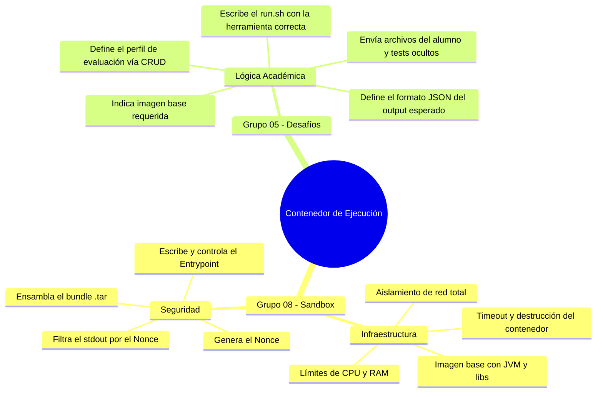
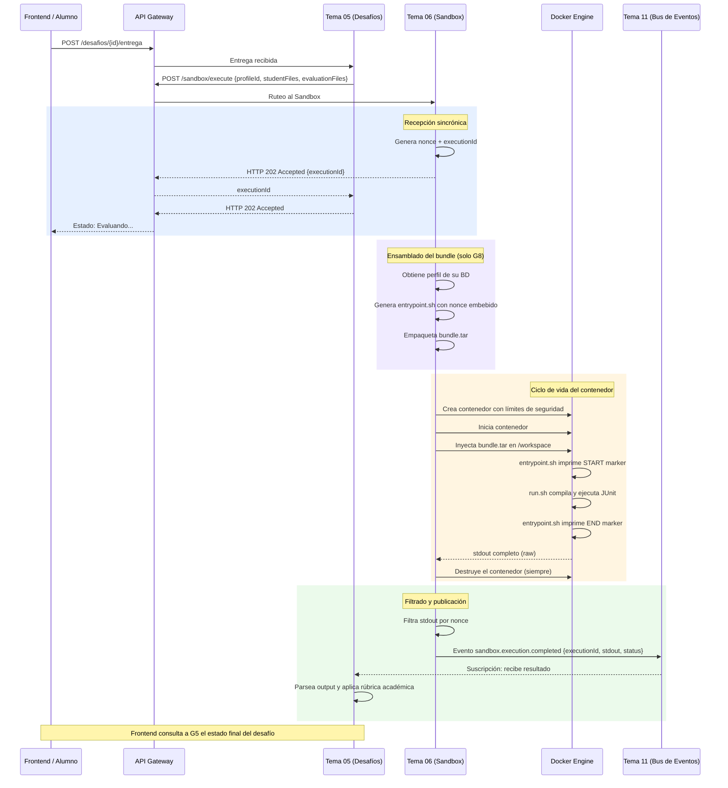

# Propuesta de Arquitectura: Microservicio Sandbox (Grupo 06)

**Contexto:** Este documento formaliza la arquitectura, responsabilidades y contratos de integración para el microservicio **Sandbox (Tema 06)**, encargado de la ejecución aislada de código para los desafíos prácticos de la plataforma gamificada.

Esta arquitectura está alineada con el PRD, las directrices globales de arquitectura (`TUP_PIV_BE_PROPUESTA_ARQ.pdf`), y los acuerdos de integración alcanzados con el **Grupo 05 (Desafíos Prácticos)**.

---

## 1. Visión General: El Sandbox Agnóstico

El principio fundamental de esta arquitectura es que **el Sandbox es un orquestador agnóstico de infraestructura**. Su único propósito es levantar contenedores efímeros, ejecutar un conjunto de instrucciones de manera aislada con recursos limitados (CPU, Memoria, Tiempo), y devolver el resultado crudo.

> [!IMPORTANT]
> **El Sandbox NO sabe de negocio.** No conoce qué es un "Desafío de Algoritmos", no sabe qué significa "Aprobado" ni entiende la rúbrica de evaluación académica. Solo entiende de lenguajes, ejecución de scripts, empaquetado de archivos y seguridad de host.

### Glosario de Conceptos Técnicos Fundamentales

Para estandarizar el lenguaje entre equipos, definimos los siguientes términos:

| Término | Definición |
|---|---|
| **Contenedor Efímero** | Entorno de ejecución aislado (Docker/Linux) que se levanta para una única ejecución y se destruye al terminar. |
| **Imagen Docker** | Plantilla de solo lectura que define el sistema operativo base y el software preinstalado (ej: Java 21 + JUnit). De una imagen se crean N contenedores. |
| **Script (`.sh`)** | Archivo de texto con comandos de terminal (Bash/Shell) que se ejecutan en secuencia. Permite automatizar compilación, ejecución y reportes. |
| **Entrypoint** | Comando principal que corre apenas nace el contenedor. Quien controla el Entrypoint, controla qué hace el contenedor desde el primer instante. |
| **Nonce** | Código secreto generado aleatoriamente para cada ejecución. Se embebe en las marcas de inicio/fin del output para que G8 pueda descartar todo lo que el alumno imprima fuera de esas marcas. Un alumno no puede conocerlo, ergo no puede falsificarlo. |
| **`.tar` (Tape Archive)** | Formato que agrupa múltiples archivos y carpetas en un único stream de bytes, sin compresión. Ideal para inyectarle al contenedor todos los archivos necesarios de forma atómica y sin montar volúmenes del host. |
| **Catálogo de Perfiles** | Base de datos del Sandbox que almacena la configuración de evaluación de cada tipo de desafío (imagen base + script de evaluación), creada y mantenida por G5 vía CRUD. |
| **Bus de Eventos** | Canal asíncrono (Tema 11) por donde G8 publica el resultado de la ejecución una vez finalizada, para que G5 lo consuma sin mantener una conexión HTTP abierta. |

---

## 2. Separación de Responsabilidades: G08 vs G05

La clave de esta arquitectura es que **ningún equipo hace el trabajo del otro**. La configuración de un contenedor de ejecución se divide en dos capas con responsabilidades que no se solapan:



### Capa 1: Seguridad e Infraestructura (Grupo 08)
G8 es el dueño absoluto del `ENTRYPOINT` del contenedor y de todo su ciclo de vida.
- Genera el nonce, escribe el `entrypoint.sh` embebiendo ese nonce como literal.
- Ensambla el bundle `.tar` combinando el entrypoint, el `run.sh` del perfil, y los archivos enviados por G5.
- Aplica todos los límites de seguridad al levantar el contenedor (red, RAM, CPU, PID, filesystem read-only).
- Captura el stdout completo y filtra solo lo que esté entre las marcas del nonce.
- Destruye el contenedor al finalizar, sin excepción.

### Capa 2: Evaluación Técnica (Grupo 05)
G5 dicta **cómo** se evalúa el código del alumno. Nunca toca Docker directamente.
- Crea y mantiene los perfiles en el CRUD de G8.
- Envía a G8: `profileId` + archivos del alumno + tests ocultos (crudos, sin empaquetar).
- Consume el evento del Bus de Eventos con el output filtrado y aplica la rúbrica académica.

> [!TIP]
> **El contrato es claro:** G5 manda datos crudos y G8 devuelve stdout filtrado. G8 nunca interpreta el resultado académico. G5 nunca toca infraestructura.

---

## 3. Catálogo de Perfiles: El Acuerdo Inicial (CRUD)

Antes de que pueda ejecutarse cualquier desafío, G5 y G8 deben ponerse de acuerdo una sola vez por tipo de desafío. G8 expone un CRUD de perfiles, que G5 administra.

### ¿Qué contiene un Perfil?

```json
{
  "profileId": "profile_998",
  "name":      "java-algoritmos-junit",
  "image":     "sandbox-java:21",
  "runScript": "#!/bin/sh\ncd /workspace\njavac -cp /libs/junit.jar student/*.java tests/*.java\njava -jar /libs/junit-platform.jar --scan-class-path --details=testfeed --reports-dir=reports\ncat reports/TEST-*.xml"
}
```

- **`image`**: La imagen Docker base que G8 tiene disponible. G8 documenta qué imágenes ofrece (ej: `sandbox-java:21`, `sandbox-python:3.11`). G5 elige la que necesita.
- **`runScript`**: El `run.sh` que G5 escribe. Asume que los archivos ya están en `/workspace/student/` y `/workspace/tests/` (G8 garantiza esa estructura). G5 solo debe compilar y evaluar.

### Escalabilidad a otros tipos de desafíos

El contrato del `POST /execute` no cambia entre tipos de desafíos. Solo cambia qué manda G5 y qué dice el perfil:

| Tipo de Desafío | `studentFiles[]` | `evaluationFiles[]` | Herramienta en `runScript` |
|---|---|---|---|
| Algoritmos/JUnit | `Fibonacci.java` | `FibonacciTest.java` | `javac` + `java -jar junit...` |
| Análisis Estático (PMD) | `Main.java` | *(vacío)* | `java -jar pmd.jar --rulesets...` |
| Arquitectura (ArchUnit) | `*.java` del proyecto | `ArchTest.java` | `javac` + `java -jar junit...` |

G8 no se entera de la diferencia. El motor es el mismo.

---

## 4. Flujo Completo de una Ejecución: Caso Base (Algoritmos con JUnit)

A continuación se detalla cada etapa del flujo, indicando qué grupo actúa, con qué operaciones, y por qué se hace así.

### Etapa 0 — Registro del Perfil (Solo ocurre una vez por tipo de desafío)

**Actores:** G5 y G8.

G8 construye y publica sus imágenes Docker base. G5 consulta esa documentación y crea el perfil que usará para los desafíos de Algoritmos:

```
G5 → POST /sandbox/profiles
{
  "name": "java-algoritmos-junit",
  "image": "sandbox-java:21",
  "runScript": "#!/bin/sh\n..."
}
← HTTP 201 Created { "profileId": "profile_998" }
```

G5 almacena `profile_998` en su base de datos, asociado al tipo de desafío "Algoritmos".

---

### Etapa 1 — Solicitud de Ejecución (G5 → G8)

**Actor:** G5.

Un alumno entrega su código en el frontend. G5 recibe la entrega, busca el `profileId` del tipo de desafío y llama al Sandbox con **archivos crudos** (no empaquetados):

```
G5 → POST /sandbox/execute
{
  "profileId": "profile_998",
  "studentFiles": [
    { "name": "Fibonacci.java", "content": "public class Fibonacci { ... }" }
  ],
  "evaluationFiles": [
    { "name": "FibonacciTest.java", "content": "@Test public void testFib() { ... }" }
  ]
}
← HTTP 202 Accepted { "executionId": "exec-abc123" }
```

La conexión HTTP se cierra en este momento. G5 no espera más. El resultado llegará por el Bus de Eventos.

---

### Etapa 2 — Ensamblado del Bundle (Solo G8, en memoria)

**Actor:** G8.

> [!IMPORTANT]
> **G8 ensambla el `.tar`, no G5.** Si G5 armara el bundle, podría incluir un `entrypoint.sh` propio y tomar control del contenedor. G8 nunca ejecuta un Entrypoint que no haya generado él mismo en ese instante.

G8 genera un nonce único (ej: UUID v4), luego construye el siguiente bundle en memoria:

```
bundle.tar
├── entrypoint.sh    ← Generado por G8 en este momento, nonce embebido como literal
├── run.sh           ← Extraído del perfil almacenado (escrito originalmente por G5)
├── student/
│   └── Fibonacci.java
└── tests/
    └── FibonacciTest.java
```

#### El Patrón Sandwich: `entrypoint.sh`

El `entrypoint.sh` que G8 genera para cada ejecución tiene esta estructura:

```bash
#!/bin/sh
# entrypoint.sh — Generado por G8. Nonce embebido: no manipulable desde dentro.

# 1. Extraer el bundle al workspace
cd /workspace

# 2. Marcar el inicio de la zona segura
echo "---SANDBOX-f47ac10b-START---"

# 3. Delegar la evaluación al script de G5
sh /workspace/run.sh
EXIT_CODE=$?

# 4. Reportar el exit code (¿terminó limpio o crasheó?)
echo "EXIT_CODE:$EXIT_CODE"

# 5. Marcar el fin de la zona segura
echo "---SANDBOX-f47ac10b-END---"
```

El `run.sh` de G5 (el "relleno del sandwich") va en el medio. Nunca sabe del nonce. Solo compila y evalúa.

#### ¿Por qué también marcar el FIN?

El marcador de fin no es redundante. Permite distinguir tres escenarios que sin él serían idénticos para G8:

| Escenario | Output del contenedor | Sin marcador FIN | Con marcador FIN |
|---|---|---|---|
| Todos los tests fallan | Reporte JUnit con 0/10 | ✅ G8 lo devuelve | ✅ G8 lo devuelve |
| El código tira `StackOverflowError` | *(vacío o parcial)* | ❌ G8 no sabe si terminó | ✅ No aparece el END → G8 reporta `RUNTIME_ERROR` |
| Alumno imprime un marcador falso | `---SANDBOX-ALGO-END---` | ❌ Output injection exitosa | ✅ El nonce no coincide → descartado |

---

### Etapa 3 — Orquestación del Contenedor (G8 con Docker Java API)

**Actor:** G8, usando la librería `docker-java`.

`docker-java` es el cliente oficial de Java para comunicarse con el Docker Engine. Permite crear, configurar, iniciar y destruir contenedores desde código Java sin ejecutar comandos de shell.

**Dependencia Maven:**
```xml
<dependency>
    <groupId>com.github.docker-java</groupId>
    <artifactId>docker-java-core</artifactId>
    <version>3.3.6</version>
</dependency>
<dependency>
    <groupId>com.github.docker-java</groupId>
    <artifactId>docker-java-transport-httpclient5</artifactId>
    <version>3.3.6</version>
</dependency>
```

**Implementación del orquestador:**

```java
public ExecutionResult runExecution(Execution execution, byte[] bundleTar) throws Exception {

    // 1. Conectarse al Docker Engine local (vía socket Unix /var/run/docker.sock)
    DockerClient docker = DockerClientBuilder.getInstance().build();

    // 2. Crear el contenedor con todos los límites de seguridad.
    //    El contenedor NO se levanta todavía, solo se configura.
    CreateContainerResponse container = docker
        .createContainerCmd(execution.getProfile().getImage())
        .withEntrypoint("/workspace/entrypoint.sh")  // G8 controla el entrypoint
        .withNetworkDisabled(true)                    // Sin acceso a red. El código no puede hacer llamadas HTTP.
        .withHostConfig(HostConfig.newHostConfig()
            .withMemory(256 * 1024 * 1024L)           // Máximo 256 MB de RAM
            .withCpuQuota(50_000L)                    // Máximo 50% de un core de CPU
            .withReadonlyRootfs(true)                 // Filesystem de solo lectura
            .withPidsLimit(64L)                       // Máximo 64 procesos (previene fork bombs)
            .withTmpFs(Map.of("/workspace", "rw,size=64m"))) // Solo /workspace es escribible, 64MB máx
        .exec();

    String containerId = container.getId();

    try {
        // 3. Levantar el contenedor
        docker.startContainerCmd(containerId).exec();

        // 4. Inyectar el bundle .tar en /workspace del contenedor.
        //    Los archivos viajan por la API de Docker sin montar ningún volumen del host.
        //    El alumno no tiene acceso al filesystem del servidor.
        try (InputStream tarStream = new ByteArrayInputStream(bundleTar)) {
            docker.copyArchiveToContainerCmd(containerId)
                .withTarInputStream(tarStream)
                .withRemotePath("/workspace")
                .exec();
        }

        // 5. Capturar el stdout en tiempo real mientras el contenedor corre.
        StringBuilder stdout = new StringBuilder();
        docker.attachContainerCmd(containerId)
            .withStdOut(true)
            .withStdErr(true)
            .withFollowStream(true)
            .exec(new ResultCallback.Adapter<Frame>() {
                @Override
                public void onNext(Frame frame) {
                    stdout.append(new String(frame.getPayload()));
                }
            })
            .awaitCompletion(30, TimeUnit.SECONDS); // Timeout de 30 segundos

        return filterOutput(stdout.toString(), execution.getNonce());

    } finally {
        // 6. Destruir el contenedor. SIEMPRE. Pase lo que pase.
        //    Si no hacemos esto, los contenedores de alumnos quedan corriendo en el servidor.
        docker.removeContainerCmd(containerId).withForce(true).exec();
    }
}
```

---

### Etapa 4 — Filtrado de Seguridad (Solo G8)

**Actor:** G8. Solo G8 conoce el nonce que generó para esta ejecución.

```java
private ExecutionResult filterOutput(String rawOutput, String nonce) {
    String startMarker = "---SANDBOX-" + nonce + "-START---";
    String endMarker   = "---SANDBOX-" + nonce + "-END---";

    int startIdx = rawOutput.indexOf(startMarker);
    int endIdx   = rawOutput.indexOf(endMarker);

    if (startIdx == -1 || endIdx == -1) {
        // El proceso murió antes de llegar al marcador de fin.
        // Puede ser: timeout, OOM, crash del JVM, fork bomb contenida.
        return ExecutionResult.of(ExecutionStatus.RUNTIME_ERROR, "");
    }

    // Solo lo que está entre las marcas es legítimo.
    // Todo lo que el alumno imprimió fuera de esa zona, descartado.
    String safeOutput = rawOutput.substring(
        startIdx + startMarker.length(),
        endIdx
    ).trim();

    return ExecutionResult.of(ExecutionStatus.SUCCESS, safeOutput);
}
```

---

### Etapa 5 — Publicación del Resultado (G8 → Bus de Eventos → G5)

**Actor:** G8 publica, G5 consume.

G8 publica el evento con el output ya filtrado. **G8 no interpreta el resultado académico.** No sabe si "10 tests pasaron" es bueno o malo. Eso es problema de G5.

```json
// Evento: sandbox.execution.completed
{
  "executionId": "exec-abc123",
  "status":      "SUCCESS",
  "stdout":      "<?xml version=\"1.0\"?><testsuite tests=\"10\" failures=\"0\">...</testsuite>",
  "durationMs":  1847
}
```

Los posibles valores de `status` son:

| Status | Causa |
|---|---|
| `SUCCESS` | El entrypoint llegó al marcador de FIN limpiamente. |
| `RUNTIME_ERROR` | El proceso crasheó o murió antes de llegar al marcador de FIN. |
| `TIMEOUT` | El contenedor superó el tiempo límite de 30 segundos. |
| `COMPILATION_ERROR` | El `run.sh` retornó un exit code ≠ 0 en la etapa de compilación. |

G5 recibe el evento, parsea el `stdout` según el formato que definió en el perfil, y aplica la rúbrica académica. El ciclo queda cerrado.

---

## 5. Diagrama de Secuencia Completo



---

## 6. Almacenamiento de Artefactos

El Sandbox almacena los artefactos de cada ejecución como **fragmentos de código reproducibles**. Esto permite auditar disputas, reproducir ejecuciones o alimentar métricas pedagógicas.

- **Soluciones de Alumnos:** El código enviado y el stdout filtrado se almacenan asociados al `executionId`.
- **Snapshots Temporales:** Para el desafío Hackathon (ver §7), el historial de submissions actúa como línea de tiempo del trabajo del alumno.

El almacenamiento es responsabilidad exclusiva de G8. G5 nunca accede directamente a estos artefactos; puede consultarlos vía API del Sandbox si los necesita.

---

## 7. Evolución a Futuro: Desafío Hackathon (MoSCoW: Won't Have)

El PRD introduce el "Desafío Hackathon", un evento de 1-2 días donde el alumno desarrolla un MVP completo (ej: una API REST). Evaluar un MVP implica que el Sandbox levante un servidor y lo mantenga vivo para recibir peticiones de prueba end-to-end.

> [!WARNING]
> **Fuera del alcance del MVP (Won't Have).**
> El foco del equipo Sandbox estará en garantizar la estabilidad, seguridad y correctitud del flujo de ejecución de scripts que terminan (Algoritmos, PMD, ArchUnit). El soporte de contenedores de larga duración queda postergado para iteraciones futuras. La arquitectura base (contenedores dinámicos por perfil) sienta las bases para esta extensión sin requerir un rediseño.
